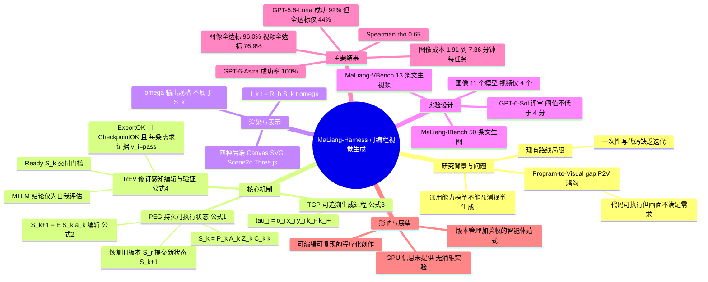

## 一、论文是干什么的？

先说一个生活场景：你请一位设计师画一张「红色气球在小女孩左手边」的图。设计师交上来的文件能正常打开（程序运行没报错），但气球却跑到了右边。论文把这种「代码能跑通，但画出来的东西不符合需求」的现象叫做 **Program-to-Visual gap**（简称 P2V gap，程序到视觉的鸿沟）。

MaLiang-Harness 要解决的就是这个问题。它不走 diffusion（扩散模型）或 flow matching 的老路，而是让多模态大模型（MLLM）像程序员一样，先写代码（Canvas、SVG、Three.js 等），再由渲染器把代码变成图片或视频；然后模型要「看一眼」渲染结果，发现不对就改代码，反复迭代。这个「构建、检查、修改」的循环被设计成一个持久的、有记录的流程，而不是一次性写完就交差。名字里的 Harness 可以理解为「给模型套上的一副工作挽具/脚手架」。

## 二、核心方法与创新

可以把它想成一个带「时光机」和「验收单」的画室。论文提出三个机制：

1. **Persistent Executable Generation（PEG）状态**：画室里的「工作台」。每一次修改后，系统都把当前的程序、素材、输出规格、场景属性和任务上下文打包存下来，并给它一个递增的版本号。论文在公式 (1) 中写作 $S_k=(P_k,A_k,Z_k,C_k,k)$，其中 $P_k$ 是带后端标识的视觉程序，$A_k$ 是带内容哈希的素材，$Z_k$ 是空间构图与时间动态等场景属性，$C_k$ 是生成上下文（提示词、需求清单、计划），$k$ 是修订编号。输出规格 $\omega$（尺寸与格式、渲染随机种子、视频时长等时间参数）不属于 $S_k$，而是作为渲染接口的参数单独给出。每次编辑写作 $S_{k+1}=\mathcal{E}(S_k,a_k)$（公式 (2)）。好处是随时能回到旧版本，同时保留当前的任务要求。
2. **Traceable Generation Process（TGP）**：画室里的「施工日志」。每一次操作在公式 (3) 中记为 $\tau_j=(o_j,x_j,y_j,k_j^-,k_j^+)$，把「做了什么」和「从哪个版本改到哪个版本」连起来，也记录了执行证据。这样事后可以查：是哪一步改动导致了气球跑偏。
3. **Revision-aware Editing and Verification（REV）**：画室里的「验收单」。质量评审的结论必须绑定到具体版本，只有当前版本满足所有必选要求，才允许交付，论文在公式 (4) 中把这个条件写作 $\mathrm{Ready}(S_k)=\mathrm{ExportOK}(S_k)\land\mathrm{CheckpointOK}(k)\land\bigwedge_{h_i\in\mathcal{H}_k}[k_i=k\land E_i\neq\varnothing\land v_i=\mathrm{pass}]$，即导出有效、检查点通过，并且每条必选需求 $h_i$ 都有针对当前修订号的非空视觉证据（裁剪图、视频帧采样等）且结论为通过（结论可为通过、失败或不确定）。论文也承认，这些由 MLLM 给出的结论只是自我评估，并非独立的感知质量度量。恢复旧版本时，系统会提交一个新的状态 $S_{k+1}$（而不是覆盖历史），并在日志中记下恢复的是哪个版本 $r$。

渲染方面，四种后端（Canvas、SVG、Scene2d、Three.js）共用同一个接口。图片是在指定时间点对程序求值，写作 $I_k(t)=\mathcal{R}_b(S_k,t;\omega)$（与公式 (2) 同处给出，$b$ 为所选后端）；视频则是沿时间采样同一份表示。模型在 harness 中可以调用的操作大致为：写程序、渲染、检查、恢复旧修订、收尾交付；检查点是模型把必选需求组织成的若干验证阶段；每次运行有 token 预算，用尽即记为生成失败。程序里用显式代码描述几何、外观和运动，必要时还可以搭配生成的图像素材。

创新点总结：把「视觉生成」从一次性写代码，改造成一个可回溯、可审计、有验收门槛的长期过程，并且指出通用能力分数不能预测这种视觉生成能力。

## 三、使用了哪些模型和计算资源？

- **被测的基础模型**：图像基准 MaLiang-IBench 评测了 11 个闭源 MLLM（ DeepSeek-V4.1-Flash、DeepSeek-V4-Pro、Kimi-K2.6、Kimi-K2.7-Code、Kimi-K3、GPT-5.6-Luna、GPT-5.6-Terra、GPT-5.6-Sol、GPT-6-Luna、GPT-6-Sol、GPT-6-Astra）；视频基准 MaLiang-VBench 只评测了其中 4 个（DeepSeek-V4.1-Flash、Kimi-K2.6、GPT-5.6-Sol、GPT-6-Astra）。摘要里的 11 个模型指的是图像侧。
- **评审模型**：用 GPT-6-Sol 作为裁判，按 1 到 5 分打分；视频的运动连贯性等维度也由它评审。
- **GPU 型号和数量**：暂无相关信息（模型都是通过 API 调用，论文中未给出 GPU 信息）。
- **图像基准的成本**（11 个模型的范围，表 2）：每任务耗时 1.91 到 7.36 分钟（全部 50 题总耗时 1.65 到 6.42 小时）；输入 token 100.8k 到 1056.5k；输出 token 8.0k 到 59.0k；模型调用 2.48 到 14.70 次。例如 GPT-6-Astra 每任务 3.55 分钟、约 6.34 次调用、输入 142.0k、输出 8.1k token；DeepSeek-V4-Pro 每任务 7.36 分钟，Kimi-K2.7-Code 输入 1056.5k 且输出 59.0k。视频基准成本更高，如 Kimi-K2.6 每任务 15.45 分钟，GPT-6-Astra 每任务 10.00 分钟。
- **图像素材生成所用模型、采样参数**：暂无相关信息。

## 四、实验结果

论文建了两个基准：MaLiang-IBench（50 条文生图提示）和 MaLiang-VBench（13 条文生视频提示）。质量维度包括提示对齐、美学、构图（视频还有运动连贯性），每项 1 到 5 分，阈值为不低于 4 分，全部达标才算满足；平均分只在成功生成的样本上计算。提示涵盖线稿、扁平设计、像素风、风格化 3D、混合媒体、写实等风格。

下表为 MaLiang-IBench 的结果（成功率来自表 2，达标率为表 3 中 All Criteria 除以 50）：

| 模型 | 生成成功率 | 全部质量达标率 |
|---|---|---|
| DeepSeek-V4.1-Flash | 12.0% | 12% |
| DeepSeek-V4-Pro | 18.0% | 16% |
| Kimi-K2.6 | 34.0% | 12% |
| Kimi-K2.7-Code | 40.0% | 24% |
| Kimi-K3 | 18.0% | 18% |
| GPT-5.6-Luna | 92.0% | 44% |
| GPT-5.6-Terra | 92.0% | 48% |
| GPT-5.6-Sol | 96.0% | 86% |
| GPT-6-Luna | 96.0% | 88% |
| GPT-6-Sol | 96.0% | 92% |
| GPT-6-Astra | 100.0% | 96% |

大白话解读：

- 最强的 GPT-6-Astra 在两个基准上生成成功率都是 100%，图像任务 96.0%（48/50）、视频任务 76.9%（10/13）全部达标。
- 「跑成功」不等于「画得对」：GPT-5.6-Luna 完成了 92% 的图像任务，但只有 44% 真正满足所有视觉要求。
- 公开的 Artificial Analysis Intelligence Index 与绘图质量通过率（11 个模型）之间的 Spearman 相关系数 $\rho=0.65$，说明相关但不够可靠：例如 GPT-5.6-Luna 与 GPT-6-Luna 指数分数同为 37，质量通过率却分别是 44% 与 88%。
- 视频方面（MaLiang-VBench，13 题，只测 4 个模型）：生成成功率 DeepSeek-V4.1-Flash 0%（64K 上下文，5 次触及 token 上限）、Kimi-K2.6 23.1%、GPT-5.6-Sol 53.8%、GPT-6-Astra 100%；全部达标的数量分别为 0、0、5、10 题（Sol 为 5/13，约 38.5%，Astra 为 10/13）。
- 消融实验：论文以多模型对比为主，未见消融实验。

## 五、潜在应用与已落地应用

潜在方向：可编辑、可复现的插画和信息图生成；需要精确位置与时间控制的动画、教学演示、数据可视化动画；作为评估 MLLM 视觉编程能力的测试台；以及给其他生成式智能体提供「版本管理加验收」的通用思路。因为输出是程序，用户可以直接改代码微调，这是纯扩散模型难以做到的。

已落地案例：论文给出了开源仓库 [MaLiang-Harness 的 GitHub 项目](https://github.com/gulucaptain/MaLiang-Harness)（该仓库的 README 和使用情况暂未能核对）。除此之外，暂无已知的商业落地信息。

## 六、网络上的讨论与评价

- 已找到的内容主要是论文聚合站点的介绍：[hyper.ai 论文页](https://hyper.ai/en/papers/2609.34309)、[paperswithcode.co 论文页](https://paperswithcode.co/paper/2609.34309)，以及 [CCTest 的解读文章](https://cctest.ai/en/articles/maliang-harness-moves-visual-generation-beyond-runnable-code)，后者把它定位为评估与编排框架，而不是又一个代码生成模型（该文章仅有搜索摘要可见，全文内容未核实）。
- 一个新闻筛选项目的 [GitHub issue](https://github.com/hanzhad/squelch-news-engine/issues/1230) 里，自动评审给它打了 2/10 并标记为噪声，理由是没有可操作的代码细节；但摘要里其实明确给出了代码仓库，这条评价看起来并不准确。
- 未检索到来自 Reddit、X、Hacker News 的实质性讨论，因此没有可靠的社区评价可以引用。HuggingFace 页面上的社区评论暂无相关信息。

## 七、思维导图

