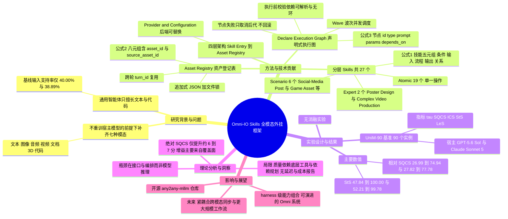

## 一、论文是干什么的？

现在的通用智能体（比如各种 coding agent、聊天助手）核心是一个大语言模型，擅长读写文字和代码。但真实工作里，人们常常要它「看一段视频，配上解说，再做一张海报和一个落地页」。这种同时涉及文本、图像、音频、视频、文档、3D 资产和代码的「全模态（Omni）」任务，普通智能体要么直接说做不了，要么做出来结构不对、质量很差。

作者的思路不是去重新训练一个更大的全模态模型，而是给现有智能体「外挂一套工具箱和工作手册」。可以把它想成：一位只会写文章的优秀编辑（宿主智能体），你不必把他重新培养成摄影师、配音员和美工，而是给他配一个资源齐全的工作室，附上每种活儿的操作手册、一块能排工序的白板，以及一个按编号存放所有成品的仓库。这套外挂就叫 **Omni-IO Skills**，论文称之为 harness（可理解为「线束」或「外骨骼」）。

## 二、核心方法与创新

整套系统由四层组成：Skill Entry（技能入口）、MCP Tool Service（工具服务）、Provider and Configuration（后端与配置）、Asset Registry（资产登记表）。宿主模型仍负责理解意图和做规划，harness 负责把规划变成可执行、可并行、可复用的产物流水线。

**1. 分层技能（Hierarchical Skills）。** 一个技能在论文中被形式化为五元组（公式 1）：

$$s = \langle c_s, I_s, P_s, O_s, H_s \rangle$$

其中 $c_s$ 是适用条件，$I_s$ 是所需输入，$P_s$ 是执行流程，$O_s$ 是预期输出，$H_s$ 是与其他技能的关系。共 27 个技能、覆盖 38 类代表性任务，分三级：

- **原子技能**（Atomic，19 个）：单一动作，如图像/视频/音频/文档/3D 理解，图像/视频/音乐/音效/语音/3D 生成，PPT/Word/PDF/Excel 生成，代码与 Markdown 生成，网页搜索与浏览。类比：一把螺丝刀、一支画笔。
- **专家技能**（Expert，2 个）：Poster Design（海报设计）和 Complex Video Production（复杂视频制作），把若干原子技能串成一个完整交付物的流程。类比：一份「做海报的标准作业程序」。
- **场景技能**（Scenario，6 个）：Social-Media Post、Office Documents、Job Application、Education Sharing、Event Material、Game Asset，一次产出多个相关交付物。类比：「办一场活动」的整套方案。

**2. 声明式执行图（Declare Execution Graph，DEG）。** 多资产任务被表示成有向无环图，每个节点是（公式 3）：

$$v = \langle \mathrm{id}, \mathrm{type}, \mathrm{prompt}, \mathrm{params}, \mathrm{depends\_on} \rangle$$

执行前先校验依赖都能解析、图里没有环。调度按「波次（Wave）」进行：先找出前置节点都已完成的节点组成下一个 Wave，同一 Wave 里互不依赖的节点并发派发；某节点失败时，取消它尚未执行的后代，但不相关的分支继续跑；每个节点的最终状态都被记录，不做回滚。类比：做一桌菜，凉菜和煲汤可以同时开工，但摆盘必须等菜都好了。

**3. 资产登记表（Asset Registry）。** 每个产物（图、视频、音频等）登记成一条记录（公式 2）：

$$a = \langle \mathrm{asset\_id}, \mathrm{type}, \mathrm{subtype}, \mathrm{path}, \mathrm{description}, \mathrm{params}, \mathrm{turn\_id}, \mathrm{source\_asset\_id} \rangle$$

asset_id 全局唯一，与具体文件路径无关，所以可以跨轮对话复用，例如「把上一轮那张图改成横版」。实现上是追加式 JSON 存储，用文件锁保证并发写入不互相覆盖。

**4. 可替换后端。** 能力（做什么）与服务（谁来做）被分开，换一家图像或视频服务商，不需要重写「怎么做」的流程知识。

## 三、使用了哪些模型和计算资源？

| 项目 | 内容 |
|---|---|
| 宿主智能体（实验） | GPT-5.6 Sol 与 Claude Sonnet 5，均不做任何训练或微调 |
| 训练 | 无训练，论文方法是免训练的外挂框架 |
| 具体生成后端 | 论文正文未指明具体模型名。官方 [GitHub 仓库](https://github.com/any2any-mllm/Omni-IO-Skill)的配置里列出可选后端，如图像（DALL-E、Flux、Midjourney、Stable Diffusion）、视频（RunwayML、Haiper、Minimax）、语音（Eleven Labs、OpenAI、Edge TTS）、转写（Whisper、AssemblyAI）、3D（Tripo、Meshy）。这些是仓库说明，并不等于论文实验实际使用的后端 |
| GPU 型号与数量 | 暂无相关信息（论文未报告，主要通过外部 API 调用） |
| 每次任务耗时 / 延迟 / 成本 | 暂无相关信息（论文未报告） |
| 运行环境 | 仓库要求 Python 3.10 及以上，需 Playwright（chromium）和各服务商 API Key，通过 MCP 服务器接入宿主智能体 |

## 四、实验结果

评测基准是 UniM-90，即从 UniM 基准中固定抽取的 90 个实例的子集，覆盖七种模态。论文没有给出各类别实例数，也没有说明评分用的裁判模型（均为暂无相关信息）。指标包括：输入支持率 $\tau$（完整支持该实例模态的比例）、SQCS（语义与质量耦合分）、ICS（交错连贯性）、StS（严格结构分）、LeS（宽松结构分，看模态覆盖）。SQCS 有两种口径：绝对值只算被支持的实例，相对值按 $\tau$ 加权覆盖全体测试集。

| 指标 | GPT-5.6 Sol 基线 | GPT-5.6 Sol + Skills | Claude Sonnet 5 基线 | Claude Sonnet 5 + Skills |
|---|---|---|---|---|
| 输入支持率 | 40.00% | 100% | 38.89% | 100% |
| 相对 SQCS | 26.99 | 74.94 | 27.82 | 77.78 |
| 绝对 SQCS | 67.49 | 74.94 | 71.53 | 77.78 |
| 绝对 ICS | 86.53 | 93.98 | 82.29 | 83.28 |
| 绝对 StS 严格结构 | 47.84 | 100.00 | 52.21 | 99.78 |
| 绝对 LeS 宽松结构 | 72.22 | 100.00 | 68.57 | 100.00 |

大白话解读：没有外挂时，两个强模型大约只有四成的任务连「输入类型」都能接住；加上 Omni-IO Skills 后全部能接住，相对语义质量分提升约 48 和 50 个百分点，输出结构几乎全部符合要求。注意绝对 SQCS 的提升要小得多（约 7.5 和 6.3 分），因为基线只在自己能做的那部分任务上打分，所以大部分增益来自「能做的任务变多了」，而不是「同样的任务做得好很多」。

论文没有做消融实验（只比较「基线」与「基线 + Skills」），因此无法知道分层技能、执行图、资产登记表各自贡献多少。

另有两个案例演示：教育分享场景下，系统结合视频理解（绘画步骤）、音频理解（讲解）生成 11 张图的绘画教程；产品推广场景下，依次调用图像理解、海报设计、复杂视频制作和代码生成，产出海报、宣传视频和落地页。

## 五、潜在应用与已落地应用

- 潜在方向：社交媒体内容制作、办公文档与演示稿批量生成、求职材料、教学素材、活动物料、游戏资产制作，以及需要跨轮反复修改素材的创意工作流。
- 落地情况：代码已在 [GitHub](https://github.com/any2any-mllm/Omni-IO-Skill) 开源（核查时约 35 颗星，数字会变动），可通过符号链接放进智能体的 skills 目录并注册 MCP 服务器使用。除此之外，暂未查到有公开的商业落地案例。

## 六、网络上的讨论与评价

- 搜索到的内容以论文页面（[arXiv](https://arxiv.org/abs/2609.31847)、[Hugging Face](https://huggingface.co/papers/2609.31847)）、[Hyper.ai](https://hyper.ai/en/papers/2609.31847) 与 [Papers with Code 镜像](https://paperswithcode.co/paper/2609.31847)等转载为主。
- 科技站点 [CCTest 的介绍文章](https://cctest.ai/en/articles/omni-io-skills-giving-general-agents-a-multimodal-work-harness)基本复述论文贡献，并引用作者的自我说明：最终质量仍取决于底层工具、它们的可用性以及依赖规划是否正确；文章认为增益来自编排与接口设计，而不是模型本身变强。
- 一个新闻聚合项目的 [GitHub issue](https://github.com/hanzhad/squelch-news-engine/issues/1245) 把该论文判为「不计划收录」的噪声，理由是涉及未发布的模型版本且基准声明难以核实。这只是一个个人项目的筛选结论，不代表学界评价。
- 未找到 Reddit、Hacker News、X 的实质性讨论。

## 七、思维导图

