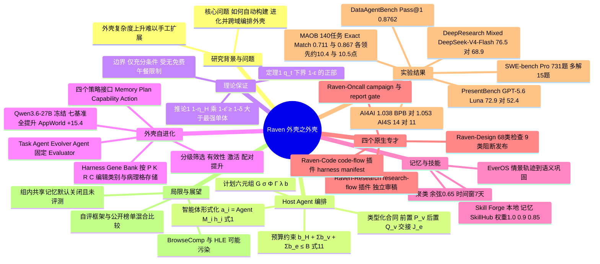

## 一、论文是干什么的？

先说一个背景词：**harness（智能体外壳）**。大模型本身像一个很聪明的实习生，但真正干活时，还需要一整套配套：给它什么工具、怎么提示它、怎么管理上下文、出错了怎么兜底。这一整套「外壳」就是 harness。同一个模型，换一个外壳，表现可能天差地别。

问题在于：外壳越做越复杂，靠人工为每个领域手工打磨很难扩展；而一个外壳又很难同时适合写代码、做研究、做设计。Raven 的思路是：不要做一个「万能外壳」，而是把每一对「模型 + 外壳」当成一个可以拼装的积木，再做一个「**外壳的外壳**」（The Harness of Harnesses）来统一调度它们，并且让外壳能够从经验里自己进化。

打个比方：Raven 像一家装修公司的项目经理（Host Agent）。客户说「帮我做一个关于希腊彩绘雕塑的演示文稿」，项目经理不会自己包办一切，而是把活拆给查资料的、写代码算数据的、做设计的、负责盯进度的专业工人，规定好谁先谁后、每个人交什么成果，最后验收拼装。同时公司有一个档案室（EverOS 记忆）和一本不断更新的「操作手册库」（Skill Forge），让经验不白白浪费。

这篇论文是 EverMind AI 团队的技术报告（arXiv 署名为 EverMind AI，附录 D 列出项目负责人 Chuanrui Hu、通讯作者 Yafeng Deng 等成员），同时提供了开源实现（见 [GitHub 仓库](https://github.com/EverMind-AI/Raven)）、一套理论分析、以及覆盖编排、研究、编程、设计、值守、技能检索等多方面的实验。

## 二、核心方法与创新

### 1. Host Agent：项目经理式的任务编排

Host Agent 做四件事：把目标拆成子任务；用「能力注册表」把子任务匹配给合适的专才；把依赖关系画成一张**有向无环图（DAG，Directed Acyclic Graph）**，也就是「先做什么、后做什么、哪些可以并行」的流程图；最后把各方结果整合。

论文把一个「智能体」形式化为模型与外壳的配对 $a_i = \mathrm{Agent}(M_i, h_i)$（式 1）。一份执行计划是一个六元组 $\pi = (G, \sigma, \Phi, \Gamma, \lambda, b)$，分别是图、节点到执行者的分配、输入绑定、合同与约束标注、调度顺序、预算分配。预算约束写成 $b_H + \sum b_v + \sum b_e \le B$（式 11）：规划成本、节点执行成本、节点之间交接成本加起来不能超过总预算 $B$。

与「让智能体自由聊天」不同，Raven 用**类型化执行合同**：每个节点有前置条件 $P_v$ 和后置条件 $Q_v$，每条边有交接合同 $J_e$。就像工厂流水线上，上一道工序必须交出合格的零件，下一道工序才能开工。运行时维护一个只追加的产物账本，任何一步没达标就触发异常处理或中止并记录原因。

实现里的一些默认值（论文 Table 10）：图节点共享并发数 8，每小时派发预算 30 次，每个节点最多额外续跑 2 次。

### 2. 理论：什么时候「组合」真的比单兵作战强？

论文给出的是充分条件，不是万能保证。核心结论大意如下：

- **定理 1（可靠性）**：对一份合法的规划，只要每个节点和每条边都能兑现各自合同，整体成功概率有下界 $q_t(\zeta,\pi) \ge [1-\varepsilon(\zeta,\pi)]_+$，大致是「把各环节的失败概率加起来再用 1 减」。
- **推论 1（新能力）**：当 $(1-\eta_H)(1-\bar{\varepsilon}) \ge 1-\delta > \max_a p_a(t,B)$ 时，组合后能解决任何单个智能体在预算 $B$ 内都做不好的任务。这里 $\eta_H$ 是规划出错率，$\bar{\varepsilon}$ 是平均执行出错率。
- **推论 2（任务族覆盖）**：规划与执行误差在一整个任务族上有界时，覆盖是一致可靠的。

生活类比：一支接力队，只要每一棒都稳、交接棒不掉，整体成绩就由各棒的失误概率累加决定；如果队里有人擅长短跑、有人擅长长跑，组合起来能完成单人跑不了的赛程。论文也坦率指出：协调有开销，收益取决于任务结构，也有「没有免费午餐」的限制，需要端到端实验验证。

### 3. 外壳自进化（Harness Self-Evolution）

模型本身保持冻结，只改外壳。论文基于 HarnessBank 的方法，把外壳拆成四个策略接口：Memory（上下文怎么组装与压缩）、Plan（给模型的回合指引）、Capability（暴露哪些工具）、Action（如何取得并判断模型响应与完成度），外壳写成 $h = (\mathrm{id}_h, \mathsf{Mem}_h, \mathsf{Plan}_h, \mathsf{Cap}_h, \mathsf{Act}_h, \theta_h)$（式 39）。

进化流程：Task Agent 干活，Evolver Agent 读失败轨迹做**诊断**（例如推理预算超支、过早收尾），提出修改；候选外壳存进**基因库（Harness Gene Bank）**，每个「修改类别 x 病理类型」格子保留一个完整外壳，修改类别分为 P/K/R/C（提示、知识、运行时、配置）；之后经过**分级筛选**：有效性检查、是否真的被触发（activation）、配对提升检验，通过的才做完整训练集评估并参与格子竞争。最终外壳在留出测试集前冻结。

类比：像教练看比赛录像找失误，针对性改战术，再让新旧战术打对抗赛，赢了才正式换上。

### 4. EverOS 记忆与 Skill Forge 技能库

- **记忆**：把执行过程记成「情景轨迹」，再做「语义巩固」提炼成可复用知识，新任务来时「重建式检索」拼出上下文。默认的聚类阈值是余弦相似度 0.65、时间窗 7 天（Table 10）。
- **Skill Forge**：整合本地技能、记忆衍生技能、外部 SkillHub 技能，做任务感知检索（多路结果用 RRF 融合，本地/记忆/SkillHub 权重为 1.0 / 0.9 / 0.85），默认最多选 2 个技能注入上下文；新经验经过增量聚类（直接并入阈值 0.85）后提炼为新技能或更新旧技能，并经过去重与发布门槛。

### 5. 四个原生专才与第三方适配

- **Raven-Research**：循证深度研究。搜索结果缓存、读页前置检查、独立审稿人复核关键论断、每个数字都给完整 URL。
- **Raven-Code**：仓库感知的软件工程。每次调用都带上 AGENTS.md、CLAUDE.md；编辑前必须读过最新文件；Python 写入后自动语法检查；任务结束生成基于仓库状态的 harness manifest。
- **Raven-Design**：渲染再检查的视觉设计。幻灯片流水线用 python-pptx，每次构建检查 68 类问题，其中 9 类会阻止发布。
- **Raven-Oncall**：无人值守的长任务。每个任务是一个「campaign」，等待期间不调用模型，由无模型监控器唤醒；结束必须通过「报告门」，没有基线或与记录矛盾的报告会被拒绝。
- **第三方适配器**：Claude Code、Codex 等无需改内部实现即可参与，适配器负责观测映射、产物绑定、验收函数与成本核算。仓库说明称可连接 13 个以上外部智能体。

## 三、使用了哪些模型和计算资源？

论文是「系统 + 多个评测」的技术报告，没有训练一个新的基础模型，所用模型随评测而不同（下表均来自论文正文与附录）：

| 评测 | 使用的模型 |
|---|---|
| 多智能体编排 MAOB | Qwen3.8-27B、DeepSeek-V4-Flash-0731（参考图由 Claude Opus 5 撰写，请求文本由 GLM-5.2 生成） |
| 外壳自进化（转引 HarnessBank） | 冻结的任务模型 Qwen3.6-27B；进化器 Claude Opus 4.8 |
| Raven-Research | Qwen3.6-35B-A3B、Qwen3.5-397B-A17B（4-bit GPTQ，自托管）、DeepSeek-V4-Flash（官方 API）；评审 GPT-5.6 Luna Pro（温度 0） |
| Raven-Code | Qwen3.8-27B（vLLM 服务）、DeepSeek-V4-Flash、Claude Opus 4.8、GPT-5.6 Luna、Claude Opus 5（DataAgentBench，经 OpenRouter，另用 Claude Haiku 4.5 与 Claude Sonnet 5 做一步语义映射） |
| Raven-Design | Claude Opus 5、GPT-5.6 Luna；PresentBench 官方评审为 Gemini 3 Flash |
| Raven-Oncall | Claude Opus 5、DeepSeek-V4.1-Flash（AI4S 中另写为 DeepSeek-V4-Flash） |
| 技能检索（转引 SkillCorpus） | Qwen3.5-27B、Qwen3.5-397B-A17B（4-bit GPTQ）、Claude Opus 4.7（单次检查）；检索与重排基线为 Qwen3-Embedding-0.6B 和 Qwen3-Reranker-0.6B；GDPval 评审为 GPT-4o |

**算力与耗时**（论文明确给出的部分）：

- 自托管的 Qwen3.6-35B-A3B 与 4-bit Qwen3.5-397B-A17B 跑在「内部基础设施」上，**GPU 型号与数量暂无相关信息**。
- Raven-Oncall 的 AI4AI 实验：每次训练限时 300 秒（单 GPU），每个 campaign 预算 5 GPU 小时，使用 2 张 A800 80GB；整个 campaign 的墙钟时间为 4.90 小时（Claude Opus 5，Raven-Oncall）、4.99 小时（Claude Code）、3.74 小时（DeepSeek-V4.1-Flash，报告成本 0.97 美元）。
- SWE-bench 类任务：每个任务限时 3600 秒；DataAgentBench 每次尝试上限 5400 秒，并发 24，共 270 次试验；Raven-Design 评测容器为 2 CPU、8 GB 内存。
- Raven-Research：每题最多 150 次工具迭代，单次输出 16384 token，每题时限在 DeepSeek-V4-Flash 上为 90 分钟，在两个自托管模型上分别为 120 和 200 分钟。DeepSeek-V4-Flash 下平均每题成本 0.0242 美元。
- Raven-Design 案例：单个设计节点耗时 2 分 58 秒到 64 分 50 秒不等，其中 4 份幻灯片为 18 分 45 秒、55 分 34 秒、47 分 03 秒、64 分 50 秒；展示页给出每份约 0.80 美元的成本（论文原话为 showcase 列出）。
- AI4S 17 个任务：Claude Opus 5 下成功 14 个，DeepSeek-V4-Flash 下成功 7 个、平均每任务成本 0.10 美元；平均耗时的具体数字仅在图 22 中，文本未给出，故暂无相关信息。
- 自进化与技能检索的耗时、GPU 数：这两部分是转引已发表结果，论文称已发表结果无法确定每次运行的全部细节，**暂无相关信息**。
- 通用编排评测（MAOB）是只测规划、不派发工人的评测，单次规划耗时暂无相关信息。

## 四、实验结果

整体评测结构是：先看编排，再看各专才，最后看自进化与技能。以下数字均出自论文。

### 1. 多智能体编排基准 MAOB

MAOB 共 140 个任务、覆盖 137 种职业；参考图平均 2.72 个节点、1.84 条边；98 个任务纯串行、42 个含并行。指标有 Node F1、Edge F1、Partial Order Accuracy（POA）、Exact Match。对比系统为 Claude Code 与 Hermes Agent，使用同样的两个骨干模型。

| 骨干模型 | Raven Exact Match | 最强基线 Exact Match | 提升 |
|---|---|---|---|
| Qwen3.8-27B | 0.711 | 0.607 | 10.4 个百分点 |
| DeepSeek-V4-Flash-0731 | 0.867 | 0.762 | 10.5 个百分点 |

另外：Qwen3.8-27B 上 Raven 的 Node F1 为 0.923（最强基线 0.776），POA 为 0.950；DeepSeek 上 Node F1 0.963、Edge F1 0.897（基线 0.854、0.813）。Edge F1 在所有系统上都低于 Node F1，说明「谁依赖谁」比「选哪些专才」更难。

### 2. 外壳自进化（冻结 Qwen3.6-27B，留出集 Pass@1）

| 基准 | 进化前 | 进化后 | 提升 |
|---|---|---|---|
| Terminal-Bench-2 | 36.1 | 45.4 | +9.3 |
| LiveCodeBench | 58.1 | 71.8 | +13.7 |
| Omni-MATH | 54.3 | 66.0 | +11.7 |
| BrowseComp+ | 16.9 | 30.8 | +13.9 |
| GDPval | 43.7 | 52.9 | +9.2 |
| AppWorld | 41.3 | 56.7 | +15.4 |
| SWE-bench Verified | 47.4 | 52.6 | +5.1 |

七个基准全部提升，其中六个通过配对提升判据；SWE-bench Verified 因测试集只有 26 个任务未通过该判据。

### 3. Raven-Research（DeepResearch Mixed，准确率 %）

| 骨干 | MiroFlow | DeepSeek-Harness | Raven-Research |
|---|---|---|---|
| Qwen3.6-35B-A3B | 47.7 | 49.7 | 56.3 |
| Qwen3.5-397B-A17B | 48.0 | 56.0 | 59.3 |
| DeepSeek-V4-Flash | 67.2 | 68.9 | 76.5 |

商业深度研究服务的准确率为 50.3 到 63.2。六组同骨干比较中五组的 McNemar 检验 p 小于 0.02，唯一不显著的是 Qwen3.5-397B-A17B 上对 DeepSeek-Harness（差 3.3 个百分点，p = 0.21）。DeepSeek-V4-Flash 上 Raven-Research 在 BrowseComp 为 69.3%、Humanity's Last Exam 为 60.0%，但在 xBench-DeepSearch 上落后 DeepSeek-Harness 3.4 个百分点。作者也提醒：各系统没有屏蔽基准的公开副本，BrowseComp 与 HLE 的绝对分数可能偏高。

### 4. Raven-Code

- SWE-bench Pro（731 题）：同为 Qwen3.8-27B，比 Claude Code 多解决 15 题。
- SWE-bench Verified（500 题）：DeepSeek-V4-Flash 上领先 0.6 分，Claude Opus 4.8 上领先 1.2 分（分别多解 3 和 6 题）。
- SWE-Refactor（20 个整仓库迁移任务）：比排行榜条目高 9.5 分（DeepSeek-V4-Flash）和 3.0 分（GPT-5.6 Luna）。
- DataAgentBench（54 题、12 个数据集）：Claude Opus 5 主模型下 Pass@1 为 0.8762、Pass@5 为 0.9097，截至 2026 年 8 月 24 日为所列条目中 Pass@1 最高，但尚未提交给榜单维护者。
- 八个设置里有六个最高；WorkBuddy-Code 上与最强者差 1.2 分（Claude Opus 4.8）和 0.4 分（Qwen3.6-35B-A3B）。

### 5. Raven-Design

PresentBench（238 个幻灯片任务）：Claude Opus 5 下 Raven-Design 80.2 对 Claude Code 78.3；GPT-5.6 Luna 下 72.9 对 52.4（提升 20.5 分）。在 ArtifactsBench（SVG、仪表盘）与 GDPval 上，六个设置全部最高，对最强替代者领先 0.3 到 2.8 分；这部分评分由内部评分器与 GPT-5.6 Luna 评审给出，与官方榜单不可比，且部分设置里生成者与评审是同一个模型。

### 6. Raven-Oncall

AI4AI（约 5000 万参数的 GPT 模型预训练配方优化，基于 autoresearch 与 nanochat，起点 1.108 BPB）：Raven-Oncall 搭配 Claude Opus 5 达到 1.038 BPB，Claude Code 为 1.053；DeepSeek-V4.1-Flash 达到 1.037。AI4S（17 个科学计算任务，人工判定）：Raven-Oncall 14/17，Claude Code 11/17，且平均耗时、token 与成本更低。

### 7. 技能检索与复用

在 407 个任务上（SkillsBench 87、GDPval 220、QwenClawBench 100），技能检索让 12 个「配置 x 基准」组合全部提升。合并增益：SkillsBench +7.5 分，GDPval +1.51，QwenClawBench +2.79。同样的技能选择下，Raven 比 OpenClaw 增益更大（SkillsBench 上 Raven 为 +6.5 与 +13.4，OpenClaw 为 +4.2 与 +5.8）。消融：换成现成的 Qwen3 嵌入与重排模型，Pass@1 由 22.6% 降到 13.8%；换成约 821000 个技能文件的原始爬取库，降到 14.9%；无技能基线为 9.2%。GDPval 上单格增益统计上不显著。

## 五、潜在应用与已落地应用

**潜在方向**：

- 跨领域的「交付型」任务，如调研加数据计算加设计出稿的一条龙工作。
- 长时间无人值守的科学计算、模型训练与参数扫描。
- 让企业把自家工具和智能体按合同接入统一编排，而不必改造内部实现。

**已知落地情况**（均来自论文或官方资料，未经独立验证）：

- 开源仓库 [EverMind-AI/Raven](https://github.com/EverMind-AI/Raven)：页面显示约 5.1k stars、143 forks，状态标注为 pre-alpha（接口可能变化），支持 macOS、Linux、WSL2、原生 Windows，提供 CLI、TUI 与浏览器 WebUI，也有 Docker 部署。
- 论文展示了 7 个案例：4 份幻灯片、2 份海报、1 个交互网站（如 GPS 三边定位页面，由两个 Raven-Code 节点分别独立实现计算、Raven-Oncall 交叉校验、Raven-Design 做页面）。
- 技能库规模：GitHub 页面写的是可从 SkillHub 目录调用 114190 个技能；论文正文没有给出这个总数（只提到消融实验里的原始爬取库约 82.1 万个技能文件，以及经过整理的精选目录），其他口径的「约 10 万」说法不予采用。
- 2026 年 7 月 9 日，EverMind 发布过 Raven Agent 的新闻稿（见 [Yahoo Finance 转载](https://finance.yahoo.com/technology/ai/articles/evermind-launches-raven-agent-self-142300811.html)），主打「L3 级数字生命」「自我重写代码」等定位。这些是公司宣传说法，未经独立验证。

## 六、网络上的讨论与评价

已找到的内容主要是官方与二手转载，而不是独立评论：

- 论文页面的镜像与索引，如 [hyper.ai](https://hyper.ai/en/papers/2609.33439)、[paperswithcode.co](https://paperswithcode.co/paper/2609.33439)。
- GitHub 技术报告发布页：[tech-report-v1](https://github.com/EverMind-AI/Raven/releases/tag/tech-report-v1)，以及大量 fork；[trendshift](https://trendshift.io/repositories/69819) 有该仓库的趋势统计。
- 官方博客：[安装教程](https://evermind.ai/blogs/install-raven-evermind-ai-on-macos-and-windows) 与 [如何搭建智能体团队](https://evermind.ai/blogs/how-to-spin-up-an-ai-agent-team-with-raven)；另有 [besthub 文章](https://www.besthub.dev/articles/when-ai-starts-rewriting-itself-evermind-s-raven-agent-redefines-digital-life-e9a0a146df10) 转述发布信息。

未检索到来自 Hacker News、Reddit、X 的针对这篇论文的独立讨论串，暂无可靠的社区口碑。以下是基于论文自身内容的几点观察：

- 许多对比使用的是作者自己的内部评测框架，部分对手分数来自公开榜单，配置未必一致；论文自己也承认这是观察性比较。
- 设计评测里生成者与评审为同一模型的情形、BrowseComp 与 HLE 可能被污染，都是作者自己写明的局限。
- arXiv 页面标注论文文本为 CC BY 4.0，而 GitHub 页面显示代码仓库为 Apache 2.0，二者针对的对象不同（论文文本与代码），并不矛盾，但容易混淆。

## 七、思维导图

