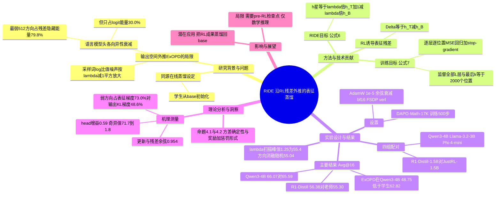

## 一、论文是干什么的？

先说背景。大模型经过强化学习（RL）之后，数学推理等能力会变强，但 RL 训练很贵。于是人们常用「在线蒸馏」（on-policy distillation，OPD）：让一个小一点或便宜一点的**学生**自己写答案，**老师**在学生写到的每个位置上给出「我会怎么写」的参考，学生逐步向老师靠拢。

这篇论文关心的是一种常见情形：学生、老师、以及老师做 RL 之前的那个「老版本」（论文叫 pre-RL checkpoint，也叫 base）三者出自同一个起点，结构和词表完全一样。传统做法把老师当作**终点**：学生学得再好，也只是无限接近老师。

作者的想法可以用一个生活类比来理解。假设有个学徒跟师傅学做菜，师傅是在某个旧版本的自己基础上，通过大量练习才变得更好的。如果只看师傅现在的味道，学徒最多做到一样。但如果我们知道师傅「从旧版本到现在」是往哪个方向变的（比如盐少一点、火候再大一点），学徒就可以顺着这个**方向**再多走一小步，甚至比师傅更进一步。论文标题「老师是一个方向，而不是一个目的地」说的就是这个意思。

论文的方法叫 **RIDE**（RL-Induced Direction Extrapolation，强化学习诱导的方向外推）。它不在输出的概率上做文章，而是在模型内部每一层的「隐藏状态」（可以想成模型脑子里的中间想法）上做外推。在四组「基础模型到 RL 老师」的配对上，RIDE 训练出的学生都达到或略超过老师的数学成绩。

## 二、核心方法与创新

### 1. 先看已有做法的问题

已有的「超越老师」方法（论文里的 ExOPD）是在**输出空间**做外推：把「老师的对数概率减去 base 的对数概率」当成隐含奖励，再把这个奖励放大。作者指出两个毛病：

- **语言模型头会把信号压扁，而且压得不均匀。** 模型最后有一个「语言模型头」（把隐藏状态变成各词概率的矩阵）。RL 带来的隐藏状态变化，恰好集中在这个头最不敏感的方向上：论文测得，头最弱的 512 个方向承载了残差 79.8% 的隐藏状态能量，却只占其 logit 能量的 30.0%（若各方向均匀，应是 33.3%）。所以只看输出，会错过大部分变化，而且更早的层完全没被约束。
- **放大会同时放大噪声。** 输出空间只用「学生采样到的那一个词」来估计奖励，是有噪声的；外推系数 $\lambda$ 越大，噪声按 $(\lambda-1)^2$ 增长，训练容易崩。

### 2. RIDE 怎么做

RIDE 三步走（类比：量出师傅从旧版本到现在每一步的变化，再让学徒走过头一点点）：

1. **让学生自己写一段答案。** 在学生写出的每一个前缀上，同时让冻结的老师 $\pi_T$ 和冻结的 pre-RL 检查点 $\pi_B$ 读同样的文字，取出每一层、每个位置的隐藏状态。
2. **算出 RL 留下的残差**（论文中的 Δ）：

$$\Delta_t^{(l)} = h_{T,t}^{(l)} - h_{B,t}^{(l)}$$

   它表示在这一段具体上下文上，RL 到底把第 $l$ 层的想法改了多少。因为两个模型读的是同一段文字，所以差别只来自 RL，而不是来自写了不同的内容。
3. **把目标放到老师再往前一点的位置**（论文公式 6），然后让学生的隐藏状态向这个目标回归（公式 7）：

$$h_t^{\star(l)} = h_{T,t}^{(l)} + (\lambda-1)\,\Delta_t^{(l)} = \lambda h_{T,t}^{(l)} + (1-\lambda) h_{B,t}^{(l)}$$

$$\mathcal{L}_\lambda(\theta) = \mathbb{E}\left[\frac{1}{|\mathcal{L}_{layer}|}\sum_{l\in\mathcal{L}_{layer}}\frac{1}{M}\sum_{t=1}^{T} m_t \frac{1}{d}\left\|h_{\theta,t}^{(l)} - \mathrm{sg}\big(h_t^{\star(l)}\big)\right\|_2^2\right]$$

   其中 $\mathrm{sg}$ 表示不对目标回传梯度，$m_t$ 是位置掩码，$M=\sum_t m_t$。当 $\lambda=1$ 时目标就是老师本身，退化为已有的在线表征蒸馏 OPRD；$\lambda>1$ 时目标落在老师之外；$\lambda<1$ 时落在 base 与老师之间。论文实际取 $\lambda=1.25$，监督所有 $L$ 层、回答末尾最后 $k=2000$ 个位置，并把损失系数按 $\lambda^{-2}$ 缩放（Remark G.1）。

### 3. 为什么有效（论文的两个命题）

- **命题 4.1（条件方差）：** 输出空间优势的方差为 $\mathrm{Var}[\ell]+(\lambda-1)^2\mathrm{Var}[\rho]-2(\lambda-1)\mathrm{Cov}[\ell,\rho]$，外推项不会随学生接近老师而消失；而 RIDE 的梯度在给定一次采样后是确定的（方差为零），因为残差是「算出来的」而不是「抽样估出来的」，所以 $\lambda$ 只改变目的地，不增加噪声。
- **命题 4.2（奖励加惩罚形式）：** 在一次采样之下，RIDE 的回归等价于最大化 $(\lambda-1)r(h)-\frac{1}{2}\|h-h_T\|_2^2$，其中 $r(h)=\langle h-h_T,\Delta\rangle$。意思是：奖励鼓励沿 RL 方向走，二次惩罚把学生拴在老师附近，两者的最优点正是 $h^\star$。
- **与输出空间的关系（公式 8）：** 在共享线性头的前提下，输出空间外推的目标恰好是 RIDE 目标经过语言模型头投影后的像，所以 RIDE 相当于「完整版」。

### 4. 创新点小结

- 提出「RL 诱导的表征残差」：同一上下文下老师与 pre-RL 检查点逐层隐藏状态之差。
- 只改目标、不改其他：RIDE 与 OPRD 的唯一差别就是目标里多了残差项，所以对比很干净。
- 给出了头部衰减与方差两条机理分析，解释为什么在表征空间外推更稳。

## 三、使用了哪些模型和计算资源？

**模型（四组基础模型与 RL 老师配对，学生都从 base 初始化）：**

| 配对 | base（学生起点） | RL 老师 |
|---|---|---|
| R1-Distill-1.5B | DeepSeek-R1-Distill-Qwen-1.5B | JustRL-DeepSeek-1.5B（公开） |
| Qwen3-4B | Qwen3-4B | Just-Qwen3-4B（作者按 JustRL 配方自训） |
| Llama-3.2-3B | Llama-3.2-3B | Just-Llama-3.2-3B（同上） |
| Phi-4-mini | Phi-4-mini | Just-Phi-4-mini（同上） |

方向消融里还用了 Qwen2.5-Math-1.5B-Instruct 作为「不同来源」的对照模型。

**训练设置（论文 Table 5）：** 数据 DAPO-Math-17K；每步 8 个提示、每个提示 2 个回答；采样温度 1.0；最大回答长度 16,384 token；共 500 步；AdamW，峰值学习率 $1\times10^{-5}$，3% 线性预热加余弦衰减；bf16 精度、FSDP（verl 框架）；**硬件为 4 块 H200 GPU**。评测用 Avg@16，温度 0.70。每种训练方法使用三个独立随机种子（不同来源给出的具体种子值不一致，此处不列）。

**额外开销（Table 6）：** 与 OPRD 相比，RIDE 在老师所在的工作进程里多做一次对 pre-RL 检查点的冻结前向，不增加通信量（传给训练端的仍是一个隐藏状态张量）。

**耗时：** 论文只给出总步数（500 步）和硬件（4 块 H200），**没有给出一次完整训练的墙钟时间或 GPU 小时数**，所以单次训练耗时：暂无相关信息。评测与单次推理的耗时同样：暂无相关信息。（注：个别第三方来源给出过「8 块 A100、约 50 到 60 小时」的说法，与论文 HTML 原文不符，本文不采用。）

## 四、实验结果

### 1. 主结果（论文 Table 1，Avg@16，单位 %，三个种子的均值）

| 配对 | 老师 | 学生（未训练） | OPD top-1 | OPD top-16 | OPRD | ExOPD | RIDE |
|---|---|---|---|---|---|---|---|
| R1-Distill-1.5B | 55.30 | 39.00 | 52.90 | 52.53 | 54.50 | 49.87 | **56.38** |
| Qwen3-4B | 65.59 | 62.82 | 59.24 | 59.74 | 62.01 | 48.75 | **66.07** |
| Llama-3.2-3B | 13.01 | 6.99 | 1.08 | 5.97 | 10.94 | 6.95 | **13.33** |
| Phi-4-mini | 17.96 | 15.13 | 12.90 | 16.76 | 17.33 | 12.22 | **18.30** |

大白话解读：

- RIDE 是唯一一个在四组配对上均值都高于老师的方法；高出的幅度分别约为 1.08、0.48、0.32、0.34 分。
- 但要诚实地看：RIDE 的跨种子标准差（Table 4）分别为 0.97、0.88、1.13、1.05，所以在三组配对上，超过老师的幅度**没有超出一个标准差**，更稳妥的说法是「追平或略超」。
- RIDE 比 OPRD 高 0.97 到 4.06 分，这一差距能直接归因于「沿残差外推」，因为两者只有目标不同。
- 输出空间外推 ExOPD 在四组上都低于老师。在 R1-Distill 配对上它甚至低于普通 OPD（49.87 对 52.90）；在老师和 base 差距很小的三组（RL 只改变了 2.8 到 6.0 分）上，它还低于未训练的学生，在 Qwen3-4B 上低了 14.1 分。RIDE 平均比 ExOPD 高 9.1 分。
- Llama-3.2-3B 配对的 AIME 成绩接近评测下限，那组的证据主要靠 AIMO。

### 2. 外推系数 $\lambda$ 的影响（R1-Distill-1.5B，每个系数一次运行）

- RIDE 的 Avg@16 从 $\lambda=0.5$ 的 48.2 升到 $\lambda=1$ 的 54.3，在 $\lambda=1.25$ 达到峰值 55.4，$\lambda=1.15$ 和 $1.35$ 分别是 55.2 和 55.3，区间 $[1.15,1.35]$ 内都优于 OPRD；更大的 $\lambda=1.5$ 与 $2$ 只是缓慢退化到 52.3 和 52.4。（注意：这是单次运行的曲线，所以 55.4 与主表三种子均值 56.38 不是同一个数。）
- ExOPD 在 $\lambda>1$ 时全部变差：$\lambda=1.25$ 时降到 49.9，$\lambda=2$ 时降到 46.2，格式正确率从 92% 掉到 64%，回答变长到约 8,700 token。
- 在 9,152 个在线验证前缀上，ExOPD 的条件方差从 $\lambda=1$ 到 $\lambda=2$ 上升了 12.6 倍，而 RIDE 的单位置梯度范数在重新采样下毫无变化。

### 3. 机理测量（R1-Distill-1.5B，第 500 步）

- 残差只保留了等范数各向同性方向 0.59 的头增益；语言模型头奇异值从 71.7 到 1.8，所以残差最多被衰减约 40 倍，而不是被消除。
- 最弱的头方向接收 73.0% 的表征损失梯度，但只接收 48.6% 的输出 KL 梯度。
- 学生的更新方向与残差余弦相似度为 0.954；学生在残差上的投影为 1.69，高于目标系数 1.25，说明学生会越过目标继续沿同一方向走。
- RL 期间老师的头只漂移了 1.65%，支撑了共享头假设。

### 4. 消融：方向是否真的重要（Table 3，R1-Distill-1.5B）

| 目标构造 | Avg@16 |
|---|---|
| 老师匹配（OPRD，$\lambda=1$） | 54.50 |
| 随机方向，范数相同 | 55.04 |
| 反向（$\lambda=0.75$） | 53.90 |
| 来源不匹配的残差（用 Qwen2.5-Math-1.5B-Instruct 当 base） | 54.75 |
| 轨迹不匹配的残差（老师与 base 在各自生成的轨迹上算） | 55.12 |
| **RIDE（RL 诱导残差）** | **56.38** |

四个对照都落在 OPRD 的一分以内，只有真正的 RL 残差带来提升，说明收益不是来自正则化或损失变大。

## 五、潜在应用与已落地应用

**潜在方向（以下为基于论文内容的合理推断，论文本身只验证了数学推理）：**

- 把一次昂贵的 RL 训练成果「蒸馏回」基础模型，而且让学生略超老师，省去再跑一轮 RL。
- 合并多个共享同一基座的领域专家模型。论文引言提到这是同源蒸馏的典型场景。
- 如果 RIDE 在更多任务和配方上成立，RL 改进就可能变成可复用的「方向」，让更便宜的学生继续沿着走。AI Weekly 的评论也表达了类似的期待，但这是编辑观点，不是实验结论。

**已落地情况：** 暂无相关信息。论文称训练代码、RL 老师检查点和评测脚本「将在发表时发布」，目前暂无已公开的代码仓库信息。

**局限（论文自述）：** 需要 pre-RL 检查点以及共享的表征空间（学生、base、老师同源）；只用一个全局 $\lambda$；只在数学推理上、只用一种 RL 配方（JustRL）评测；学生被监督的是没有任何模型真正产生过的隐藏状态目标，所以校准和安全行为未必与老师一致，也没有评估；由于目标超出老师，老师身上的偏差在原则上可能被放大。

## 六、网络上的讨论与评价

截至 2026-10-02，公开讨论很有限：

- [AI Weekly 的快讯](https://aiweekly.co/alerts/ride-lets-students-match-or-beat-their-rl-trained-teachers)转述了论文结论，并认为如果 RIDE 能推广到所测试的配对之外，RL 的收益就会变成可复用的方向，而不是学生必须接受的性能天花板。
- 论文还被 [hyper.ai](https://hyper.ai/en/papers/2609.36484)、[paperswithcode.co](https://paperswithcode.co/paper/2609.36484) 和一个新闻聚合仓库的 [GitHub issue](https://github.com/hanzhad/squelch-news-engine/issues/1262) 收录，内容基本是摘要转载。
- 未检索到来自 Hacker News、Reddit、X 的针对该论文的讨论帖。HuggingFace 论文页评论区情况：暂无相关信息。

## 七、思维导图

