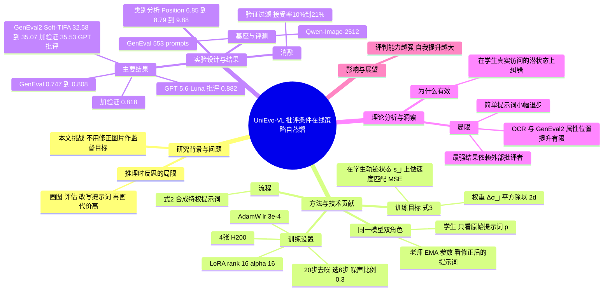

## 一、论文是干什么的？

现在的多模态模型（例如能看图、也能画图的统一模型）往往「又会画又会看」。这给了一个有趣的可能：让模型画一张图，再自己看一眼，指出问题（比如「要求画三只猫，你只画了两只」），然后据此改进提示词再画一次，画得往往更好。这种做法叫推理时反思，缺点是每次都要多画多看，又慢又贵。

这篇论文想解决的问题是：能不能把「画完再批评再重画」带来的好处，直接训练进模型里，让它**一次就画对**？打个比方：学生做完作业，老师批改后写下评语，学生下次不再需要老师盯着，一上来就能避开同样的错误。UniEvo-VL 就是这样一套训练配方，而且「老师」和「学生」其实是**同一个模型**，只是看到的信息不同。

## 二、核心方法与创新

**一个模型，两个角色。** 论文把同一个统一模型拆成两种模式：生成模式（画图）和理解模式（看图、写批评、改写提示词）。

整个流程可以用「带答案的老师」类比：

1. 学生拿到原始提示词 $p$，先画出一张草稿图。
2. 模型切换到理解模式，评估草稿，得到纠错反馈 $c$。
3. 根据反馈合成一个修正后的提示词 $\tilde{p} = M_\theta^{und}(p, c)$（论文式 2），它相当于「藏了答案提示的特权提示词」。
4. 可选的验证环节：检查修正提示词是否真的让图变好，变好才接受（论文中称为 post-revision verification）。
5. 训练：学生只看原始提示词 $p$，老师看修正提示词 $\tilde p$，两者在**学生自己的采样轨迹**的每一个去噪状态上，比较各自预测的结果，并让学生向老师靠拢。
6. 只更新学生的 LoRA 参数；老师是学生参数的指数滑动平均（EMA）。

**为什么叫「在线策略」（on-policy）？** 学生是沿着自己真实会走的去噪路径被纠正的，而不是看别人给的标准答案图。类比：驾校教练坐副驾，在你自己开出来的每个路口纠正你，而不是只给你看一段完美的录像。

**训练目标。** 论文的主目标（式 3）是在学生访问到的每个状态 $s_j$ 上，让学生预测与老师预测匹配，且梯度只流向学生：

$$
\mathcal{L}(\theta) = \mathbb{E}\, D\big(M_\theta^{gen}(\mathrm{sg}[s_j], p),\ \mathrm{sg}[M_{\bar\theta}^{gen}(\mathrm{sg}[s_j], \tilde p)]\big)
$$

其中 $\mathrm{sg}$ 表示停止梯度，$\bar\theta$ 是 EMA 老师参数。对于 Qwen-Image 这类基于流（flow）的生成模型，差异度量 $D$ 变成确定性的速度匹配（据 arXiv HTML 整理）：

$$
\ell_j^{flow}(\theta) = \frac{(\Delta\sigma_j)^2}{2d}\,\big\| M_\theta^{gen}(\mathrm{sg}[s_j], p) - \mathrm{sg}[M_{\bar\theta}^{gen}(\mathrm{sg}[s_j], \tilde p)] \big\|_2^2
$$

**与已有工作的区别**（论文自述）：不需要「修正后的图片」作为监督目标；不需要穿过评判模型反传奖励梯度（不是 RL 式的奖励优化）；并通过成对评测，把训练带来的收益和推理时反思的收益分开衡量。

## 三、使用了哪些模型和计算资源？

| 项目 | 内容 |
|---|---|
| 生成骨干 | Qwen-Image-2512（基于流的文生图模型） |
| 理解与反馈模式 | Qwen3-VL-8B（批评用 Thinking 版，改写提示词用 Instruct 版） |
| 对照的外部评判模型 | GPT-5.6-Luna（用于对比更强批评者的上限） |
| 微调方式 | LoRA，rank 16、alpha 16 |
| 优化器与学习率 | AdamW，学习率 $3\times10^{-4}$ |
| EMA 衰减 | 0.999（也试了 0.99 和 0.995） |
| 生成设置 | 1024×1024 分辨率，20 步去噪，CFG scale 4.0 |
| 批大小 | 本地 batch size 1，梯度累积 2 |
| 噪声时间步比例 | 0.3（20 步中选 6 步） |
| GPU | 4 张 NVIDIA H200 |
| 单次训练耗时、总步数 | 暂无相关信息（论文主文表示优化器更新次数只衡量学习进度，不代表固定计算预算，未给出墙钟时间） |
| 数据 | GenEval 评测 553 条提示词；GenEval2 评测 800 条；OCR 约 1018 条测试提示词，来自约 20000 条训练集合 |
| 采集开销 | 启用验证时，约 10% 到 21% 的采集尝试被接受，即每个被接受的训练对大约需要五到十次尝试 |

## 四、实验结果

主表（来自 arXiv HTML 的表 1，数值整理自 arXiv HTML，GenEval2 基线在摘要与表中写法略有出入，见文末说明）：

| 方法 | GenEval 总分 | GenEval 原子准确率 | GenEval2 Soft-TIFA | OCR 总分 |
|---|---|---|---|---|
| 基线 Qwen-Image-2512 | 0.747 | 95.30% | 32.58 | 0.771 |
| UniEvo-VL（Qwen-VL 自我批评） | 0.808 | 96.90% | 32.37 | 0.761 |
| UniEvo-VL（加验证） | 0.818 | 97.41% | 35.07 | 0.790 |
| UniEvo-VL（GPT-5.6-Luna 批评） | 0.882 | 98.76% | 35.53 | 0.775 |

大白话解读：

- 摘要主打的数字是 GenEval 从 0.747 提到 0.808，GenEval2 Soft-TIFA 从 32.97 提到 35.53（后者用的是外部更强批评者的结果）。
- 加上验证过滤后，纯自我批评可以达到 GenEval 0.818。
- 批评者越强，天花板越高：用 GPT-5.6-Luna 时 GenEval 达 0.882。论文也因此指出，评判能力更强的模型有望获得更大的自我提升。
- 按类别看（表 3a，Gemini 打分 0 到 10）：位置类 6.85 提到 8.79（Qwen-VL）和 9.88（Luna），计数类 7.86 提到 9.29 和 9.58，总体 8.96 提到 9.57 和 9.87。
- 提升集中在原本就画不好的难题上；对本来就容易的提示词，会有 1 到 4 分的小幅退步。
- 推理时反思在训练后依然有额外收益。
- 局限：不同任务提升不一致，OCR 并非在所有配置下都变好（无验证时 0.771 降到 0.761）；GenEval2 上位置和属性只有有限提升；单项语义检查、基准正确率和视觉质量三类指标可能不同步。
- 消融：EMA 衰减 0.999 优于 0.99、0.995；验证过滤有助于稳定。

数据不一致提醒：摘要中 GenEval2 的起点为 32.97，而论文表 1 的基线为 32.58，口径可能不同，本文表格采用表 1 数值；OCR 基线在表中为 0.771，另有一处写作 0.769，来源未确认。

## 五、潜在应用与已落地应用

潜在方向：

- 文生图产品的「一次出图更准」：把多轮反思的成本摊到训练阶段，降低线上推理开销。
- 其他统一多模态模型（图像编辑、视频生成）的自我改进，只要模型既能生成又能评判。
- 缺少人工标注或奖励模型的场景，用模型自己的批评做监督信号。

已落地应用：暂无相关信息（论文刚刚发布，未发现官方产品落地或开源仓库的明确说明）。

## 六、网络上的讨论与评价

- 搜索到的内容主要是 [DEV Community 上的一篇解读文章](https://dev.to/prabhakar_chaudhary_7afe4/unievo-vl-on-policy-self-distillation-for-multimodal-image-generation-4g4m)：认为这是一套具体可用的训练配方，赞赏沿着轨迹做蒸馏优于只监督修正后的最终图片；同时提醒结果在各任务间不一致、简单提示词会退步、最强结果依赖外部评判模型 GPT-5.6-Luna，因此「完全靠自己」的说法需要谨慎。
- 另有聚合站如 [hyper.ai](https://hyper.ai/en/papers/2609.38721) 和 [Hugging Face 论文页](https://huggingface.co/papers/2609.38721) 收录该论文，HF 票数为 270。
- 未检索到来自 Reddit、Hacker News、X 的针对该论文的专门讨论。

## 七、思维导图

