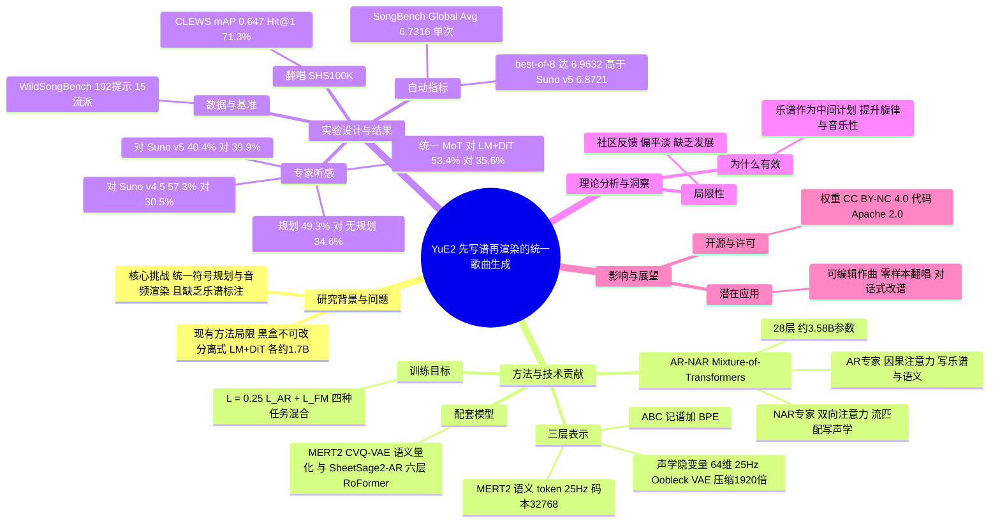

## 一、论文是干什么的？

想象你要做一首歌。专业音乐人通常不会一上来就录音，而是先在纸上写好「谱子」（旋律加和弦），再找人演唱、配器、混音。但今天大多数 AI 歌曲生成器（比如 Suno）更像是一个黑盒：你输入一段文字，它直接吐出一整首录好的歌，中间的「谱子」你看不到，也改不了。

YuE2 想做的事情，就是让 AI 也「先写谱，再演奏」。它用同一个模型，先写出一份人类能读懂的乐谱（旋律和和弦），再把乐谱变成歌词演唱加伴奏的完整歌曲音频。因为中间有乐谱，用户就可以改乐谱、再让 AI 重新渲染；也可以拿一首现成的歌，让模型先把它「听写」成乐谱，再换一种风格重新演绎（零样本翻唱，zero-shot cover）。论文声称在 WildSongBench 基准上，它的质量可与商业产品 Suno v5 一较高下，并且权重公开。

此外，论文还顺带发布了两个配套模型：MERT2（更强的音乐理解编码器）和 SheetSage2（把音频转写成简谱/乐谱的模型）。它们主要是为了给 YuE2 的训练「造数据」：把大量没有乐谱的音乐，自动标注上乐谱和语义标记。

## 二、核心方法与创新

### 1. 三层表示：乐谱、语义、声学

可以把整个流程类比成「写剧本、排演、拍电影」：

| 层次 | 类比 | 具体形式（据论文） |
|---|---|---|
| 符号层（Symbolic） | 剧本，也就是乐谱 | ABC 记谱法，再用 BPE 切成 token |
| 语义层（Semantic） | 排练，大致定下每一刻的音乐内容 | 25 Hz 的 MERT2 语义 token，码本 32768 项、32 维，约 375 bit/s |
| 声学层（Acoustic） | 最终拍出来的画面 | 25 Hz 连续声学隐变量，64 维，由 48 kHz 立体声 VAE 解码 |

VAE 沿用了 Stable Audio Open 的 Oobleck 结构，用六个残差下采样块把 48 kHz 立体声压缩 1920 倍。

### 2. 一个模型里的两种「大脑」：AR–NAR Mixture-of-Transformers

传统做法是用两个独立模型：先用语言模型（LM）一个字一个字地写出离散 token，再用扩散模型（DiT）把它变成音频。YuE2 把这两件事放进同一个 28 层的 Mixture-of-Transformers（MoT），总参数约 3.58B：

- 自回归（AR）专家：像写作文，从左到右一个 token 一个 token 地写，负责乐谱和语义 token（因果注意力）。
- 非自回归（NAR）专家：像画画，一次性对整段声学隐变量做全局修整，负责声学层（双向注意力，用流匹配 flow matching 训练）。
- 两个专家各有自己的归一化、QKV 与输出投影、MLP，但共享位置编码，并且在同一次注意力计算中互相看得见。这样声学部分可以直接「读到」乐谱和语义内容。

序列格式大致是：[ABC_START] 乐谱 [ABC_END] [MUSIC_START] 语义 token [MUSIC_END]，再接声学部分；输出端用类型相关的掩码，防止一个专家输出另一个专家的 token。整首歌被打包进一个 24576 位置的上下文，不会把一首歌拆到两个训练样本里。

### 3. 训练目标

据论文给出的损失函数，AR 部分是标准的负对数似然，NAR 部分是条件流匹配（预测速度场，目标为噪声减去干净隐变量），两者按 0.25 与 1 加权相加：

$$\mathcal{L} = 0.25\,\mathcal{L}_{\mathrm{AR}} + \mathcal{L}_{\mathrm{FM}}$$

其中 $\mathcal{L}_{\mathrm{AR}}$ 是在被监督的 token 集合 $\mathcal{A}$ 上平均的 $-\log p_\theta(w_i \mid w_{<i})$，$\mathcal{L}_{\mathrm{FM}}$ 是对 64 维声学隐变量 $z$ 做的速度回归均方误差。

训练时混合四种任务：完整的「乐谱 + 语义 + 声学」，以及分别去掉乐谱、去掉语义、两者都去掉的三种变体。这让同一个模型既能规划着写，也能直接写。具体采样概率：暂无相关信息（正文未找到）。

### 4. 配套模型：给没有乐谱的音乐「补课」

- MERT2：音乐理解编码器，课程式训练：基础预训练（多视角目标的掩码预测）、全曲适配（Stage 2-FS，双向注意力）、因果适配（Stage 2）、监督微调（CTC、mel、chroma 目标，Stage 3）、语义量化（Stage 4，CVQ-VAE）。其预训练目标用到了冻结的 MuQ 和 Qwen2-Audio-Instruct 编码器。项目页称 MERT2 编码器约 632M 参数（未在论文中核实）。
- SheetSage2：把音频转成 lead sheet（旋律加和弦的简谱）。其中 SheetSage2-AR 是六层自回归 RoFormer 解码器，配 MERT2-FS 编码器（24 层、1024 维 Conformer，带 ConvNeXt 前端，25 Hz 输出）和低秩适配器。训练数据混合了人工标注数据和 MIDI 渲染音频。
- 流程：先用 SheetSage2 给海量音频补上乐谱，用 MERT2 分词器补上语义 token，用 VAE 补上声学隐变量，然后训练 YuE2。

### 5. 衍生能力

- 乐谱编辑：改动乐谱后重新渲染，支持由外部语言模型智能体（agent）驱动的对话式改谱。
- 零样本翻唱：音频到乐谱再到新风格音频。
- 项目页提到支持纯器乐生成及多种渲染模式。

## 三、使用了哪些模型和计算资源？

| 项目 | 信息 |
|---|---|
| 主模型 | YuE2-3B，AR–NAR MoT，28 层，约 3.58B 参数 |
| 是否基于现成 LLM 初始化 | 论文中未见基于某个现成 LLM（如 Qwen）初始化的说明，暂无相关信息 |
| 对照基线 | 分离式 LM + DiT，两者各约 1.7B（共 3.4B） |
| 辅助模型 | MERT2（编码器，项目页称约 632M）、SheetSage2（六层 AR 解码器）、Oobleck 风格 48 kHz VAE |
| 训练数据规模 | YuE2 约 346K 小时（论文）；MERT2 约 700K 小时、SheetSage2 约 28.4K 小时（仅见于项目页转述，未在论文 HTML 中核实） |
| 数据来源 | 项目页称主要为 CC0 音乐和合成数据，大部分合成数据由 Tokenwave.AI 授权提供 |
| 训练 GPU 型号与数量 | 暂无相关信息（已检查 arXiv HTML 全文，未找到） |
| 训练耗时 | 暂无相关信息 |
| 推理耗时（每首歌） | 暂无相关信息；项目文档只提到 NOIZ 提供名为 YuE2-Turbo 的加速工具包，未给速度数字 |
| 推理硬件要求 | GitHub 说明：支持 BF16 的 NVIDIA GPU，至少 24 GB 显存，Linux + Python 3.12（3B 模型） |
| 流匹配采样步数、CFG 强度 | 暂无相关信息 |

## 四、实验结果

评测基准是 WildSongBench（WSB），共 192 条提示，覆盖 15 个流派桶。

### 自动指标

| 指标 | YuE2 单次生成 | YuE2 best-of-8 |
|---|---|---|
| SongBench Global Avg | 6.7316 | 6.9632 |
| Musicality | 5.9075 | 6.2666 |

论文表格中 Suno v5 的 SongBench Global Avg 为 6.8721，YuE2 的 best-of-8 为 6.9632，略高于它。其他报告数字（据 arXiv HTML 表 1）：AudioBox 制作质量 8.2598、Qwen3-Omni 对齐度 4.6819、音素错误率 0.0844（对应的具体设置请以原文为准）。

### 专家听感评测（偏好比例）

| 对比 | 结果 |
|---|---|
| 有符号规划 vs 无规划 | 49.3% 偏好有规划，34.6% 偏好无规划 |
| YuE2 vs Suno v5 | 40.4% 对 39.9%，几乎持平（best-of-8） |
| YuE2 vs Suno v4.5 | 57.3% 对 30.5%，YuE2 占优 |
| 对六个商业系统的音频质量 | 平均 tie-adjusted 偏好 58.9%（best-of-8） |
| 统一 MoT vs 分离 LM+DiT（均带规划） | 总体质量 53.4% 对 35.6%；音频质量 48.5% 对 29.6% |

### 翻唱（SHS100K，948 首作品）

用 CLEWS 评测时 mAP 为 0.647，Hit@1 为 71.3%；用 Discogs-VINet 评测时 mAP 为 0.288，Hit@1 为 37.5%。

### 配套模型

MERT2 在 MARBLE 的 15 项指标中有 14 项超过此前最佳；SheetSage2 在 15 个基准与指标组合中有 12 个领先（据二手文章转述论文摘要，未逐项核对）。

局限性：论文 HTML 中没有专门的局限性小节；社区反馈见下文。

## 五、潜在应用与已落地应用

潜在应用：

- 音乐人辅助创作：先出乐谱草稿，人工修改后再渲染，把「作曲」与「演绎」分开控制。
- 翻唱与风格转换：把已有歌曲转写后换风格重做。
- 对话式音乐编辑：让语言模型智能体帮你改旋律、和弦。
- 作为 MERT2 和 SheetSage2 的下游：音乐检索、转写、教学等。

已落地情况（据项目页与 GitHub）：

- 模型与代码已公开：[GitHub 仓库](https://github.com/multimodal-art-projection/YuE)（v0.1.6，2026-09-29）、[Hugging Face 上的 YuE2-3B](https://huggingface.co/m-a-p/YuE2-3B)、[项目主页](https://map-yue2.github.io/)。
- 有 NOIZ 托管的免费网页演示（yue.noizai.net）。
- 许可证：模型权重 CC BY-NC 4.0（并允许个人用户和内容创作者将产出变现），代码和文档 Apache 2.0；企业商用需联系团队。
- HN 讨论中有用户提到已有 ComfyUI 集成，这是评论者所述，未经独立核实。

## 六、网络上的讨论与评价

- [Hacker News 讨论串](https://news.ycombinator.com/item?id=49652028)：约 109 分、101 条评论。大量评论是围绕「AI 音乐是否有艺术价值、会不会淹没人类作品」的泛泛争论，真正评测模型的评论不多。
- 偏正面的声音：有评论者认为 YuE2 是少数不只是「文字生成音频」的开源权重模型，可以拿现成乐谱转成 ABC 记谱来做翻唱；有人把它当作工具而非替代品，欣赏先作曲再渲染的流程；有音乐人认为它把作曲与演绎分离，可融入 DAW 工作流；也有人称赞它能本地运行。
- 偏批评的声音：有评论者说它比同类更干净，但音乐很平淡，歌曲停留在前奏、缺乏发展，作曲学院味重；有人推测训练数据主要是 CC0 免版税音乐，所以听感通用、平淡；有人指出某些流派标签与生成内容不符。
- 其他：有若干博客和文章（如 Medium 上的 Open-Source Suno Killer 一文、Civitai 文章）在推介，标题带有营销色彩，仅有搜索摘要可见，内容未逐篇核实，评价请自行判断。
- 暂无来自 Reddit 或 X 的具体讨论内容。

## 七、思维导图

