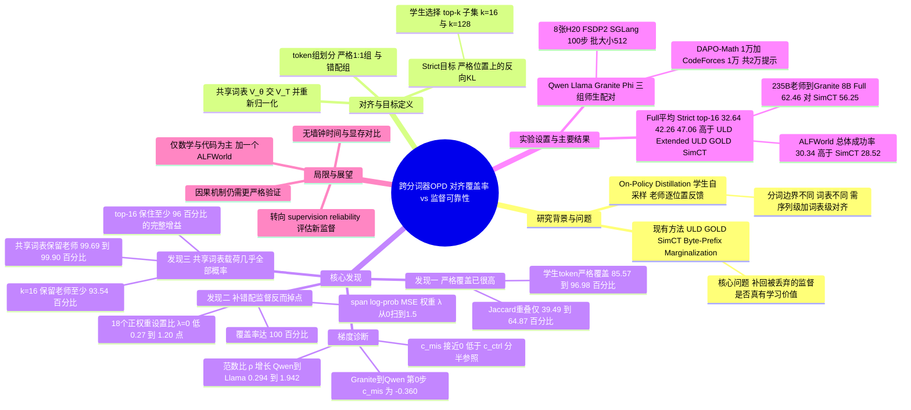

## 一、论文是干什么的？

先解释几个背景词。**知识蒸馏**（knowledge distillation）就是让一个小模型（学生）向一个大模型（老师）学习。传统做法是拿现成的数据让学生模仿老师；而**在线策略蒸馏**（On-Policy Distillation，简称 OPD）换了一种思路：让学生自己先写一段回答，然后老师在学生写出来的每一个位置上给出「如果是我，下一个词会怎么选」的反馈。这就像学生先自己做一遍题，老师再拿着学生的草稿逐步批改，比单纯抄标准答案更贴合学生真实会犯的错。

麻烦出在**分词器**（tokenizer）上。大模型不是按字读文字的，而是先把文本切成「词块」（token），不同模型家族（比如 Qwen、Llama、Granite、Phi）的切法和词表都不一样。同一句话，一个模型可能切成 3 块，另一个切成 4 块；而且下一个词的候选集合（词表）也不是同一个。想让两个模型「逐位置比较预测」，就得同时解决两件事：序列层面对齐（哪几块对应同一段文字）和词表层面对齐（候选词怎么对应）。已有工作（如 ULD、GOLD、SimCT 等）都在想办法把更多被丢掉的片段「救回来」，让监督覆盖得更全。

本文提出一个反直觉的问题：**多救回来的那部分监督，真的对学习有帮助吗？** 作者用一个很朴素的实验回答：先只在「严格一对一」（一个学生 token 对一个老师 token、覆盖同一段文字）的位置上做蒸馏，然后再加上对不齐片段的监督，看效果怎么变。结论是：严格一对一的位置已经覆盖了学生绝大多数 token，加上对不齐片段的监督，覆盖率到了 100%，准确率反而下降。于是作者主张，研究重点应该从「最大化对齐覆盖率」转向「保证监督信号的可靠性」。

打个比方：老师批改学生作业，绝大多数题目两人用的是同一套记号，批改很顺畅；剩下少数题目两人写法差得太远，老师硬要「翻译」后再批改，反而让学生被误导。与其逐题硬翻译，不如把精力放在那些能直接对上的题目上。

## 二、核心方法与创新

这篇论文更像一篇「实证分析加诊断」的研究，而不是提出一个全新的复杂算法。核心是三个层层递进的发现，以及一个简单的「紧凑」训练目标。

### 1. 先把几个概念讲清楚：严格对齐与错配组

作者对学生生成的回答，分别用学生和老师的分词器各切一遍，找出两边都认可的切分边界，把回答划成 $R$ 对「对齐的 token 组」。每一对组里，学生的 token 与老师的 token 拼起来是同一段文字。

- **严格一对一组**（strict 1:1 group）：学生一个 token、老师一个 token，覆盖同一段文字。这些位置称为严格位置。
- **错配组**（mismatch group）：至少有一边需要多个 token 才能拼出同一段文字。

词表层面，作者取两个模型词表的交集作为**共享词表** $\mathcal{V}_{\cap}$（排除特殊 token 和有歧义的匹配）。在严格位置上，把学生和老师各自的预测限制并重新归一化到共享词表上，得到 $\bar{\pi}_\theta$ 和 $\bar{\pi}_T$。

**严格跨分词器目标**（Strict Cross-Tokenizer objective）就是在所有严格位置上，对共享词表上的分布求反向 KL（reverse KL，即以学生分布为基准衡量与老师分布的差异），再对学生自己采样的回答取期望：

$$\mathcal{L}_{1:1}(\theta)=\mathbb{E}_{x,\,y\sim\pi_\theta}\Big[\sum_{r\in\mathcal{A}_{1:1}(y)}\mathrm{KL}\big(\bar{\pi}_\theta\,\|\,\bar{\pi}_T\big)\Big]$$

### 2. 发现一：词表重叠度低，不代表严格对齐少

用 Jaccard 重叠 $J_{\mathrm{vocab}}=|\mathcal{V}_\theta\cap\mathcal{V}_T|/|\mathcal{V}_\theta\cup\mathcal{V}_T|$ 衡量静态词表差异，在三组师生模型上只有 39.49% 到 64.87%。但在学生真实生成的回答上，严格一对一的学生 token 覆盖率高达 85.57% 到 96.98%（老师侧 82.82% 到 97.26%）。其中词表重叠最低的 Granite 到 Phi（39.49%），覆盖率反而最高。原因是：静态词表把每个条目等权计数，但真实文本里常见词块的出现频率极不均匀，所以词表差距很大，也可以和「严格对齐很频繁、概率质量集中在共享词表条目上」同时存在（这是论文的解释，作者没有逐词块验证）。

### 3. 发现二：给错配组加上「片段对数概率 MSE」，覆盖率到 100%，准确率却下降

对每个错配组 $r$，作者算出学生和老师各自生成这一整段文字的路径概率 $q_\theta^{(r)}$ 与 $q_T^{(r)}$（各 token 条件概率的连乘），然后用均方误差匹配它们的对数：

$$\mathcal{L}_{\mathrm{span}}(\theta)=\mathbb{E}\Big[\sum_{r\in\mathcal{A}_{\mathrm{mis}}(y)}\big(\log q_\theta^{(r)}-\log q_T^{(r)}\big)^2\Big],\qquad \mathcal{L}_\lambda=\mathcal{L}_{1:1}+\lambda\,\mathcal{L}_{\mathrm{span}}$$

扫描 $\lambda\in\{0,0.25,0.5,0.75,1.0,1.25,1.5\}$。三组师生模型全部在 $\lambda=0$（即只用严格监督）时综合平均最高；18 个正权重设置全部比各自的严格基线低 0.27 到 1.20 个百分点。

### 4. 发现三：共享词表几乎装下了全部概率质量，学生挑的前 16 个就够用

在严格位置上，作者测量共享词表保留了多少概率质量：老师 99.69% 到 99.90%，学生 98.99% 到 99.81%。也就是说，被丢掉的词表条目合起来几乎没有概率。更进一步，作者让学生在每个严格位置挑出自己概率最高的 $k$ 个共享词表条目（**学生选择的 top-$k$ 子集**，记作 $\mathcal{K}_k^{(r)}$），$k=16$ 时仍然保留老师至少 93.54%、学生至少 94.55% 的概率质量。

于是紧凑训练目标就是：把严格目标限制在 $\mathcal{K}_k^{(r)}$ 上，两边分布在这个子集上重新归一化后再算反向 KL。本文比较了 $k=16$、$k=128$ 和完整共享词表三种做法。

### 5. 为什么错配监督会拖后腿：梯度诊断

作者在只用严格损失训练的检查点（第 0、20、60、100 步）上，对同一批回答分别求两个损失的梯度 $g_{1:1}=\nabla_\theta\mathcal{L}_{1:1}$、$g_{\mathrm{mis}}=\nabla_\theta\mathcal{L}_{\mathrm{span}}$，并计算两个量：

$$c_{\mathrm{mis}}=\frac{\langle g_{1:1},g_{\mathrm{mis}}\rangle}{\|g_{1:1}\|_2\|g_{\mathrm{mis}}\|_2},\qquad \rho=\frac{\|g_{\mathrm{mis}}\|_2}{\|g_{1:1}\|_2}$$

结果是：错配梯度与严格梯度的夹角余弦 $c_{\mathrm{mis}}$ 在绝大多数检查点接近 0（Granite 到 Qwen 在第 0 步为负，达到 -0.360），并且始终低于「把严格位置随机分成两半、两半梯度之间的余弦」$c_{\mathrm{ctrl}}$；而范数比 $\rho$ 在训练中持续上升（例如 Qwen 到 Llama 从 0.294 升到 1.942）。通俗地说：错配监督给出的更新方向和主线基本不一致，而且越训练它「嗓门」越大，固定的正权重就会让这股杂音越来越主导训练。作者措辞谨慎，说这些诊断「可能有助于解释」精度下降，而不是严格证明因果。

## 三、使用了哪些模型和计算资源？

论文没有训练新的基础模型，而是在现有开源模型之间做蒸馏。

| 师生配对（老师到学生） | 老师 | 学生 |
|---|---|---|
| Qwen 到 Llama | Qwen2.5-7B-Instruct | Llama-3.2-3B-Instruct |
| Granite 到 Phi | Granite-4.1-8B | Phi-4-mini-instruct |
| Granite 到 Qwen | Granite-4.1-8B | Qwen2.5-7B-Base（基座模型） |
| 大老师实验（附录 D） | Qwen3-235B-A22B-Instruct-2507 | Granite-4.1-8B |
| ALFWorld 实验（附录 E） | Qwen3-4B-Instruct-2507 | Llama-3.2-3B-Instruct |

词表规模（附录 Table 4）：Qwen 与 Llama 的组合中，老师词表 151,665、学生 128,256、交集 109,567；Granite 与 Phi 的组合中，老师 100,352、学生 200,029、交集 85,034；Granite 与 Qwen 的组合中，老师 100,352、学生 151,665、交集 99,163。

**训练数据**：共同的 20,000 条提示池，包括从 DAPO-Math-17K 随机取 10,000 条数学题，以及从 CodeForces 随机取 10,000 条代码题，不做去重，只保留学生分词后不超过 2,048 个 prompt token 的样本（因此保留的样本数随学生分词器而变）。

**计算资源与训练设置**：

- GPU：单节点 8 张 NVIDIA H20，使用 FSDP2，rollout 引擎为 SGLang，bfloat16 计算、梯度检查点、按 2,048 token 分块计算损失。
- 训练：100 次在线迭代，全局批大小 512 条回答（每个 prompt 只生成 1 条回答），优化器 AdamW，学习率 $1\times10^{-6}$，$\beta_1,\beta_2=0.9,0.98$，权重衰减 0，梯度裁剪 1.0；采样温度 1.0、top-p 0.95，最大生成长度 8,192；检查点每 10 步保存一次。所有蒸馏模型都在第 100 步评测。
- 对比基线 ULD、Extended ULD、GOLD、SimCT 均使用 KDFlow 框架的实现，统一 KD 权重 1.0，不混合交叉熵，师生温度均为 1.0。
- 每个完整计算单位的耗时：论文只给出了评测里的硬限制，即 LiveCodeBench 每个候选代码的执行超时为 10 秒，每个候选的总评测等待时间上限 120 秒；每一步迭代、整次训练的墙钟时间、GPU 小时数，**暂无相关信息**。
- 在线概率质量探针使用完整的 20k 提示，每个提示由蒸馏前的学生生成 1 条回答。
- 梯度诊断：在第 0、20、60、100 步检查点上，对同样的 512 条提示生成回答并回放，取各回放单元的中位数。
- 论文还给出一个匿名代码仓库链接（[4open.science 匿名镜像](https://anonymous.4open.science/r/Cross-Tokenizer-OPD)，我访问时返回 401，未能核实内容），没有其他开源信息。

## 四、实验结果

评测指标为准确率：数学用 mean@32（每题采样 32 个回答），代码用 mean@8。数学包含七个基准：MATH500、GSM8K、AIME-2024、AIME-2025、AIME-2026、AMC23、Minerva-Math；代码包含三个基准：HumanEval、MBPP、LiveCodeBench（release_v6，1,055 题）。Full 是数学平均与代码平均的等权平均。

### 1. 加上错配监督会掉点

以下是严格监督（$\lambda=0$）对比各正权重下的 Full 平均（Table 11 到 13，单位 %）：

| 师生配对 | $\lambda=0$ | $\lambda=1.5$ | 下降 |
|---|---|---|---|
| Qwen 到 Llama | 32.86 | 31.84 | 1.02 |
| Granite 到 Phi | 42.49 | 41.69 | 0.80 |
| Granite 到 Qwen | 47.35 | 46.55 | 0.80 |

三组配对中，数学平均与代码平均也都是 $\lambda=0$ 最高。

### 2. 主结果：严格监督优于现有跨分词器方法（Table 2，Full 平均 %）

| 方法 | Qwen 到 Llama | Granite 到 Phi | Granite 到 Qwen |
|---|---|---|---|
| Base（蒸馏前学生） | 26.96 | 36.55 | 29.56 |
| ULD | 29.12 | 38.63 | 27.12 |
| Extended ULD | 31.13 | 38.35 | 32.57 |
| GOLD | 27.16 | 41.75 | 46.55 |
| SimCT | 31.59 | 41.68 | 46.10 |
| Strict full（完整共享词表） | 32.86 | 42.49 | 47.35 |
| Strict top-16 | 32.64 | 42.26 | 47.06 |
| Strict top-128 | 32.38 | 42.54 | 47.65 |

几点读法：

- Strict full 与两个紧凑变体在三组配对里，数学与 Full 平均都高于四个对比方法。
- Strict top-16 相对完整共享词表保留了至少 96% 的 Full 平均提升（相对 Base 的增益），且在 Full 平均上领先最强对比方法 0.51 到 1.05 个百分点。
- 把 $k$ 从 16 增大到 128 没有稳定的额外收益，说明紧凑子集足够。
- 值得注意：Granite 到 Qwen 这一组里 ULD 的 Full 平均（27.12）反而比蒸馏前的 Base（29.56）更低，代码平均从 34.51 掉到 20.87。

### 3. 大老师与智能体任务

- **235B 老师到 8B 学生**（Qwen3-235B-A22B-Instruct-2507 到 Granite-4.1-8B，附录 D）：Base 的 Math、Code、Full 为 39.30、63.32、51.31，老师为 66.00、82.35、74.17。Strict top-16 为 51.29、73.62、62.46，在 Math、Code、Full 上都是被评估的蒸馏方法里最高；SimCT 的 Full 为 56.25，GOLD 为 54.01，ULD 为 52.43，Extended ULD 为 51.16。这一实验在数学里额外加入了 HMMT 2025 二月与十一月两个基准。
- **ALFWorld**（Qwen3-4B-Instruct-2507 到 Llama-3.2-3B-Instruct，附录 E，三次评测取平均，每次 128 个回合、最多 50 轮交互）：成功率方面，Base 总体为 10.68，老师为 29.56，Strict top-16 为 30.34（seen 26.04，unseen 34.64），SimCT 为 28.52，Extended ULD 为 24.48，GOLD 为 2.61，ULD 为 1.43。平均交互轮数上 Strict top-16 为 39.78，是被评估的蒸馏方法中最低。注意这一部分的 Strict top-16 总体成功率甚至略高于老师本身（30.34 对 29.56），但论文没有对这个差距做显著性检验。

### 4. 诊断小结

- 严格覆盖率：全程 100 步、共 51,200 条回答（每步 512 条）的统计显示，三个窗口（第 1 到 20 步、41 到 60 步、81 到 100 步）之间，学生覆盖率的变动不超过 1.43 个百分点，老师覆盖率不超过 3.75 个百分点。
- 概率质量：$k=16$ 时，三组配对里老师保留 93.54% 到 97.67%，学生保留 94.55% 到 98.44%；从 $k=16$ 增加到 $k=128$，老师最多再多 3.44 个百分点，学生最多再多 2.70 个百分点。
- 作者的措辞偏谨慎：论文自己强调这是对「所评估的目标与迁移设置」的结论，不是对所有跨分词器场景的普遍定理。

## 五、潜在应用与已落地应用

**论文自己明确的结论与建议**：

- 做跨分词器蒸馏时，把预算放在「严格一对一的位置加紧凑的 top-$k$ 共享词表监督」上，比追求覆盖所有被丢弃的片段更划算；评估新增监督时，应当看它与严格分布匹配之间的相互作用，以及对下游表现的实际影响，而不是只看覆盖率数字。

**作者的推测与可能的延伸（论文并未实验验证）**：

- 论文只在数学推理、代码生成（外加一个 ALFWorld 附录实验）上验证，若要用于对话、多语言或长文本场景，需要重新检验严格覆盖率是否同样高。
- 紧凑 top-$k$ 目标可以减少每个位置参与计算的词表条目数量，但论文没有给出显存、吞吐或训练时间对比，因此「更省资源」只是直觉推断，原文没有证据。

**已落地情况**：论文只提供了一个匿名代码链接，没有公开的产品部署或工业落地案例；作者隶属 Alibaba Cloud Computing，但论文中没有提到该方法已被用于具体产品，暂无相关信息。

## 六、网络上的讨论与评价

- Hugging Face 论文页面（[Paper page](https://huggingface.co/papers/2610.08448)）显示 186 个点赞；页面上有 2 条评论：一条是论文提交者（用户 Nothing2Say，显示名 JGC，与作者 Guochao Jiang 的邮箱前缀 jgc 相符，这是我的推断）把摘要贴出来，另一条是 Librarian Bot 的自动相关论文推荐，其中列出了同主题的论文，如 Beyond Token Alignment: Event Completion for Cross-Tokenizer On-Policy Distillation、Look Before You Select: Rethinking Vocabulary Sparsification in On-Policy Distillation 等。没有独立读者的实质性评价。
- 检索到的是论文索引或收录页面，而不是评论：[hyper.ai 论文页](https://hyper.ai/en/papers/2610.08448)、GitHub 上的两个个人阅读清单条目（[jjakimoto/research-issues #2058](https://github.com/jjakimoto/research-issues/issues/2058)、[AtsunoriFujita/paper-reading-notes #202](https://github.com/AtsunoriFujita/paper-reading-notes/issues/202)）。我只确认了这些页面存在并收录了该论文，没有核实其中是否包含独立评价。
- Hacker News（Algolia 检索）对标题与 arXiv 编号均无结果；Reddit 直接访问被拦截（403 类阻断），改用网页搜索（英文标题加编号、中文关键词、加 reddit/twitter/zhihu/blog 关键词各一轮）也只返回论文索引页和相关论文，Reddit、X、知乎、博客上暂未发现公开讨论。论文发表仅数天，这并不奇怪。
- 以下是基于论文自身内容的几点观察，不是社区评价：
  - 全部实验只在一组较小规模的设置里做（训练 100 步，每个 prompt 只采样 1 条回答），论文里没有看到多次随机种子或置信区间，细小差距（例如 Strict full 与 top-16 之间 0.2 个百分点）是否稳定，论文没有说明。
  - 作者自己用了谨慎措辞（如「可能有助于解释」），梯度诊断是相关性证据而非因果证明。
  - 部分对比基线（如 GOLD）在个别配对上表现很强（Granite 到 Qwen 的 Full 为 46.55，与 Strict top-128 的 47.65 只差约 1.1 个百分点），说明差距并非处处很大。

## 七、思维导图

