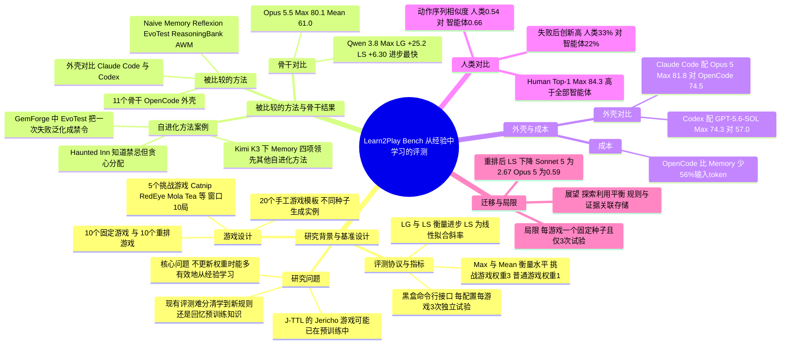

## 一、论文是干什么的？

大模型智能体最近很火，但有一个问题一直没被说清楚：当一个智能体在重复做某类任务时越做越好，它到底是「真的从经验里学到了新规则」，还是「只是把预训练时就背过的知识翻出来用」？比如让它在网页上订机票、修代码，这些场景的规则网上到处都是，模型很可能早就见过。

这篇论文提出的 **Learn2Play Bench**，思路是干脆让智能体去玩一批「全新设计、规则反直觉」的文字游戏。打个比方：这像是把一个学霸扔进一个从没见过的桌游房间，没有说明书，只能边玩边摸索规则，并且要把前几局的心得用到后几局。论文里举的例子是一个职场游戏：在这个游戏里偷同事的午饭反而能让你升职，努力工作却没用。现实职场经验在这里帮不上忙，智能体只能靠游戏反馈去发现真规则。

整套基准有 20 个人工设计的游戏模板，每个模板可以用不同随机种子生成不同实例；游戏反馈是确定性的、自动打分，所以实验可复现。论文用它比较了不同的骨干模型、不同的自进化方法（也就是「怎么把经验存下来再用」）、不同的智能体外壳（harness，可以理解为包在模型外面的那套工具和流程），还招募了大学生玩同样的游戏，做人机对比。项目页面见 [项目网站](https://liushiliushi.github.io/learn2play-bench-website/)，代码见 [GitHub 仓库](https://github.com/liushiliushi/Learn2Play-Bench)。

## 二、核心方法与创新

这是一篇评测型论文，作者明确说目标不是提出新的适应方法，而是在受控条件下评估已有方法学得多好；评测聚焦于不更新模型权重的学习。

### 1. 游戏设计的四条原则

- 规则新颖：隐藏规则在已有游戏里找不到，并且刻意设计成与常识相冲突。
- 自动打分：每局自动给分，不需要人工评判。
- 可复现：结果是确定性的，可以重放、检查错误。
- 跨局受控变化：保持核心规则不变，只改变可见的场景，用来测试知识迁移。

### 2. 两种划分方式

- 固定游戏（10 个）与重排游戏（10 个）：固定游戏每局都是同一个实例，玩家可以越来越熟悉同一张地图或配方；重排游戏每局换一个实例（换菜单、换客人、换角色），但背后规则不变，考察能否把学到的规则搬到新情境。
- 挑战游戏（5 个）与普通游戏（15 个）：作者先用几个智能体做预实验估计难度，选出 5 个挑战游戏，分别是 Catnip、DreamGarden、Mola Tea、RedEye、Roadside Observatory。挑战游戏评分窗口为 10 局，普通游戏为 5 局。

打个比方：固定游戏像反复挑战同一道迷宫，重排游戏像每次换迷宫、但迷宫的建造规律不变。

### 3. 交互协议

智能体通过黑盒命令行接口玩游戏：环境描述状态并列出合法动作，智能体选一个动作，环境返回观察结果，局末给出分数。智能体拿不到游戏源码，也拿不到求解器。每个配置、每个游戏要求独立跑 3 次试验（trial），每次试验开始时没有任何之前试验的记忆；同一次试验内能保留多少之前的经验，取决于外壳。

### 4. 四个指标

分数先按每个游戏的参考分数归一化。

- Max：每次试验窗口内的最高终局分，再对各次试验取平均，衡量「能达到的最好水平」。
- Mean：所有评测局的平均分，衡量稳定性。
- Learning Gain（LG）：窗口里最后几局与最初几局的平均分之差，衡量净进步。
- Learning Slope（LS）：对所有评测局的分数做线性拟合，取每局的斜率，衡量整体学习速度。

跨游戏汇总时，挑战游戏权重为 3，普通游戏权重为 1，所以 5 个挑战游戏与 15 个普通游戏各占 50% 的总权重。

### 5. 被比较的六种经验保留方法

- Naive：只保留当前局的对话，局间全部丢弃，相当于没有跨局经验。
- Memory：把前面各局完整、未经修改的交互历史原样放进新一局的提示词，只有超出上下文预算时才丢掉最旧的几局。
- Reflexion：每局结束后反思，得出关于已发现规则、成败动作、下一步的简短教训，累积后放进提示词。
- EvoTest：根据历史和结果，演化出一段指导提示词和一个状态提取程序。
- ReasoningBank：把每局成败提炼成少量可复用的推理教训。
- Agent Workflow Memory（AWM）：从成功的历史中归纳出多步工作流，失败的局不被使用。

## 三、使用了哪些模型和计算资源？

论文没有训练新模型，只做评测，全部通过外部模型调用完成。

**骨干模型**（均在 OpenCode 外壳下比较，共 11 个）：GPT-6 Astra、Claude Opus 5.5、Claude Opus 5、Claude Sonnet 5、Gemini 3.5 Flash、Gemini 3.7 Flash、GPT-5.6-SOL、GPT-5 Mini、DeepSeek V4 Pro、Kimi K3、Qwen 3.8 Max。各模型的参数量：暂无相关信息。

**自进化方法对比使用的骨干**：Kimi K3、Claude Opus 5、GPT-5 Mini。

**外壳对比**：OpenCode 对比 Claude Code（配 Opus 5），OpenCode 对比 Codex（配 GPT-5.6-SOL）。

**计算资源**：
- GPU 型号与数量：暂无相关信息（都是商业或第三方 API，未提及自有 GPU）。
- 评测规模：论文称共 31 个智能体配置，每个配置每个游戏 3 次完整试验，共 620 个配置与游戏的组合单元；GPT-6 Astra 的账单对应 600 个已完成的局。
- 动作预算：一个 SynergyCorp 案例里提到 30 步动作预算。
- 价格依据：除 Opus 5.5 与 GPT-6 Astra 外，用 2026 年 8 月 30 日的价格快照估算；Opus 5.5 用 2026 年 10 月 7 日的 Anthropic 标准价格；GPT-6 Astra 用实验负责人确认的总账单约 150 美元，除以 600 局，得到每局约 0.25 美元（预检、重试等费用未单独列出）。
- 每局成本（标准价格估算，来自论文 Table 12）：OpenCode 配 GPT-5 Mini 为 0.0063 美元，配 DeepSeek V4 Pro 为 0.021 美元，配 Kimi K3 为 0.313 美元，配 Opus 5 为 2.57 美元，Claude Code 配 Opus 5 为 0.647 美元，Codex 配 GPT-5.6-SOL 为 0.144 美元。
- 每局 token 用量：Kimi K3 在 OpenCode 下约 0.56M，Claude Sonnet 5 约 0.73M；Memory 配 Opus 5 约 3.52M。
- 每个完整计算单位的耗时（每局或每次试验的墙钟时间）：暂无相关信息，论文报告的是 token 与成本，没有给出时间。
- 人类实验：每个游戏 21 到 30 名大学生参与，不允许使用 AI 工具或代码，有报酬，得分最高者有额外奖励。

## 四、实验结果

以下数字均来自论文表格，分数为归一化后的百分制加权值。

### 1. 骨干模型对比（OpenCode 外壳）

| 骨干 | Max | Mean | LG | LS |
|---|---|---|---|---|
| Claude Opus 5.5 | 80.1 | 61.0 | +23.0 | +5.22 |
| GPT-6 Astra | 76.2 | 56.1 | +23.8 | +5.88 |
| Claude Opus 5 | 74.5 | 53.8 | +21.3 | +5.13 |
| Qwen 3.8 Max | 72.5 | 51.1 | +25.2 | +6.30 |
| Gemini 3.5 Flash | 72.0 | 52.2 | +19.8 | +5.37 |
| Kimi K3 | 68.5 | 50.2 | +17.1 | +4.24 |
| Gemini 3.7 Flash | 58.3 | 39.9 | +10.7 | +2.47 |
| GPT-5.6-SOL | 57.0 | 41.1 | +14.5 | +3.71 |
| Claude Sonnet 5 | 55.9 | 35.6 | +15.7 | +3.72 |
| DeepSeek V4 Pro | 54.2 | 38.2 | +14.7 | +3.66 |
| GPT-5 Mini | 34.0 | 22.3 | +9.2 | +1.83 |

要点：Opus 5.5 的 Max 与 Mean 最高，但进步最快的是 Qwen 3.8 Max（LG +25.2、LS +6.30）。也就是说，分数最高的模型不一定是进步最多的模型。日志显示，较强的模型会检验自己对规则的理解、遇到不符预期的观察就修正；较弱的模型有时会重复过去有效但现在已失效的动作，或一次改动好几个因素，分不清是哪个因素起作用。例如在 Poisoner（给国王选菜、从接受或拒绝中推断口味）里，一次 GPT-5 Mini 的运行总是按菜单位置选菜，不利用以前的反馈；Kimi K3 则用反馈来决定下一个要测试的食物属性。

### 2. 自进化方法对比

| 骨干 | 方法 | Max | Mean | LG | LS |
|---|---|---|---|---|---|
| Kimi K3 | OpenCode（对照） | 68.5 | 50.2 | +17.1 | +4.24 |
| Kimi K3 | Memory | 63.3 | 48.0 | +16.9 | +4.69 |
| Kimi K3 | EvoTest | 62.4 | 48.0 | +1.8 | +1.01 |
| Kimi K3 | Reflexion | 61.6 | 40.4 | +14.8 | +3.35 |
| Kimi K3 | ReasoningBank | 59.9 | 40.1 | +8.3 | +2.59 |
| Kimi K3 | AWM | 56.1 | 37.0 | +4.8 | +0.62 |
| Kimi K3 | Naive | 54.7 | 31.9 | +0.3 | +0.42 |
| Opus 5 | EvoTest | 66.1 | 51.3 | +9.4 | +2.52 |
| Opus 5 | Reflexion | 64.8 | 48.8 | +11.6 | +2.93 |
| Opus 5 | Memory | 60.9 | 48.2 | +11.4 | +2.87 |
| Opus 5 | ReasoningBank | 60.2 | 45.3 | +12.3 | +2.85 |
| Opus 5 | Naive | 53.4 | 36.6 | -5.1 | -1.08 |
| Opus 5 | AWM | 50.7 | 37.8 | +0.7 | +0.43 |

三个骨干（Kimi K3、Opus 5、GPT-5 Mini）取平均时，Memory 的 Mean 为 44.5、LG 为 +11.4、LS 为 +3.04，三项最高；Max 最高的是 Reflexion（60.0，Memory 为 57.6）。

核心结论是：**简单保留原始历史，常常胜过精心设计的自进化方法**。Memory 在 Kimi K3 上四个指标都领先于其他自进化方法。论文的解释是，反思或规则抽取可能把不完整的理解固化成后续会一直遵守的规则，而原始历史还保留着原始证据，可供日后修正。典型案例在 GemForge（把原料合成宝石）：一次 EvoTest 配 Opus 5 的运行，只试过一次玉与蛋白石的融合并失败，之后的提示词就写成「不要尝试 tier-2 或 tier-3 融合」，连没试过的组合也一并禁掉。作者同时强调，这个案例并不能证明压缩就是总体差距的原因。

另外，论文正文写道 OpenCode 在相同骨干下好于被评测的自进化方法，并解释说是因为它让模型自己决定何时回看反馈、做计算或检查计划，而自进化方法是预设好的步骤。不过按论文自己的表来看，这个说法要分骨干理解：Kimi K3 骨干上 OpenCode 的 Max 为 68.5，高于各方法的 54.7 到 63.3；Opus 5 骨干上为 74.5，高于各方法的 50.7 到 66.1；但 GPT-5 Mini 骨干上 OpenCode 只有 34.0（表 1），而同一骨干下各方法在附录表 7 中是 47.0 到 53.5，反而更高。

### 3. 什么限制了进一步提升

- 探索过早停止：GemForge 中一次 Opus 5 的运行在几次失败后断定更高价值的宝石造不出来，之后一直重复已知配方。
- 知道规则但不会规划：Haunted Inn 中智能体说出了相关禁忌，却贪心地分配房间，让后面的客人没有安全房间；下一局它才学会为选择少的客人预留房间。

### 4. 外壳对比（相同骨干）

| 骨干 | 外壳 | Max | Mean | LG | LS |
|---|---|---|---|---|---|
| Claude Opus 5 | OpenCode | 74.5 | 53.8 | +21.3 | +5.13 |
| Claude Opus 5 | Claude Code | 81.8 | 62.3 | +27.1 | +6.59 |
| GPT-5.6-SOL | OpenCode | 57.0 | 41.1 | +14.5 | +3.71 |
| GPT-5.6-SOL | Codex | 74.3 | 54.8 | +22.2 | +5.66 |

Claude Code 与 Codex 在四个指标上都优于 OpenCode。论文给出的解释是模型是在自家外壳上训练出来的，外壳也针对模型能力调整过（这是作者的解释，并非本实验直接验证的结论）。

### 5. 人类对比

每个游戏有 21 到 30 名学生，按 Max 选出 Top-1、Top-3、Top-5 的记录：

| 系统 | Max | Mean | LG | LS |
|---|---|---|---|---|
| Human Top-1 | 84.3 | 53.5 | +21.6 | +7.33 |
| Human Top-3 | 79.1 | 50.1 | +18.9 | +5.54 |
| Human Top-5 | 75.1 | 47.1 | +17.1 | +4.62 |
| 全体人类平均 | 43.6 | 31.2 | +10.4 | +2.72 |

Human Top-1 的 Max（84.3）高于所有被评测的智能体配置（最高为 Claude Code 配 Opus 5 的 81.8），但注意全体人类平均只有 43.6，所以这是「顶尖人类」对比，不是普通人。行为上（附录说明：人类取 Human Top-3，智能体取 Opus 5 配六种方法、合并 3 次试验，且只看固定游戏）：相邻两局动作序列的平均相似度，人类 0.54、智能体 0.66；分数下降后下一局创下个人新高的比例，人类为 33%（39 次下降中有 13 次），智能体为 22%（238 次下降中有 52 次）。作者提醒这些只是描述性比较，不是因果检验。

另外，顶尖人类在需要找到新策略的游戏（GemForge、Grapevine）表现更好，智能体在需要执行长动作序列或精确计算的游戏（RedEye、Model Auditor）表现更好，如 Model Auditor 里智能体会写程序做系数搜索来推断隐藏规则。

### 6. 重排游戏中的迁移（LS 下降量 = 固定对照组减重排组）

| 智能体 | 固定对照 LS | 重排 LS | LS 下降 |
|---|---|---|---|
| Claude Opus 5 | 4.10 | 3.51 | 0.59 |
| Qwen 3.8 Max | 3.16 | 3.57 | -0.41 |
| Gemini 3.5 Flash | 4.50 | 2.76 | 1.73 |
| Kimi K3 | 4.19 | 3.31 | 0.88 |
| Gemini 3.7 Flash | 4.49 | 2.34 | 2.15 |
| GPT-5.6-SOL | 3.72 | 1.78 | 1.94 |
| Claude Sonnet 5 | 4.90 | 2.23 | 2.67 |
| Claude Code（Opus 5） | 4.30 | 3.77 | 0.52 |
| Codex（GPT-5.6-SOL） | 2.51 | 2.71 | -0.19 |

场景一变，Sonnet 5 与两个 Gemini Flash 模型的学习明显变慢，Opus 5 与 Kimi K3 的下降较小。SynergyCorp 案例里，Opus 5 能把之前学到的「桌面特征到偏好动作」映射用到新老板身上，得 137 分；Sonnet 5 每遇到新老板都重新试探，得 67 分；Gemini 3.5 Flash 得 84 分。

### 7. 成本

- 同一外壳下，价格更高的模型总成本未必更高：OpenCode 下 Kimi K3 的 Max 高于 Claude Sonnet 5，而且总成本更低，因为 Kimi K3 每局平均用 0.56M token，Sonnet 5 为 0.73M。
- 模型固定时，更合适的外壳能提升表现并降低成本：OpenCode 配 Kimi K3 的 Max 比 Memory、EvoTest、ReasoningBank 都高，估算成本更低；Kimi K3 下 OpenCode 的输入 token 比 Memory 少 56%，生成 token 比 EvoTest 少 71%、比 ReasoningBank 少 41%。原因是后几种方法每个动作都调用一次模型并重复提供历史，而 OpenCode 可以在一次响应里执行多个动作并去掉重复反馈（有个 GemForge 轨迹把 9 个动作合并为一次调用）。
- Reflexion 与 AWM 的总估算成本低于 OpenCode，但 Max 也更低。

## 五、潜在应用与已落地应用

**论文自己提出的方向**（Discussion 一节，属于作者展望）：

- 更好地平衡探索与利用，让智能体即使当前策略已有高分，也会去试新策略。
- 改进经验存储：例如把每条学到的规则与产生它的原始交互关联起来，让智能体在新反馈到来时回看证据并修正规则。
- 让智能体学会区分环境中「不变的规则」与「随实例变化的细节」，以适应现实中变化的环境、资源和人。

**可以作为评测工具使用**：基准提供了可复现的评测环境，可以用来比较不同记忆机制和外壳的学习能力。以下是基于论文内容的推断，不是作者声称的落地：研发自进化智能体的团队可用它检验自己的方法是否真的在学习而不是依赖预训练知识。

**已落地情况**：

- 作者开源了 [代码仓库](https://github.com/liushiliushi/Learn2Play-Bench)（2026 年 10 月 10 日查看时约 12 个 star、0 个 fork，仓库描述为匿名评审用的代码快照，没有显示许可证）和 [项目网站](https://liushiliushi.github.io/learn2play-bench-website/)，网站含排行榜、学习曲线和游戏示例；网站注明游戏门户需要登录。
- 暂无发现产品或工业界的落地案例。

## 六、网络上的讨论与评价

暂无发现公开讨论。本次检查了 Hugging Face 论文页（点赞数 109；评论区有 2 条：账号 zz1358m 于 2026 年 10 月 9 日发布的论文摘要介绍，以及 Librarian Bot 于 10 月 10 日发的相似论文自动推荐，都不算独立的第三方讨论）、GitHub 仓库、Hacker News（按 arXiv ID 与标题检索均无结果），并用网页搜索检索了标题关键词和 arXiv ID，没有找到针对这篇论文的独立评论、博客或社区讨论。Reddit 对脚本请求（curl 访问搜索接口）和 Playwright 无头浏览器访问都返回了拦截页，因此 Reddit 的结论是「无法检索」，不能说明那里没有讨论；Hacker News 通过 Algolia 接口按 Learn2Play 检索，只命中无关评论。另外用网页搜索（限定 X、知乎、alphaXiv、Hugging Face 等域名）检索标题与作者名，只返回论文本身的 Hugging Face 页面和作者的 alphaXiv 个人页，没有发现 X 或知乎上针对这篇论文的讨论（搜索引擎不收录不代表不存在）。

以下是基于论文自身内容的几点观察，不是外部评价：

- 论文摘要列出三个发现，引言里写成五个发现（新增了「变化环境中学习更慢」与「会学规则但难以形成有效策略」），两处口径略有不同，读者可以对照阅读。
- 评测只用每个游戏模板的一个固定种子，每个配置 3 次试验，作者也承认试验次数少限制了标准差估计的精度。
- 人类对比用的是按 Max 选出的顶尖记录，不是随机人群，而且有些游戏的人类记录出现了后期减少探索的情况。
- 作者的几个机制解释（如自进化方法不如 Memory 是因为压缩丢证据）主要来自案例分析，论文自己也说案例不能证明总体因果。
- 价格口径不统一：GPT-6 Astra 用实际账单，其余用价格快照估算，所以 Astra 不参与成本前沿比较。

## 七、思维导图

