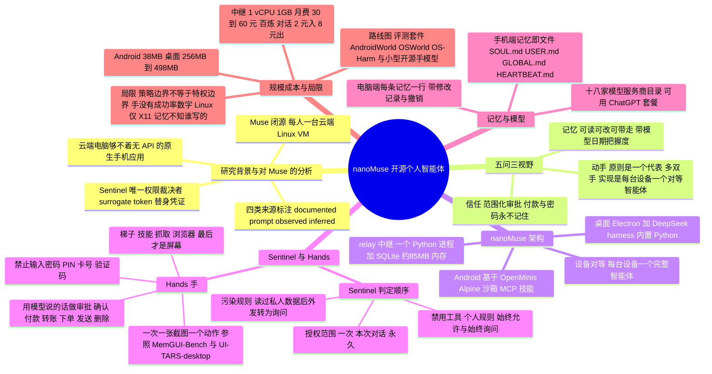

## 一、论文是干什么的？

先解释一个词：**个人智能体（personal agent）**。论文给的定义是：替某一个人，在他的账号、设备和文件上办事的程序；它可以连续工作好几周，有时人不在也在干活，事后还要向本人交代做了什么（日志、账目、当前持有的权限清单）。

打个比方：以前的 Siri、Alexa 像前台问询处，你问一句它答一句；2023 年起的 AutoGPT 这类智能体像临时工，接一个任务干完就走；个人智能体则像一位长期私人秘书，认得你、记得你、能替你跑腿，还会在值得的时候主动找你说话。

2026 年 9 月 8 日 Meta 发布了 Muse，论文说它是第一个把这些要素拼成「为一个人服务」的产品。但 Muse 跑在 Meta 云端、每人一台 Linux 虚拟机里，而且只在美国销售，除了一个 10 月 2 日发布的小型硬件 SDK 之外并不开源。作者认为：一个掌管你生活的智能体，应当能被你本人（或你信任的人）检查，应当尽量跑在你自己的设备上。于是他们做了 nanoMuse，一个完整、可自己运行的开源对应物，并写成这篇技术报告。

要注意：这篇论文不是传统的「提出新算法、跑一堆实验」的论文。它更像是一份「产品加立场」的报告：先梳理历史，再根据 Meta 的公开资料和一份 Muse 生产环境系统提示词的副本分析 Muse 的构造，再提出自己的观点，最后介绍 nanoMuse 的实现和路线图。作者在文中明确说，成功率这类数字「目前还不存在」，宁可不报也不估计。

作者团队来自浙江大学（HF 页面标注的机构），arXiv 作者为 Guangyi Liu、Yong Liu、Jiangning Zhang。代码在 [GitHub 仓库](https://github.com/nano-muse/nanoMuse)，另有 [项目主页](https://nanomuse.cn/) 与 [网页演示](https://nanomuse.cn/web/)。

## 二、核心方法与创新

### 1. 先读懂 Muse：每个论断都标明来源

论文第 3 节把对 Muse 的每条陈述标成四类来源：documented（Meta 公开说过）、prompt（在那份系统提示词副本里读到）、observed（在已发布的客户端里看到）、inferred（作者自己的推断）。作者还声明不复制提示词全文，最多引用几个词，并承认这份副本的真实性无法在与其他两类资料一致之外再验证。

论文归纳的 Muse 要点：

- **运行方式**：每人一台专属 Linux 虚拟机，是文件、记忆、凭证和对话的「系统记录」；智能体和所有工具跑在带 seccomp 过滤器、能力受限的容器里。
- **Sentinel（哨兵）**：Meta 称其为连接器动作与全部网络出口的「唯一权限裁决者」。智能体只能提议动作，只有 Sentinel 能放行；需要密码等机密时，智能体手里只有替身令牌（surrogate token），审批通过后才在网络边界换成真凭证；每个工具进程在内核里被追踪，读了用户数据就变成「被污染」状态。
- **记忆**（论文标注为来自提示词副本）：两层，既有智能体自己维护的记忆文件，也有运行时维护的记忆库和人际关系图；被告知回答前先搜索记忆，不要轻信「似乎记得」。
- **设计要点**：一个有名字有脸的智能体、一段长对话而不是一次次会话、每次工具调用一个小标签、记忆是人能打开编辑的文件、主动发消息有可调的门槛等。
- 作者对 Muse 技术内核的总结：本质是标准的工具调用智能体加子智能体和定时任务，新意在于把所有安全机制放在智能体够不着的地方，以及把大部分设计预算花在「让人看得懂」上。

### 2. 作者的观点：五个问题、三个时间尺度

第 4 节明确说这是「观点」，不是结论。五个问题分别是：

- **它知道什么**：记忆应当是人能读、能改、能带走的普通文件；每一行最好带上写入它的模型、日期和把握程度；人写的行优先于模型写的行。
- **它在哪里动手**：论文原则是「一个智能体、多双手」：一个人应当只有一个代表自己的智能体，而不是每个应用或每台设备一个；带屏幕、麦克风或电机的东西都是它的「手」。落到 nanoMuse 的实现上，则是每台设备各跑一个完整智能体、彼此对等，把其他设备当工具，共享同一段对话（见下文第 3 小节）。
- **它向谁负责**：审批是信任的「语法」，授权要有人能一句话说清的范围（一次、本次对话、对某个收件人或网站永久），并且能随时查看和撤销；付款和密码永远不被记住。
- **它怎么学习**：主动开口的门槛应当让人看得见、调得动；最难的版本是学会人的注意力规律，还要先征求同意。
- **它由谁出钱、谁治理**：小到能在家里跑，长期看应当像公共品。

三个时间尺度是：2026 年已有的、开源对应物接下来应当补的、能陪伴数年的智能体。

### 3. nanoMuse 的构造

nanoMuse 的核心主张是：每台设备都是一个完整智能体，设备之间是对等关系，通过一个可选、可自建的中继（relay，名为 nanoMuse Cloud）相遇。

- **设备**：Android 应用是对 OpenMinis（一个 GPL 的手机端智能体）的修改，应用内自带沙箱 Alpine Linux、shell、浏览器、MCP 服务器、技能和定时任务，可对接任意兼容 OpenAI 接口的模型；桌面应用是围绕 DeepSeek harness 的 Electron 外壳，内置 Python 运行时，同一运行时也为网页端服务；iOS 应用在 TestFlight 上，但 iOS 不允许一个应用操作另一个，所以没有「手」。
- **Sentinel**：智能体自己从不执行工具，每次调用都要过一道有固定判定顺序的闸门：先是被禁用的工具；再是人自己的规则；再是始终允许与始终询问清单；再是「污染」规则（一旦对话读过私人数据，任何把数据送出白名单之外的调用都会变成询问，且这个转变只往一个方向）；再是工具风险与人设定的模式；最后是少数无论什么模式都放不过去的警告（如破坏性 shell 命令、下载后直接执行、标签里带「确认」类字眼）。授权是带范围的：一次、本次对话，以及在能指明对象时「永久」针对某收件人、网站、文件夹、设备或应用，并列在「权限」页里带撤销按钮；带警告的调用只能给「一次」；每个决定都进日志。
- **Hands（手）**：智能体按「梯子」选最低一级能用的办法：技能、命令行工具或 MCP 服务器，然后是带登录态抓取网页，然后是浏览器，最后才是设备自己的屏幕。最后一级默认关闭，是「每次一张截图、一个动作」的循环，手机侧沿用 MemGUI-Bench 的手机操作员格式，电脑侧移植自 UI-TARS-desktop。模型每步看到截图、目标、每步一句话的历史，以及（设备提供时的）无障碍元素，输出「想法、一句用人的语言说明要做什么的话、一个手势」。关键设计是：确定性的策略无法判断图片，但可以判断模型说的这句话——带「确认付款、转账、下单、发送、删除」字眼的步骤每次都要审批；一次性输入并回车提交的步骤算敏感；没有标签的步骤带警告。操作员提示词禁止输入密码、PIN、银行卡号和一次性验证码。
- **记忆即文件**：手机上是 Markdown 文件，包括 SOUL.md（智能体是谁）、USER.md（用户是谁）、GLOBAL.md（跨对话保持的内容）、带日期的日记和 HEARTBEAT.md（例行任务）；电脑上每条记忆是一行，带修改记录和撤销，靠稀有词或（有嵌入服务时）语义召回，整理时只会提议合并与删除，从不删人写的内容。
- **每台设备都是工具**：任何设备上的智能体都能把其他设备当作工具，「在手机上找订单号，再填进 Mac 的表格里」是一段对话；被委托的设备用自己的 Sentinel 审批，发起方无法出借自己没有的权限。
- **模型由人选**：单设备时填入自己的 API 密钥，除模型调用外没有任何东西离开设备；应用与中继共用一个含十八家服务商的目录；ChatGPT 套餐可借 OpenAI 的 Codex 授权流程代替密钥（只覆盖对话和手，不含图片和视频）；本机模型服务器也可以。
- **中继保存什么**：账号（哈希标识、签发的密钥及对应设备）、模型调用账本（模型、token 数、费用，不含内容）、智能体档案、在线状态，以及用户选择同步的对话文本；从不保存文件、图片或工具返回内容。关闭同步会删除已存数据，删除账号会删除全部，撤销密钥的哈希保留 90 天。另有一个「帮助改进 nanoMuse 的 AI 模型」开关，对社区中继的新账号默认开启，可一键关闭；作者自己说这是项目里最不确定的选择。

### 4. 路线图

- **现在**：追上 Muse，包括记忆在恰当时刻浮现、定时任务之间的主动性、更少失败的「手」、一条命令自建中继。
- **接下来**：用失败运行构建评测套件，与 AndroidWorld、OSWorld、MemGUI-Bench、OS-Harm 并行跑；再用人们自愿贡献的轨迹训练一个小型开源「手」模型。
- **以后**：把摄像头、家电、机械臂也当作一台设备，沿用同一套审批和日志。

## 三、使用了哪些模型和计算资源？

这篇论文没有训练任何模型，也没有跑成功率之类的基准实验（只有表 2 里的体积与内存数据：体积来自发布文件或一次安装，内存来自一台 Linux 工作站的实测），所以以下多数项目是「暂无相关信息」。

| 项目 | 论文给出的信息 |
|---|---|
| 自研模型 | 无。作者明确说 nanoMuse 缺少自己的模型，模型由用户选择 |
| 可接入的模型 | 十八家服务商（国内外都有），每个条目注明该服务商的密钥覆盖对话、视觉、图像、视频中的哪些；也可用 ChatGPT 套餐（经 OpenAI 的 Codex 授权流程）或用户本机的模型服务器。具体型号与参数量：暂无相关信息 |
| 被分析的 Muse 所用模型 | 作者推断提示词副本中的模型是 Meta 的 Muse Spark 系列的一个编号版本，其规模与训练数据未知 |
| 桌面端基座 | Electron 外壳加 DeepSeek harness，内置 Python 运行时；电脑端「手」移植自 UI-TARS-desktop |
| 手机端基座 | 修改自 OpenMinis，应用内沙箱 Alpine Linux |
| GPU 型号与数量 | 暂无相关信息（无训练，推理走服务商 API 或用户自己的机器） |
| API 价格（估算，百炼 2026 年 10 月价目表） | 忙时对话模型每百万 token 输入 2 元、输出 8 元；「手」所用模型输入 3 元、输出 12 元；论文称一天的聊天只需几分钱（原文为「a few fen」） |

「nano」到底多小，论文的表 2 给出数字（体积来自发布文件或一次安装，内存来自一台 Linux 工作站上的实际测量；只有自建中继的月费和模型调用价格是依据项目文档和服务商价目表的估算，且不是对任何人实际使用的测量）：

| 对象 | 数字 |
|---|---|
| Android 应用 | 下载约 38 MB（arm64） |
| 桌面应用 | 下载 256 MB（Linux）、498 MB（macOS）、266 MB（Windows）；Linux 上安装后 928 MB；空闲时全部进程合计约 0.5 GB 内存 |
| 中继 | 一个 Python 进程加一个 SQLite 文件；全新数据库空闲时约 85 MB 内存；按 1 个 vCPU、1 GB 内存的服务器规格设计 |
| 自建中继的月费 | 中国大陆内约 30 到 60 元，海外最小服务器档约 4 到 6 美元，另加模型用量 |

每个完整计算单位（每步、每次任务、每次运行）的耗时：暂无相关信息。作者明确写道，没有成功率，也没有人工接管次数的统计。

## 四、实验结果

这篇论文**没有成功率之类的定量实验**：没有基准测试得分、没有消融。但它有表 1 的系统对比表（逐项比较九个系统的运行位置、手机与电脑屏幕能力和开源许可）和表 2 的规模成本表。作者在局限性一节明确说「手」的成功率和人工接管次数「不存在，我们宁愿说明而不愿估计」。

论文中能算作「结果」的是以下这些描述性内容：

| 内容 | 论文说法 |
|---|---|
| 与同类系统的对比（表 1，共九个系统） | nanoMuse 是表中唯一同时具备手机屏幕操作和电脑屏幕操作的系统，且完全开源（GPL-3.0）；Muse 有电脑屏幕、无手机屏幕、不开源（仅小工具 SDK 为 Apache-2.0）；OpenMinis 有手机屏幕（仅 Android，无障碍执行器）、无电脑屏幕；Hermes Agent 与 OpenClaw（均为 MIT）两者都没有屏幕能力 |
| 规模与成本（表 2） | 见上一节。Android 约 38 MB 来自发布文件；桌面端体积来自发布文件与一次安装、空闲内存约 0.5 GB 为实测；中继空闲约 85 MB 内存为实测（1 vCPU、1 GB 的规格取自自建说明页）；只有自建中继月费（几十元或几美元）和模型调用价格是估算 |
| 版本 | 首次发布为 2026 年 9 月 25 日，报告描述的是 0.1.40 版 |

另外，论文在局限性里列出了尚未解决的问题：

- **策略边界不等于特权边界**：单设备上 Sentinel 与智能体在同一信任域内，规则能拦住「被说服的模型」，模型改不了规则，但设备被攻破就等于智能体被攻破。
- **「手」靠词语判断**：纯图标按钮、不带标签的应用，既没有标签也没有无障碍文本可判断；专业高密度界面里光是找到按钮都还没解决；Linux 上只支持 X11 会话。
- **记忆不知道是谁写的**：弱模型猜的一行会被强模型当事实读，目前只记录何时改过并允许撤销，不记录模型、日期和置信度。
- **中继是共享的而且保存文本**：社区中继是项目方运营的一台机器上的一个进程。
- **对 Muse 的描述证据偏薄**：只依赖四份公开文档、已发布客户端和一份无法独立核实来源的提示词副本。

## 五、潜在应用与已落地应用

**论文自己声称的方向与路线图**（均为作者的计划或观点，不代表已经实现）：

- 用「手」去操作没有 API、没有网页版的应用，如银行和政务类应用，这是作者认为云端电脑够不着的地方。
- 评测套件与小型开源「手」模型：用自愿共享的轨迹训练，与 AndroidWorld、OSWorld、MemGUI-Bench、OS-Harm 并行评估。
- 把摄像头、家电、机械臂接入为又一台设备，沿用同一套审批和日志；更远期是记忆与身份能跨模型、设备和厂商存续的、能陪伴数年的智能体。

**已落地、作者开源的部分**（以论文与公开仓库为准，未经独立验证）：

- 开源仓库 [nano-muse/nanoMuse](https://github.com/nano-muse/nanoMuse)，许可证 GPL-3.0；包含 Android 应用、iOS 应用（TestFlight）、桌面应用（macOS、Windows、Linux）、网页应用以及中继 nanoMuse Cloud 与其控制台。
- 我在 2026 年 10 月 10 日查看 GitHub 接口时，该仓库有 560 个 star、57 个 fork，创建于 2026 年 9 月 23 日；最近的发布为 v1.0.0（10 月 8 日）和 v1.0.1（10 月 9 日）。HF 页面上显示的是 539 个 star，数字随时间变动。
- [网页演示](https://nanomuse.cn/web/) 与 [文档站](https://nanomuse.cn/docs/) 可访问。仓库 README 称登录后在社区中继上有一份由开发者买单的免费模型额度，用完后可自带密钥，以上均是项目方自述。

## 六、网络上的讨论与评价

- Hugging Face 论文页上作者 lgy0404（Guangyi Liu）发了一条介绍帖，概述了项目定位并给出代码、试用与文档链接；页面上另有一条 Librarian Bot 的自动相似论文推荐，以及一条看上去是在讨论另一篇论文（关于 RLVR 的）的作者留言，与本文无关，不予采用。
- 搜索结果里出现了论文页镜像与索引，如 [hyper.ai](https://hyper.ai/en/papers/2610.08699)、一个新闻聚合仓库里自动生成的论文页条目、[DeepWiki 的仓库解析页](https://deepwiki.com/nano-muse/nanoMuse)，以及一个 [nano-muse.github.io 项目页](https://nano-muse.github.io/)。这些主要是转载或自动生成内容，不是独立评论。
- 另有几个名字相近的 GitHub 仓库（例如 newsky123/nanoMuse、Meca2025/nanoMuse），简介与官方仓库高度相似，我没有核实它们与官方项目的关系，请读者以官方组织 nano-muse 下的仓库为准。
- Hacker News 上有一条 [Show HN 帖子](https://news.ycombinator.com/item?id=49987765)（2026 年 10 月 7 日发布，我在 10 月 10 日通过 HN 的公开接口查看时为 65 分、22 条评论），讨论的是 GitHub 仓库而不是论文本身。评论的大意：有人觉得名字「Muse」可能撞商标、「过一周就得改名」；有人说暂时不敢装在日常手机上，并追问安全边界怎么处理；有人认为听起来像 Meta 产品、担心数据被收集；有人建议先审计安装器会不会改动其他助手的配置文件；也有人表示欢迎 Muse 的开源替代品；其余多是关于「普通人到底需不需要个人智能体」的争论（有用户提到用 Hermes Agent 辅助管理注意力缺陷带来的困扰）。HN 上另有两条直接提交论文 arXiv 链接的帖子，都没有评论。
- 其他平台：我另外搜索了 Reddit、X、知乎等，没有找到针对这篇论文的独立讨论串（搜索引擎只返回了 [Digg 的 AI 摘要页](https://digg.com/ai/b0g81xc2)、[Hakky 的 AI 自动生成摘要](https://book.st-hakky.com/en/news/nanomuse-open-source-personal-agent) 等转载内容，页面自述暂无讨论）。

基于论文自身内容的几点观察（属于我的阅读判断，不是社区评价）：

- 报告把「没有数字」说得很坦率，这对读者是好事，但也意味着「手」好不好用目前无法从论文判断。
- 对 Muse 的分析部分依赖一份无法核实来源的系统提示词副本，作者自己也提醒要按「prompt」和「inferred」的标注区别对待。
- 「帮助改进模型」开关对社区中继的新账号默认开启，作者自己也说这是最拿不准的选择，使用社区中继前值得留意。
- 版本更新很快（报告写的是 0.1.40，而 10 月 9 日已有 v1.0.1），论文描述与最新代码可能不一致，作者也提醒后续版本会不同。

## 七、思维导图

