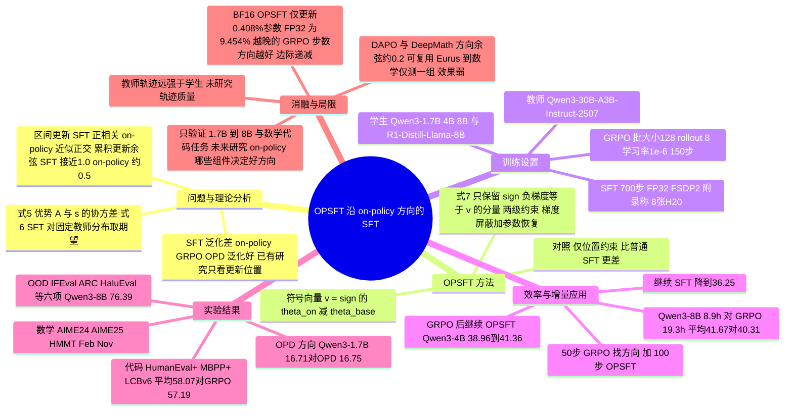

## 一、论文是干什么的？

大模型训练完预训练之后，还要经过「后训练」才能学会做数学题、写代码。主流有两条路。一条叫 **SFT（监督微调）**，相当于让学生照着标准答案抄作业，好处是简单、省时间、能直接用强模型写好的高质量解题过程；另一条叫 **on-policy 方法**（如 GRPO 这类强化学习，以及 OPD 在线蒸馏），相当于让学生自己做题、做完由老师打分再改进，通常泛化得更好，也就是遇到没见过的题型、没见过的领域时表现更稳，但训练要反复让模型生成答案，非常耗时。

此前有不少工作研究「为什么 on-policy 泛化更好」，发现它更新的参数位置很稀疏、改动幅度很小，但这些发现大多被当作训练的「副产品」，没人真的拿来改进 SFT。本文想回答一个更实用的问题：**on-policy 训练里到底有没有某种参数更新行为，可以单独拿出来，让 SFT 也泛化得一样好？**

作者的答案是：有，就是「每个参数累积下来往哪个方向（变大还是变小）走」。打个比方：on-policy 训练像一位探路者，一路摸索、不断修正，最后在地图上留下一条路线；SFT 则像照着一条笔直的老路一路走到底。论文的做法是把探路者的最终路线图（每个参数该增还是该减）拿过来，让 SFT 只能沿着这个路线图的方向走，这就是 **OPSFT（On-Policy direction-constrained SFT）**。结果显示，被这样约束的 SFT 在多个模型和数据集上明显好于普通 SFT，并接近甚至略超过提供方向的 GRPO，同时训练时间更短。代码见 [GitHub 仓库 ssfgunner/OPSFT](https://github.com/ssfgunner/OPSFT)。

## 二、核心方法与创新

### 1. 理论分析：SFT 方向稳定，on-policy 方向不断变

论文把每条回答 $\tau$ 的对数概率梯度记作 $s_\theta(x,\tau)=\nabla_\theta \log \pi_\theta(\tau \mid x)$（式 1），并指出它在当前策略的采样下期望为零（式 2）。于是 on-policy 的策略梯度可以写成「优势值 $A_\theta(x,\tau)$ 与 $s_\theta$ 的协方差」（式 5），而 SFT 的梯度只是对固定老师分布 $\pi_{\mathrm{teacher}}$ 取 $s_\theta$ 的期望（式 6）。

用大白话讲：SFT 的目标分布是固定的，所以每一步都朝着差不多的方向推；on-policy 的「优势」分布会随着策略自己变化而变化，所以每个阶段的推动方向都不一样。

实验验证（Qwen3-1.7B 在 DeepMath 上，图 2）：

- 看相邻区间的更新：SFT 各阶段方向是正相关的，而 GRPO 和 OPD 在不同阶段探索的方向几乎正交。
- 看累积更新：SFT 不同阶段的累积方向余弦相似度接近 1.0，on-policy 方法只有约 0.5，说明它一直在持续调整累积方向。

### 2. OPSFT：用符号向量约束 SFT 的梯度

设基础模型参数为 $\theta_{\mathrm{base}}$，on-policy 训练后参数为 $\theta_{\mathrm{on}}$，取符号向量 $v=\mathrm{sign}(\theta_{\mathrm{on}}-\theta_{\mathrm{base}})\in\{-1,0,1\}^d$。它同时包含了两层信息：哪些参数被更新过（位置），以及是往正还是往负更新（方向）。SFT 的梯度 $g$ 按式 7 被过滤：

$$
g_s=\mathbb{I}\left(\mathrm{sign}(-g)=v\right)\odot g
$$

也就是只保留那些「下降方向与 $v$ 一致」的梯度分量，其余置零。

实现上还有一个细节（附录 A）：AdamW 的权重衰减和动量可能破坏约束，所以 OPSFT 做了两级约束。第一级在梯度层面，把与累积 GRPO 更新方向相反的梯度屏蔽；第二级在优化器更新之后，把累积位移方向与 on-policy 方向相反的参数恢复成初始值，并让不在更新位置集合内的参数保持不变。

### 3. 两个实用场景

- **提升训练效率**：先跑少量 GRPO 步数（论文用 50 步）识别方向，再做 100 步 OPSFT。因为 OPSFT 阶段不需要反复生成回答（rollout），总耗时比完整 GRPO 少一半以上。
- **在已经 on-policy 后训练过的模型上继续用好数据**：直接拿新的高质量解题轨迹去 SFT 已经训练好的模型，会破坏已学到的能力；而 OPSFT 沿着原来的 on-policy 方向继续训，可以继续提升，不必重走「SFT 再 RL」的全流程。

### 4. 关键对照：只约束位置够不够？

作者做了「只共享更新位置」的 OPSFT（位置掩码取 $\{0,1\}^d$）对照。结果是只约束位置的表现甚至比普通 SFT 还差，而约束到符号方向 $\{-1,0,1\}^d$ 才带来显著提升。这说明此前研究强调的「稀疏更新位置」本身不足以解释泛化，方向才是关键。

## 三、使用了哪些模型和计算资源？

**模型**（均来自论文第 3.3 节与附录）：

| 角色 | 模型 |
|---|---|
| 被训练的学生模型 | Qwen3-1.7B、Qwen3-4B、Qwen3-8B、DeepSeek-R1-Distill-Llama-3-8B（表格中写作 DeepSeek-R1-LLaMA-8B） |
| SFT 轨迹的教师模型 | Qwen3-30B-A3B-Instruct-2507，解码温度 0.6，top-p 为 0.95，最多生成 16384 个新 token（模型上下文上限 18432 token） |
| OPD 实验（附录 B）的教师和学生 | 教师 Qwen3-30B-A3B，学生 Qwen3-1.7B，训练 150 步，其余设置沿用 G-OPD |

**数据**：数学用 DeepMath 中难度大于等于 6 的 57K 条做 RL 数据；代码用 Eurus-RL-Code 共 25K 条。SFT 轨迹经答案验证器筛选后，数学数据集有 44810 条训练样本和 914 条验证样本，代码数据集有 9585 条训练样本。

**GPU 与精度**：附录 A.2 在 SFT 一段中写道「All experiments use FP32 training with FSDP2 sharding over 8 NVIDIA H20 GPUs」，另有「Unless otherwise specified, all experiments use FP32 parameter precision by default」。这句话出现在 SFT/OPSFT 的训练设置段落里，字面上是「所有实验」，但 GRPO 的超参数表（表 A7、A8）并没有单独列出 GPU 型号与数量，所以 GRPO 阶段是否同样使用 8 张 H20，原文没有明确说明，只能说附录的措辞可能涵盖所有实验，不宜断言。

**训练超参数**：

- GRPO（数学、代码相同的部分）：训练批大小 128，每题 rollout 8 条，学习率 $1\times10^{-6}$，共 150 步，KL 系数 0.0；数学最大回复长度 16384，代码为 8192；奖励为答案正确或单元测试全过得 1.0，否则 0.0。
- SFT 与 OPSFT：全局批大小 64，最大序列长度 16384，AdamW（$\beta_1=0.9$，$\beta_2=0.95$），权重衰减 0.01，梯度范数裁剪 1.0，恒定学习率（默认 $1\times10^{-7}$，第 4.1 节的实验（表 2、表 4）与表 5 的实验为 $1\times10^{-6}$），训练 700 步，随机种子 42。
- 注意：附录超参数表写 GRPO 共 150 步，但第 4.1 节正文说明表 2 中 GRPO 基线训练 100 步；OPSFT 为 50 步 GRPO 加 100 步 OPSFT。

**每个完整训练运行的耗时**（表 2，数学，DeepMath；OPSFT 的时间包含识别方向和后续 OPSFT 训练）：

| 模型 | GRPO | SFT | DFT | OPSFT |
|---|---|---|---|---|
| Qwen3-1.7B | 4.9h | 3.5h | 3.9h | 2.3h |
| Qwen3-4B | 16.5h | 8.1h | 8.6h | 6.4h |
| Qwen3-8B | 19.3h | 13.2h | 13.9h | 8.9h |
| DeepSeek-R1-LLaMA-8B | 18.2h | 13.6h | 14.1h | 8.1h |

代码任务（表 4，Qwen3-4B，Eurus）：GRPO 20.3h，SFT 9.8h，OPSFT 9.5h。每一步的单独耗时、推理评测耗时，原文没有给出，暂无相关信息。

## 四、实验结果

评测方式：数学用 AIME24、AIME25、HMMT25 二月（Feb）和十一月（Nov）四个竞赛基准，每题采样 8 个解；代码用 HumanEval+、MBPP+ 和 LiveCodeBench（仅 v6，2025 年 2 月到 5 月），每题采样 4 个解；评测温度 1.0，top-p 为 1.0，最大生成长度 16384。

### 1. 数学任务：训练效率与效果同时提升（表 2）

| 模型 | GRPO 平均 | SFT 平均 | DFT 平均 | OPSFT 平均 |
|---|---|---|---|---|
| Qwen3-1.7B | 12.09 | 13.15 | 13.16 | 15.11 |
| Qwen3-4B | 38.96 | 34.22 | 34.69 | 40.11 |
| Qwen3-8B | 40.31 | 38.41 | 38.97 | 41.67 |
| DeepSeek-R1-LLaMA-8B | 25.21 | 18.02 | 19.90 | 26.56 |

四个模型上 OPSFT 的平均准确率都最高，而且训练时间都最短。作者举的例子：Qwen3-8B 上 OPSFT 用 8.9h 对 GRPO 的 19.3h，平均准确率 41.67 对 40.31；DeepSeek-R1-LLaMA-8B 上 OPSFT 用 8.1h 拿到 26.56，而 DFT 用 14.1h 只有 19.90。

### 2. 分布外（OOD）泛化（表 1，在 DeepMath 上训练）

| 模型 | Base 平均 | SFT 平均 | GRPO 平均 | OPSFT 平均 |
|---|---|---|---|---|
| Qwen3-4B | 73.43 | 73.65 | 73.95 | 74.11 |
| Qwen3-8B | 75.85 | 75.54 | 76.20 | 76.39 |

评测集为 IFEval、ARC、HaluEval、Hellaswag、Winogrande、PIQA 六项。差距不大，但 OPSFT 的平均值略高于 GRPO。需要注意，Qwen3-8B 上 OPSFT 在 IFEval 上（88.13）低于 GRPO（89.09），是靠 HaluEval 等项拉高的平均。

### 3. 在已经 GRPO 训练过的模型上继续训练（表 3，数学）

| 模型 | 起点（GRPO 后）平均 | 继续 SFT | 继续 OPSFT |
|---|---|---|---|
| Qwen3-1.7B | 12.09 | 13.54 | 16.77 |
| Qwen3-4B | 38.96 | 36.25 | 41.36 |
| Qwen3-8B | 40.31 | 37.50 | 42.39 |
| DeepSeek-R1-LLaMA-8B | 25.21 | 16.36 | 26.15 |

除了 Qwen3-1.7B 之外，直接继续 SFT 反而让三个模型变差，而 OPSFT 四个模型都继续提升。

### 4. 代码任务（Qwen3-4B，Eurus，表 4 与表 5）

| 方法 | HumanEval+ | MBPP+ | LCBv6 | 平均 | 训练时间 |
|---|---|---|---|---|---|
| GRPO | 80.79 | 69.04 | 21.75 | 57.19 | 20.3h |
| SFT | 80.50 | 63.90 | 18.51 | 54.30 | 9.8h |
| OPSFT | 84.00 | 67.30 | 22.90 | 58.07 | 9.5h |

在已 GRPO 的代码模型上继续训练（表 5）：基础 GRPO 模型平均 57.19，继续 SFT 降到 48.71，继续 OPSFT 升到 60.05。

### 5. 其他发现与消融

- **方向在同领域数据集间可复用；跨领域只测了一组、效果弱**：DAPO 与 DeepMath 同属数学领域，两者识别的方向余弦相似度只有约 0.2，但用 DAPO 的方向在 DeepMath 上训练的 OPSFT 甚至略好于用 DeepMath 自己的方向；而用代码领域 Eurus 的方向训练数学（DeepMath），论文报告表现较弱，原文称这种复用性「does not extend across domains」。这只是第 3.3 节中一组代码到数学的结果，不能当作一般性结论。更新位置的重叠度不论同领域还是跨领域都约 0.4。
- **越晚的 GRPO 步数识别的方向越好，但边际收益递减**：100 步方向相对 50 步方向的提升，比 150 步相对 100 步的提升更大。
- **精度的影响（表 6，Qwen3-8B）**：BF16 下，普通 SFT 只更新 2.702% 的参数（小梯度被舍入成零），OPSFT 只更新 0.408%，平均 40.94 对 38.33；FP32 下，普通 SFT 更新约 89.286% 的参数，OPSFT 为 9.454%，与 GRPO 的 9.499% 接近，平均 42.81 对 GRPO 的 42.01。
- **推理行为（图 7）**：三者回复长度相近；OPSFT 的多次回答准确率标准差高于 SFT、接近 GRPO；「分情况讨论」和「逻辑连接」提示词的使用频率也更像 GRPO，而不是单纯变长。
- **OPD 方向（附录表 A9，Qwen3-1.7B）**：基础模型 8.59，OPD 16.75，普通 SFT 13.83，OPSFT（方向约束）16.71，OPSFT（仅位置约束）13.48。

## 五、潜在应用与已落地应用

**论文自己声称的方向**：

- 用少量 on-policy 步数识别方向，再用 SFT 高效训练，节省 rollout 成本。
- 已经做过强化学习后训练的模型，随着新高质量轨迹的积累，可以增量更新，而不必从基础模型重新走完整后训练流程。

**作者开源的内容**：

- [代码仓库 OPSFT](https://github.com/ssfgunner/OPSFT)（检索时约 3 个 star、0 个 fork，最近更新为 2026 年 9 月 30 日），README 说明了从下载教师验证过的轨迹和匹配的 GRPO 检查点开始，本地识别方向，再对比普通 SFT 与 OPSFT 的快速复现流程。
- 发布了轨迹数据集 [shufanshen/SFT-Trajectories](https://huggingface.co/datasets/shufanshen/SFT-Trajectories) 与 [OPSFT 模型集合](https://huggingface.co/collections/shufanshen/opsft-6aa781ffb646c53df3707a3b)，其中包含 Qwen3-4B 在数学与代码上训练 150 步的 GRPO 检查点。

**已落地应用**：论文与 README 未提到工业界实际部署，暂无相关信息（作者中有 Meituan 的成员，但原文没有说明是否在内部使用）。

**作者的推测与未验证部分**：论文的未来工作只提出要研究 on-policy 的哪些组成部分决定了「好方向」，以及轨迹性质如何影响泛化，并没有在更大模型或更多任务类型上验证。

## 六、网络上的讨论与评价

- Hugging Face 论文页面：[huggingface.co/papers/2609.36659](https://huggingface.co/papers/2609.36659) 显示 87 个点赞，2026 年 10 月 5 日进入每日论文榜。页面上只有两条评论，一条是作者 shufanshen 自己的一句话介绍，另一条是 Librarian Bot 的自动相似论文推荐，没有实质性的第三方讨论。
- 在 Hacker News（经 Algolia 搜索接口按 arXiv 编号和标题关键词查询）没有命中结果；Reddit 的接口对脚本请求返回 403，用带真实浏览器 User-Agent 的 Playwright 重试后仍显示「已被网络安全拦截」要求登录，因此 Reddit 上有无讨论无法确认。另用网页搜索（标题、arXiv 编号、OPSFT 加 Reddit、知乎、Twitter 等关键词）查询，只找到 [hyper.ai 的论文聚合页](https://hyper.ai/en/papers/2609.36659)（仅是摘要转载，不算讨论），未检索到针对本文的独立讨论，暂无发现公开讨论。

基于论文内容本身的几点观察（属于本综述的判断，不是社区评价）：

- 实验只覆盖 1.7B 到 8B 的模型和数学、代码两类可验证任务，结论能否推广到更大模型或开放式任务，论文没有回答。
- 论文自己承认的局限：所用 SFT 轨迹是比学生强得多的教师模型生成的高质量轨迹，没有研究轨迹质量对结果的影响。
- OOD 提升幅度很小（平均分差在零点几个点），更有说服力的证据来自数学与代码的域内任务。

## 七、思维导图

