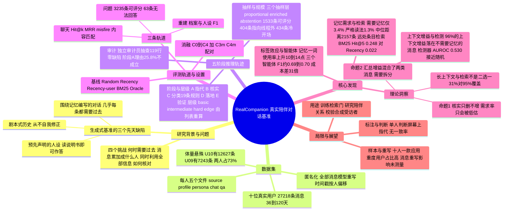

## 一、论文是干什么的？

设想你有一个每天聊天的AI朋友，聊了几个月。一个好的陪伴者应该做到三件事：记得你说过什么，大致懂你是个什么样的人，还要能判断「你现在这句话，到底要不要翻出以前聊过的事」。比如你在三月说「公司开了个组长岗位，我要带六个人」，四月说「我申请了，其实不确定想不想要，只是不想事后纠结」，六月说「我拿到这个职位了」。这时回复「恭喜，正合你意！」就错了，因为你从没说过自己想要；回复「你四月申请过但不确定」又显得空洞，因为你自己早就知道；比较好的回复是「你拿到了这个职位，尽管当初并不确定，现在感觉如何？」。

要检验AI能不能做到这些，需要真实的人的长期对话。但真实对话是私密的，所以以往的基准（LoCoMo、LongMemEval、PersonaMem 等）都是「生成」的：先编出一个人，再编出长对话，再围绕要考的记忆出题。作者认为这样有三个先天缺陷：一是生成的对话是围绕记忆写的，几乎每条消息都需要过去；二是人设预先写好，问人设的问题等于读说明书；三是剧本式的历史从不自我修正。这样一来「什么时候需要记忆」这个问题，在AI看到题目之前就被决定了。

这篇论文（Quis Lab，arXiv 2026 年 10 月 1 日提交）发布了 **RealCompanion**：十位真实用户（均同意研究与公开）与同一款AI陪伴应用的完整聊天记录，共 27218 条消息，每人 36 到 120 天。每人配有五个文件：对话本身（已经过匿名化重写，不是未经改动的原文）、档案（profile，用户明说过的事实）、人设（persona，推断出的性格与思维方式）、聊天标注（chat ground truth，一条回复应当知道什么、应当说什么）和问题集。每条标注都标明所依据的消息，每条聊天标注还带有产生它的推理轨迹。数据集在 [Hugging Face](https://huggingface.co/datasets/Quislab/RealCompanion) 上以申请审核（manual gated）的方式提供。

## 二、核心方法与创新

### 1. 数据：只保留真实、不改写时间结构

对话来自一款内部AI陪伴应用的运营数据库，用户与一个有名字、心情、服装的朋友式陪伴者聊天。所有消息用模型重写以匿名化（直接标识符换成一致的替身，说了什么、为什么说保留，措辞改变），时间戳加一个每人固定的偏移，所以间隔准确而日历位置不准。陪伴者先开口的天数为 217 天，用户先开口为 207 天，应用先开口为 6 天（共 430 个用户天）。

十个人的体量差别很大：最短只有 115 条消息，最长的 U10 有 12627 条，U09 有 7243 条；最重的两人占全部消息的 73%。论文因此强调「每人一个独立实例」，所有结果都可以按人单独报告。

### 2. 聊天标注：五阶段推理，把「这条消息指向什么」一步步核对

这是最关键的创新。每个探测点（probe）都是用户真实发出的一条消息，按发布数据里的原样取用，不改写、不转述、不另行撰写（注意：发布数据里的消息本身已是匿名化重写后的文本，见上文）。围绕它，标注流程分五步，每一步只读前面步骤写下的内容，并且在同一次调用里写下「决定」和「理由」，因此理由不是事后补的：

- 阶段 A（指代）：用户这句话指向什么？它存在于哪里（当前对话、档案、更早的某次交流、陪伴者自己过去的行为，或者什么都不指）。
- 阶段 B（核实）：对指代对象检索候选，并逐一与原始对话核对，核实不过的丢掉。这一步只能删除、不能添加，所以核实错误只会让「需要记忆」的比例被低估，不会高估（论文的命题 1）。
- 阶段 C（分类）：按 19 条固定规则给出层级（tier）和类别，并记录触发的规则。
- 阶段 D（落地）：只依据记录下来的上下文写参考回复，并标明依据哪些消息。
- 阶段 E（验证）：检查参考回复是否被证据支持、类别是否合适，不合格则降级或撤回。

层级的定义很直观，可以由列表重算：只有前几条消息为基础（basic），含档案条目为中级（intermediate），含更早的某次交流为困难（hard），上下文为空为边缘（edge）。在 1533 条可评分的聊天条目中，1009 条指向当前对话线程，120 条什么都不指，其余 404 条指向线程之外：档案条目 223 条、更早交流 116 条、陪伴者自己过去的行为 65 条。

探测点分三个抽样层：「按比例层」是随机样本，只有它能回答「过去到底多常被需要」；「富集层」专门收集需要深层历史的消息，用来研究需要记忆时系统做什么；「弃权对照」是 434 条会话开场白（冷开场），本来就不需要任何过去，用来检查系统会不会乱翻旧账。

### 3. 档案与人设

档案记录用户明说过的内容，3580 条断言、6784 条消息引用，每条带置信度和有效时间窗；人设记录性格倾向、思维与决策方式，每个条目只在对话支持时才填写，并带有证据和强度。注意作者明确说明：人设是模型从对话里推出的趋势估计，不是经过验证的心理测量，也没有给本人看过，条款禁止用作对任何人的评估。

### 4. 三条评测轨道

- 重建轨道：系统读完整历史，写出档案与人设，按字段打分（精确率、召回率、F1、多次运行的一致性）。
- 聊天轨道：给一条用户消息和之前的历史，输出对早期消息的排序和一条回复，评分包括命中率、MRR、内容匹配、证据覆盖、是否在不需要时乱用记忆（misfire）等。
- 问题轨道：针对整个历史的 3235 个可评分问题（共 3312 个，其中 63 个故意设为无法回答），评检索与答案或弃权。

### 5. 关键实验设计

检索基线有五个：Random、Recency（取最近若干条，相当于滑动上下文窗口）、Recency-user（只取用户自己的近期消息）、BM25、Oracle（直接给标注的答案）；另有三个对照用来检验指标本身（偏移置换、位置随机化、故意给错的「坏 Oracle」，后者必须得零分）。

上下文消融用同一个生成器在五种条件下回答：C0 只有探测消息，C1 加前三条消息，C2 加标注的必需消息（Oracle），C3 加 BM25 选出的十条，C4 加最近十条；另有 C3m 与 C4m 在相同标题和时间顺序下做公平配对。每条消息显示时截断为 220 个字符。

### 6. 一个关键的统计洞见（命题 2）

当「需要记忆」的探测点很少时，把上下文补全后的总体提升，主要来自那些其实不需要记忆的消息，所以「上下文有帮助」不能算作「记忆有用」的证据。只有按「是否需要记忆」拆开统计才能看清。这对任何探测点是人工编写的基准都适用。

## 三、使用了哪些模型和计算资源？

论文没有训练新模型，只做评测；模型随角色而异：

| 角色 | 模型 | 说明 |
|---|---|---|
| 消融生成器 | gemini-3-flash-preview | 温度 0 |
| 回复评判（judge） | gemini-3.6-flash | 温度 0，一次调用同时给五种条件的回复打分 |
| 独立审计员 | gemini-3.1-pro-preview | 温度 0，未参与构建任何标注 |
| 重建轨道系统一 | Claude Opus 5.5（智能体工作流，1M token 上下文） | 每人每层三次独立运行 |
| 重建轨道系统二 | Codex GPT-5.6-sol（通过 Responses API，单次请求） | 最大一次请求约 597k token（U09） |
| 重建轨道系统三 | Antigravity 运行 Gemini 3.8 Flash（高思考级别，256k token 预算） | U09、U10 分段阅读 |
| 标注阶段 A、D、E 及匿名化、问题轨道、检测器 | 论文只说是语言模型 | 具体型号暂无相关信息 |

另外有已部署记忆系统的对比（附录 F.7）：一个「Codex port」（覆盖全部十人）、Supermemory（只覆盖两人）、mem0（只跑到 U09 前 850 个问题就用完了检索配额）。

**计算资源与耗时：**

- GPU 型号与数量：暂无相关信息（评测用的都是商业模型接口，论文未写 GPU）。
- 每个完整计算单位的耗时（每次推理、每个任务、每次运行的墙钟时间）：暂无相关信息，论文没有报告时间，只报告了 token 消耗。
- 重建轨道每次运行（十个人合计，U10 分两半读）的成本，按 token 计：

| 系统 | 人设层：调用次数 / 处理 token / 输出 token | 档案层：调用次数 / 处理 token / 输出 token |
|---|---|---|
| Claude | 1716 / 545.5M / 3.0M | 296 / 117.8M / 904k |
| Codex | 138 / 17.7M / 153k | 28 / 3.7M / 182k |
| Antigravity | 498 / 35.8M / 677k | 509 / 34.3M / 902k |

论文称在人设 F1 相同的前提下，Codex 处理的 token 约比 Claude 少 31 倍，Antigravity 约少 15 倍，这就是摘要里「31 倍成本差」的来源。作者提醒，调用次数在系统之间不可比（智能体每一步都会重发上下文，Codex 一次调用就是一次请求），Claude 的压缩调用没有记录。金额成本在论文里暂无相关信息。

## 四、实验结果

### 1. 过去很少被需要，而且很远

在按比例层的随机样本中，3.4%（区间 2.5 到 4.6）的用户消息带有已核实的记忆需求（宽松读法），严格读法（去掉指代对象其实就在屏幕上的 154 条）为 1.3%（区间 0.8 到 2.1）。另外两种估计方法给出 3.2% 和 1.73%。十个人里有三个人在宽松读法下没有任何需要记忆的条目，严格读法下为五个人。需要记忆的消息，其最远的必需消息中位数在 2157 条之前，上四分位数 5114，最大 12542；即使最近的必需消息，中位数也在 450 条之前。

### 2. 找得回来吗？看「远处条目」上的 Hit@5

| 方法 | 全部条目 | 按人平均 | 依赖型条目 |
|---|---|---|---|
| Random | 0.005 | 0.004 | 0.000 |
| Recency-user | 0.015 | 0.014 | 0.006 |
| Recency | 0.022 | 0.029 | 0.024 |
| BM25 | 0.248 | 0.424 | 0.347 |
| Oracle | 1.000 | 1.000 | 1.000 |
| 坏 Oracle | 0.000 | 0.000 | 0.000 |

如果把所有 1477 个带参考集的探测点混在一起，72.6% 其实在最近的线程里就能回答，此时 Recency 找到必需消息的比例高达 0.959，BM25 为 0.236。BM25 在两个人群里变化不大，而 Recency 下降约四十倍，所以混合统计只反映语料的构成。窗口越大覆盖越多：8k token 时必需消息覆盖率 0.109，128k 时 0.453，一百万 token 时 1.000（所有历史都装得下）。

### 3. 给上下文有帮助，但绝大部分帮助落在不需要记忆的消息上

内容匹配用 0 到 2 分评：

| 条件 | 提供的上下文 | 全部条目 | 按人平均 |
|---|---|---|---|
| C0 | 无 | 1.431 | 1.286 |
| C1 | 前三条消息 | 1.622 | 1.587 |
| C2 | 标注的必需消息（Oracle） | 1.763 | 1.736 |
| C3 | BM25 取十条 | 1.426 | 1.352 |
| C4 | 最近十条 | 1.625 | 1.584 |

在 167 条参考回复确实依赖所记录消息的条目上，从 C1 换成 C2 的提升约为 0.455（区间 0.319 到 0.588，原文结论部分也引用了这个数字）；而在按比例层上，96% 的提升来自不需要记忆的探测点。同一预算与顺序下，BM25 选出的十条比最近十条低 0.189（区间 0.156 到 0.247），而且它的得分几乎与完全不给上下文持平（1.426 对 1.431）。

### 4. 系统不知道什么时候该回头看

在自然比例下，一个读探测消息及其前三条消息的检测器，AUROC 为 0.530（对比指代对象不存在的探测点）和 0.548（对比冷开场），接近随机；对照它自己的目标为 0.601，阈值下抓到 40 条需要记忆的探测点中的 6 条，同时有 40 次误报。人工写的问题更容易区分（检测器 0.802，对比聊天消息上的 0.546），因为写出的问题与其证据共享更多词汇，也就是「出题泄露了线索」。

不给任何上下文时，模型从不乱提不存在的过去（misfire 为 0）。给了上下文后，如果给的是为这条消息挑选的内容，乱用率升到 29.2%；给的是无关的十条，升到 60.8%。更有意思的是「标签效应」：把同样的十条消息改称「检索到的记忆」而不是「本次聊天的早先对话」，所有测试人群里记忆使用率都提高 10 到 14 个百分点，包括根本不需要记忆的探测点。

### 5. 三个智能体重建人设：同样的 F1，成本相差 31 倍

| 系统 | F1 | 精确率 | 召回率 | 处理 token | 自身多次运行一致性 |
|---|---|---|---|---|---|
| Claude Opus 5.5 | 0.686 | 0.557 | 0.893 | 546M | 0.935 |
| Codex GPT-5.6-sol | 0.688 | 0.573 | 0.861 | 18M | 0.932 |
| Antigravity Gemini 3.8 Flash | 0.701 | 0.591 | 0.861 | 36M | 0.946 |

精确率 0.56 到 0.59 而召回率 0.86 到 0.89，意味着系统能找回档案里有的，但同时多出了很多文件里没有的内容：每找回一百个字段，大约多编七十到八十个。三个系统彼此之间的一致性（0.86 到 0.88）远高于它们与标准文件的一致性，说明它们犯的是相似的、系统性的「读得过多」。论文的概括是：它们看到人，然后又想象出更多。

### 6. 已部署记忆系统（附录 F.7，覆盖不同，不能互比）

在当前版本上，Codex port 在 3235 个问题上答对 44.5%（十人宏平均），聊天探测点上 58.1%；必需消息进入前五的比例分别为 0.331 和 0.137。Supermemory 与 mem0 是基于旧版本、只覆盖一两个人的结果，作者特地标记「不要跨标记平均」。

### 7. 标注质量

独立审计员（gemini-3.1-pro-preview）对全部 1533 行再评一遍，抽查了其未标记的 119 行，没有发现标注缺陷，据此估计漏检率约 2.5%。另有一个法官对每条有效聊天条目对照对话线程与所引消息重新核验，只在 7 条（0.46%）上与所存参考回复不一致，其中两条重新生成，其余五条核对原文后保留。但作者也坦率承认：阶段 A 的文字理由在 395 条（25.8%）上无法证明所记录的指代位置，人工核对确认其中大部分确有问题，所以理由只是「构建者当时怎么说的」，并不是标注的担保，没有据此改标签。问题轨道的内容缺陷率为 3.8%（区间 3.2 到 4.6）。

## 五、潜在应用与已落地应用

**论文自己声称的价值与用途：**

- 训练或评估「检索门」：逐探测点监督（1129 个负例对 404 个正例）可用来训练「什么时候不要检索」，作者称现有架构几乎每一轮都检索，部分原因是从来没有数据告诉它们何时不该。
- 中间决策的监督：每个条目记录了指代、核实后保留了什么、哪条规则定了标签，可训练或评估中间步骤。
- 对「长上下文还是检索」的判断：论文称持有最近一千条消息的系统只能覆盖 31% 需要记忆的探测点，覆盖 95% 需要一万条，比十段历史中的九段还长，所以在这个长度上两者不是二选一。
- 附录 I 还探讨了对心理学、情感与心理状态建模、消费者研究（检验合成受访者）的用途，这些是作者的设想，并未实际开展。

**已落地情况：** 数据集已于 2026 年 10 月在 Hugging Face 上以审核制发布（页面显示约 14 次下载），论文称评测与打分代码在匿名仓库中提供，评分包接受他人提交。作者明确说该语料「只用于本文的基准，没有用于其他用途」，并禁止任何商业用途、对个人的画像或针对。作者开源的只是数据与代码，没有给出真实产品落地案例。

## 六、网络上的讨论与评价

- Hugging Face 论文页面上只有两条评论：作者之一 Arman Behnam 的邀请合作留言（概括为「带推理轨迹的、真实的人与AI长期关系基准」），以及 Librarian Bot 的自动相似论文推荐。没有独立的评价。
- 检索到的第三方内容都是复述摘要的二次转载，没有独立评价：[Lilys 的每日论文笔记](https://lilys.ai/en/notes/daily-papers-20261005/realcompanion-human-understanding-real-conversations)、[CCTest 的介绍文章](https://cctest.ai/en/articles/realcompanion-tests-whether-ai-can-understand-people-over-time)（2026 年 10 月 5 日，概述数据集结构并称现有评测应区分理解当前消息、判断过去是否相关、选取并使用证据三种能力，属文章作者的看法）、[Papers with Code 镜像页](https://paperswithcode.co/paper/2610.01780)，以及一个新闻机器人自动生成的 [GitHub issue](https://github.com/hanzhad/squelch-news-engine/issues/1333)（转贴 Hugging Face 摘要）。
- Hacker News（用 Algolia 接口以标题和 arXiv 编号检索）、WebSearch（标题加 arXiv 编号）中未发现有人对该论文做实质讨论；Reddit、X（Twitter）、知乎没有能确认的结果。总体而言，暂无发现公开的独立讨论。

基于论文内容本身的几点观察（以下是综述者的读后判断，不是社区评价）：

- 十个人、一款应用、四个月内的数据，作者自己说明不能代表陪伴类用户的整体，其中两位最重度用户占了消息量的 73%，严格读法下只有五人带有需要记忆的条目，所以「需要记忆的比例」之类结论的置信区间并不窄。
- 所有消息都被模型重写过，重写对检索与回复得分的影响没有测量（作者承认原文不公开，无法测量）。
- 标注主要由模型完成，再由独立模型与人工抽查审计；论文给出了不少自我批评的数字（如阶段 A 理由 25.8% 不成立），这在基准类论文里相对少见。
- 伦理方面：数据含有 GDPR 第 9 条所指的特殊类别（健康等），授权基于用户同意；伦理审批来自数据运营方内部委员会，作者承认该委员会不独立于运营方，且没有 IRB 参与。
- 作者属于数据来源应用的运营公司 Quis Lab，数据集由 Quis Inc. 发布，这一利益关系读者需要自己留意。
- 论文还称「标签效应」使记忆使用上升 10 到 14 个百分点，这是在一个生成器（gemini-3-flash-preview）上得到的结果，是否对其他模型成立，论文没有展开。

## 七、思维导图

