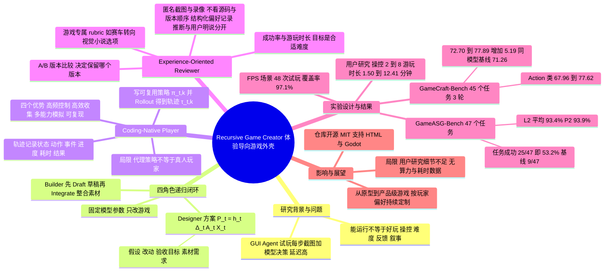

## 一、论文是干什么的？

现在的编程智能体（coding agent）已经能「一句话生成一个能跑的小游戏」。但能跑不等于好玩：操作手感是否跟手、难度是否合适、画面和提示是否清楚、剧情是否连贯，这些「体验」问题，光看程序有没有报错是发现不了的。

这篇论文提出 **Recursive Game Creator**（递归游戏创造者），一个「体验导向」的游戏开发外壳（harness，也就是围绕大模型搭建的一整套工作流程与工具）。它模仿真实的游戏工作室，设了四个角色：策划（Designer）、程序美术（Builder）、试玩员（Player）、评审（Reviewer）。游戏做出来后，由试玩员真的去玩，评审根据玩的记录和截图给出「哪里不好玩、为什么、怎么改」，策划据此写新的改进计划，程序美术再改，如此一轮一轮循环。

打个比方：普通的 AI 写游戏像一个人闭门造车，写完就交差；Recursive Game Creator 则像一家小工作室，每改一版都要找人试玩、开评审会、再返工。论文最关键的一个设计是**让试玩员「写代码」而不是「看屏幕点鼠标」**：试玩员写出一段可重复运行的玩游戏程序（策略），一次运行就能快速玩完一局并留下完整记录，不需要大模型对每一帧画面都做一次判断。

本文由 Jiajun Chen、Haoyu Wu、Mingda Jia、Xihui Liu 完成，四位作者都署名香港大学 HKU MMLab；其中 Jiajun Chen、Mingda Jia、Xihui Liu 同时署名 Shenzhen Loop Area Institute，Haoyu Wu 仅署名香港大学（原文标注了共同贡献与通讯作者，但网页文本里没有显示各自对应哪几位作者），作者提供了[项目主页](https://imbaldy.github.io/recursive-game-creator)和[GitHub 仓库](https://github.com/IMBALDY/RecursiveGameCreator)。论文 2026 年 10 月 6 日提交到 arXiv（cs.AI）。

## 二、核心方法与创新

整个系统是一个闭环：策划出方案，程序美术实现，试玩员执行策略并收集轨迹，评审给出体验评估并决定保留哪个版本，再交回策划。论文中还强调：整个过程固定模型参数，不训练模型，改进的对象是「游戏本身」。

### 1. Designer（策划）与 Builder（程序美术）

策划把用户的一句话需求，扩展成包含核心玩法循环、机制、进度与难度、画面方向、制作优先级的详细方案。第 $t$ 轮的方案写成

$$
P_t = \mathrm{Design}(U, G_t, \mathcal{H}_{t-1}) = (h_t, \Delta_t, A_t, X_t)
$$

其中 $U$ 是用户需求，$G_t$ 是当前游戏，$\mathcal{H}_{t-1}$ 是上一轮的反馈。四个输出分别是：假设 $h_t$（想达成什么体验改进以及依据），具体改动 $\Delta_t$（含要保留的优点），验收目标 $A_t$（用场景、玩家输入和可观察结果来描述），以及素材需求 $X_t$。这就像装修前先写一份有验收标准的施工单。

程序美术接手方案后，按玩法、交互、画面方向和素材需求挑选实现工具，分两个阶段走：先写出可玩的草稿，再把素材整合进去：

$$
Z_t = \mathrm{Draft}(G_t, \Delta_t),\quad X_t^{*} = \mathrm{Generate}(X_t; Z_t),\quad C_t = \mathrm{Integrate}(Z_t, X_t^{*})
$$

草稿阶段允许先用占位素材；之后由框架生成素材文件，程序美术再检查素材在游戏场景里的显示效果，以及与碰撞、动画和交互区域的配合，并做针对性自检和项目配置的检查。论文特别强调：只生成素材并不等于游戏变好，必须看它在游戏里的表现。

### 2. Coding-Native Player（代码原生试玩员）

这是论文最核心的创新。已有工作（论文引用的 GUI agent 路线）让智能体看截图、点界面来测试游戏，缺点是：每个动作都要一次视觉理解加模型决策，速度慢，难以大量重复；而且编程智能体本身更擅长写代码和推理，不擅长细粒度的画面理解。

论文的做法是：试玩员读取游戏暴露出来的状态结构、可用动作和测试目标，然后写一个策略（policy）程序，由它读状态、选动作、一直玩到结束或达到预算。第 $t$ 轮第 $k$ 个策略对候选版本 $C_t$ 的试玩记为

$$
\tau_{t,k} = \mathrm{Rollout}(C_t, \pi_{t,k}),\quad \mathcal{E}_t = \{(\tau_{t,k}, V_{t,k})\}_{k=1}^{K}
$$

$\tau$ 是轨迹，里面记录状态、动作、事件、进度、耗时和结束结果；$V$ 是可用时的画面记录；$\mathcal{E}_t$ 是 $K$ 次试玩的证据集合。作者列出的好处有四点：高频控制、轨迹收集高效、能模拟不同能力的玩家、结果可复现。

不同策略会在风格、技能、探索程度和冒险倾向上不同，比如一个策略一路快冲，另一个专门探索可选内容。策略通过游戏的编程接口或命令行接口运行，试玩请求以执行任务的形式派发，可以重复运行、使用独立的游戏实例并行。试玩员会检查结果和执行失败，必要时改自己的策略代码。

论文也坦率说明了局限：总成本包括策略生成、修复、执行和评审；代理策略并不能证明代表了全体真人玩家。

### 3. Experience-Oriented Reviewer（体验导向评审）

评审综合三类证据：行为轨迹、视觉观察、用户输入。

- **通用信号：成功率与游玩时长**。用不同策略的大量轨迹估计成功率，观察游戏在哪里结束或卡住。成功太容易缺少挑战，反复失败则令人沮丧，目标是「适合目标玩家的难度」而不是成功率越高越好。游玩时长要结合进度、探索内容和停止原因一起看，以区分「内容丰富的长局」与「卡在同一处的长局」。
- **游戏专属评分标准（rubric）**。评审先从共享维度出发，包括操控响应、内容丰富度、叙事或进度节奏、视觉一致性、探索与重玩支持，再按游戏类型具体化。例如赛车游戏要有清晰的赛道引导、灵敏的转向和可见的碰撞反馈；视觉小说则要有连贯的对话和后果可辨的选项。
- **视觉证据**。评审拿到抽样截图和录像，但看不到源码，也不知道版本先后（匿名比较），用来判断文字可读性、视觉风格和动作反馈。视觉评审与快速控制循环分开，所以收集轨迹时不需要逐帧看图。
- **结构化的偏好记录**。评审把轨迹规律、视觉发现和用户的显式输入，转写成文字形式的偏好记录：想要的体验、支持证据、是「推断的」还是「用户明说的」偏好、对应的修改优先级。比如玩家倾向探索可选区域，可能暗示喜欢发现；用户明确要求战斗别那么难，则是显式的难度目标。论文强调不能仅凭游玩时长就断定偏好。
- **版本比较与保留**。评审用同样的信号和标准比较候选版本与当前保留版本，输出「A 更好、B 更好、平局、或无法判断」，附理由与证据路径，然后由外壳决定保留哪个版本。GitHub 说明文档补充：候选版本需要通过配置的检查，并且在匿名 A/B 两种展示顺序下都被一致偏好，才会取代旧版本（这是仓库文档的说法，不是论文正文）。

### 4. 递归闭环

四步串起来：策略执行产出轨迹，轨迹与画面分析产出体验与偏好反馈，策划把反馈翻译成计划，程序美术实现新候选版本，再次试玩。论文称这是不更新模型参数的持续进化，并支持「人参与」：用户在试玩中提出的文字偏好也能进入下一轮设计。

## 三、使用了哪些模型和计算资源？

论文正文没有单独的「实现细节」或附录章节，下面是原文和作者仓库中能确认的信息。

| 项目 | 内容 |
|---|---|
| 主实验所用模型（GameCraft-Bench） | 表 1 中 Recursive Game Creator 与「GPT-6 Astra (high)」基线同模型对比，说明驱动模型为 GPT-6 Astra（推理强度 high）；参数量暂无相关信息 |
| 主实验所用模型（GameASG-Bench） | 表 2 对应的行是 GPT-6-Astra high，对比基线为同模型加 Codex CLI；Recursive Game Creator 自己各角色是否都用同一模型，论文正文未逐角色说明 |
| 作者仓库示例配置 | GitHub 说明文档称示例配置使用 gpt-6-astra，通过 Codex CLI 登录授权，可改成账号可用的其他模型（来自仓库，不是论文） |
| 可选素材生成 | 仓库说明可选接入 Hunyuan 的图像或 3D 生成，以及 Blender 集成（来自仓库）；论文正文只说框架会执行素材请求并生成素材文件，具体用了哪些生成模型暂无相关信息 |
| 计算资源（GPU） | 论文暂无相关信息；仓库说明游戏运行环境使用 Docker 和软件渲染，不需要宿主机 GPU，支持 macOS 或 Linux |
| 轮数 | GameCraft-Bench 实验跑 3 轮递归改进，选用 45 个任务 |
| 每轮试玩数量 | 论文中 FPS 场景示例用 48 次策略试玩；仓库快速上手说明每个被测版本默认收集 3 条策略轨迹 |
| 每个完整计算单位的耗时 | 论文没有给出每轮、每个游戏或每次试玩的耗时（暂无相关信息）；论文在 4.3 节明确说示意图展示的是覆盖度而不是实测加速，要做受控对比，需要在相同预算与观察条件下，并计入策略构建、修复、执行和评审的成本 |
| 费用 | 暂无相关信息 |

## 四、实验结果

### 1. GameCraft-Bench（Godot 游戏，0 到 100 分）

在 45 个选定任务上跑 3 轮改进，分 Action、Timing、Strategy、Simulation、Adventure 五类，并报告总分。

| 方法 | Overall |
|---|---|
| Codex + GPT-5.5 (high) 原始（Vanilla） | 49.58 |
| 同上加 HoH（Harness-of-Harness）第 3 轮 | 71.52 |
| OpenCode + DeepSeek-V4-Pro 原始 / HoH 第 3 轮 | 26.90 / 48.98 |
| Pi + MiniMax-M3 原始 / HoH 第 3 轮 | 42.16 / 58.78 |
| GPT-6 Astra (high) 基线 | 71.26 |
| Recursive Game Creator 第 1 轮 | 72.70 |
| Recursive Game Creator 第 2 轮 | 75.35 |
| Recursive Game Creator 第 3 轮 | 77.89 |

要点：第 3 轮总分 77.89，比第 1 轮高 5.19 分，比同模型基线高 6.63 分，比最强已报告基线（HoH 第 3 轮的 71.52）高 6.37 分，五个类别在三轮中都有提升。进步最大的是 Action 类，从 67.96 升到 77.62（增加 9.66 分），而前两轮的 Action 分数还低于同模型基线的 73.33。作者的猜想是动作游戏的质量取决于操控、碰撞、战斗反馈和成长系统的联动调整，需要多轮试玩修订，但也说明仅凭类别分数无法确认原因。需要注意，表中不同方法使用的底层模型并不相同，只有 GPT-6 Astra 基线是严格同模型的对比。

### 2. GameASG-Bench（浏览器游戏，47 个任务）

任务成功要求有效交付、完成评测，并通过全部 L1（源码检查）和适用的 L2 P0 与 P1（浏览器运行检查）。

| 配置 | 任务成功 | L1 | L2 平均 | P0 | P1 | P2 |
|---|---|---|---|---|---|---|
| GPT-6-Astra ultra + Codex CLI | 26/47 (55.3%) | 98.0 | 93.2 | 99.0 | 92.7 | 92.4 |
| Claude-Opus-5 + Claude Code | 24/47 (51.1%) | 99.6 | 90.4 | 91.2 | 89.9 | 91.1 |
| GPT-6-Astra high + Codex CLI | 9/47 (19.1%) | 95.6 | 86.6 | 97.1 | 84.1 | 88.6 |
| GPT-6-Astra high + Recursive Game Creator | 25/47 (53.2%) | 98.3 | 93.4 | 99.0 | 92.2 | 93.9 |

同模型对比，任务成功率从 19.1% 提高到 53.2%（增加 34.1 个百分点；摘要写作「34.1% improvement」，按表格是百分点）。L2 平均 93.4% 和扩展功能 P2 的 93.9% 是所列配置中最高的。但按表格，GPT-6-Astra ultra 加 Codex CLI 的严格任务成功数（26/47）略高于 Recursive Game Creator 的 25/47，所以「任务成功率最高」不是表格能直接支持的结论，论文摘要只说「运行检查通过率最高」。此外引言里写「从 9.47 到 25/47」，应是笔误，表里的基线是 9/47。

### 3. 质性案例

论文展示了三个游戏版本演化（V1 到 V3）：动作游戏（战斗效果、遭遇头像、升级反馈、首领机制）、视觉小说（从大段文字到分角色轮流发言、配插图事件、结合当前场景的选项）、Meme Arena（角色阵容不变，竞技场细节、技能特效、召唤攻击、终结技强调、选择界面和移动引导变得更丰富）。图 1 还列出 Twilight Front（增加战争迷雾显示并扩充英雄阵容）、KAZE（赛车，含变化的比赛条件、车库和涂装）、See You Tomorrow（视觉小说）。论文的结论是：改进不只是修 bug，还延伸到玩法循环的可读性与表现。

### 4. 试玩探索覆盖（图 4）

在一个 FPS 测试场景中，48 次代码策略试玩，源数据给出 97.1% 的网格覆盖率（含 11 个室内空间）。作者强调这只是覆盖度的展示，GUI 路线图只是示意，并不是实测加速。

### 5. 用户研究（表 3）

专家评分（1 到 10 分）与平均游玩时长随轮次的变化：

| 轮次 | 操控 | 可玩性 | 深度 | 美术 | 平均游玩时长（分钟） |
|---|---|---|---|---|---|
| 第 1 轮 | 2 | 1 | 3 | 2 | 1.50 |
| 第 2 轮 | 5 | 4 | 4 | 6 | 4.87 |
| 第 3 轮 | 8 | 7 | 6 | 8 | 12.41 |

论文没有在正文中交代专家人数、被测游戏数量和评分方式（暂无相关信息），所以这些数字更适合当作「方向性证据」。

## 五、潜在应用与已落地应用

**论文自己声称的方向**：

- 把「功能原型」推进到「产品级游戏」，并支持按个体玩家口味持续定制（结论部分称其为评估「对个体玩家的持续适配」的基础）。
- 按用户的显式文字偏好或评审从试玩中推断的偏好，修改游戏的玩法、难度和表现。
- 相关工作部分提到的思路：代码形式的策略可以重复执行、复用，这一思路来自机器人控制和 Minecraft 技能库等领域，被借用到游戏试玩。

**作者开源与展示的内容**（以下来自作者公开资料，不是第三方验证）：

- [GitHub 仓库](https://github.com/IMBALDY/RecursiveGameCreator)已创建，采用 MIT 许可证；抓取时仓库约 37 个 star、0 个 fork，创建于 2026 年 10 月 7 日。论文摘要写「Code is coming soon」，而仓库已上线并有安装与使用文档，命令行工具名为 game-agent，支持 HTML 与 Godot 游戏，可恢复中断的运行，导出保留版本的源码与素材。
- [项目主页](https://imbaldy.github.io/recursive-game-creator)提供 3 分 40 秒的演化影片，以及可在浏览器中试玩的 4 个游戏：Whitebird（动作 Roguelite）、Racing Rocket Trials（物理赛车，24 条赛道）、See You Tomorrow（中文视觉小说）、Bluebay Night Kitchen（中文探索模拟）。

**需要保持谨慎的地方**：论文是预印本，未见同行评审；用户研究细节缺失；试玩员只是代理策略，不能代表真人玩家。作者的「产品级」措辞，是对方向的描述，不等于已经有商业产品落地。

## 六、网络上的讨论与评价

按任务要求检索了以下来源：

- Hugging Face 论文页：截至抓取时有 87 个点赞，评论区只有作者本人（IMBALDYY）发的论文简介，以及 Librarian Bot 自动推荐的相似论文（包括 SWE-Game、GameXpert-Bench、RSIGame、GameASG-Bench、GAMEGO、GameLogicBench、CraftBench-UE 等），没有读者的独立评价。
- GitHub：仓库页面除作者的说明文档外，仅有一条第三方公开 issue：用户 NielsRogge 于 2026-10-08 创建的 [Release Recursive Game Creator artifacts on Hugging Face](https://github.com/IMBALDY/RecursiveGameCreator/issues/1)，内容是建议作者在代码发布时，把检查点、数据集、游戏轨迹或可玩演示等产物也放到 Hugging Face 并关联论文页；该 issue 目前无评论，不构成实质性的第三方讨论。
- Hacker News（通过 Algolia 搜索论文标题与 arXiv 编号）：未发现与本文相关的讨论串。
- alphaxiv：有[论文页面](https://www.alphaxiv.org/abs/2610.08621)，页面上没有可见的读者评论。
- Reddit、X、知乎、博客：用论文标题加 arXiv 编号、以及标题加平台名做了两轮网页搜索，结果只有论文本身的收录页面（如 alphaxiv），没有发现这几个平台上的公开讨论。

因此，目前没有可靠的社区口碑可以转述。以下是基于论文内容的几点客观观察：

- 与「Concurrent work RSIGame」（arXiv 2609.39045）同属于递归自我改进的游戏开发方向，论文只在相关工作中提及，没有直接做实验对比。
- GameCraft-Bench 的对比里，不同基线用的底层模型不同，只有 GPT-6 Astra 是同模型对比，因此「超过最强基线 6.37 分」要结合这一点来看。
- 论文自己提醒：代理试玩的游玩时长不能说明真人是否感兴趣；用户研究的样本信息缺失。

## 七、思维导图

