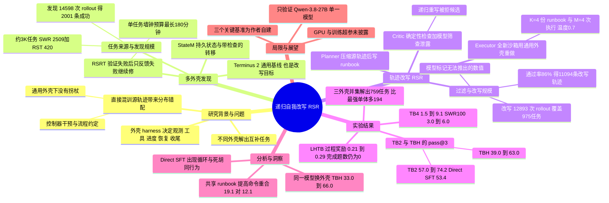

## 一、论文是干什么的？

先解释一个背景词：**harness（智能体外壳）**。大模型像一个聪明的实习生，但干活时还需要一套配套规则：怎么看到终端输出、怎么调用工具、怎么记录进度、做错了怎么补救、什么时候收工。这套规则就是外壳。同一个模型，换一个外壳，能解出的题目会不一样。

论文观察到两件事。第一，不同外壳能让同一个模型解出互补的题目，用的外壳越多，能解出的题越多。第二，这些成功的解题过程（**轨迹**）里夹带了很多外壳的「私货」，比如控制器的催促、固定的流程约定、特殊的收尾规则。如果直接把这些轨迹拿去微调模型，模型会学到「依赖外壳的拐杖」，而部署时只有一个通用外壳，拐杖不在了。

打个比方：几位老师用不同的辅导方式帮同一个学生做出了难题。直接让学生背这些「有老师在旁边提示」的解题笔记，考试时没人提示就不会了。论文的做法是：先把每份笔记整理成一份去掉答案的「操作手册」（runbook），再让学生在没有老师的普通考场里照着手册重新做一遍，只留下做对了的新答卷当教材。这就是 **Recursive Self-Rewrite（RSR，递归自我改写）**。

论文来自 Tencent HY LLM Frontier 与多所高校，全程只用一个基础模型 Qwen-3.8-27B。作者还在 Hugging Face 上放出了训练后的模型 [IntelligenceLab/RSR-27B](https://huggingface.co/IntelligenceLab/RSR-27B)。

## 二、核心方法与创新

整体分三步：多外壳发现、轨迹改写、过滤后微调。

### 1. 多外壳发现（Multi-Harness Discovery）

用三种发现外壳让 Qwen-3.8-27B 去做约 3K 个终端任务，保留通过验证的轨迹：

- **Terminus 2**：通用基线外壳，模型发终端命令、看输出、自己决定何时结束；它也是后面改写和最终推理所用的「通用外壳」。
- **StateM**：围绕持久工作流状态、阶段内上下文和带检查的状态转移来组织执行，中断后可凭 runbook 恢复。
- **Recursive Self-Reflect Terminus（RSRT）**：作者在 Terminus 2 上改的版本。模型宣布完成后，外壳运行验证器；失败则只告诉模型「没过」，不泄露验证器内部或参考答案，让模型回顾轨迹、找错、继续修，直到通过或超时。每个任务的墙钟预算最长 180 分钟。

任务池由两部分组成：作者自建的 SWR（约 2.5K 个终端任务，覆盖软件、生物、化学、物理、硬件、运维、安全等约 50 个领域，论文表 1 记为 2,509 个），以及从 RST 数据集中筛选并加难的 420 个任务，合计 2,929 个，约 3K。

### 2. 轨迹改写：规划器、批评器、执行器三个角色

三个角色都由同一个 Qwen-3.8-27B 扮演。

- **规划器（Planner）**：先压缩源轨迹，只保留任务指令、模型动作和环境观测，去掉外壳专属的控制消息；再写出一份 runbook，包含最终要达成的状态、关键里程碑、有用的检查、恢复策略和常见陷阱。runbook 可以描述任务、相关接口和验证办法，但不能直接给出成品。
- **批评器（Critic）**：先做确定性检查（格式校验、移除已知产物、拒绝不支持的工具引用），再让模型批评器只看公开任务指令和候选 runbook，判断它是在提供有用的流程，还是泄露了执行器不该拿到的信息。不合格的会带着批评意见递归重写。
- **执行器（Executor）**：拿到合格 runbook 后，在全新沙箱里用通用外壳重做一遍。runbook 只作为私有指导，不写进公开轨迹，所以执行器必须根据当前环境产生新轨迹，而不是照抄源轨迹。

这就像老师把「提示笔记」改写成「去答案的复习提纲」，学生拿着提纲在普通考场重新答题。

### 3. 过滤与训练

- 用模型自己检查轨迹里是否出现「既不能从任务也不能从环境推出」的数值，这是隐藏答案泄露的信号，出现就丢弃。
- 微调时只保留公开交互历史（任务指令、环境观测、模型回复），去掉 runbook 和批评器对话。
- 具体设置：每个成功的源轨迹采样 $K=4$ 份候选 runbook，经批评器筛选后，每份保留的 runbook 引导 $M=4$ 次全新执行，温度 0.7。只对 StateM 和 RSRT 的成功轨迹做改写。
- 最终 RSR 训练集是改写出的验证轨迹，再加上 Terminus 2 原本就通过的 766 条直接轨迹（不改写）。

### 4. 论文的创新点

- 把「外壳」从推理时的控制器，转成发现经验的工具：用多个外壳扩大成功覆盖面。
- 提出带泄露筛查的「规划、批评、重做」改写流程，让经验适配通用外壳。
- 用实验对比 Base、Direct SFT（直接用源轨迹微调）和 RSR 三组。

## 三、使用了哪些模型和计算资源？

| 项目 | 信息 |
|---|---|
| 基础模型 | Qwen-3.8-27B（参数量 27B），发现、规划、批评、执行、被微调的都是它 |
| 发现外壳 | Terminus 2、StateM、RSRT |
| 通用外壳 | Terminus 2（改写目标，也是推理时使用的外壳） |
| 发布的模型 | RSR-27B（Hugging Face 页面标注 Apache-2.0 许可证） |
| GPU 型号与数量 | 暂无相关信息（论文正文未给出，也没有附录说明） |
| 微调方式与超参（学习率、轮数、批大小、序列长度） | 暂无相关信息 |
| 微调总耗时 | 暂无相关信息 |
| 单次改写或推理的耗时 | 暂无相关信息（仅给出发现阶段每个任务墙钟预算最长 180 分钟） |

论文在脚注里提到，批评器部分可以用 Jev（Deng 等人的另一项工作，arXiv 2609.24965）来加速推理，但没有说明实际是否使用。

数据规模方面：发现阶段共 14,598 次 rollout，其中 Terminus 2 为 5,405 次、RSRT 为 3,777 次、StateM 为 5,416 次，共得到 2,001 条成功轨迹；改写阶段共 12,893 次 rollout，覆盖 975 个任务，通过率 86%，得到 11,094 条通过的改写轨迹。

## 四、实验结果

### 1. 多个外壳能解出更多任务

在 2,929 个任务上，按「至少一次 rollout 通过」算覆盖率（论文表 1）：

| 外壳 | 解出任务数（占比） | 独有任务数 |
|---|---|---|
| Terminus 2 | 565（19.3%） | 129 |
| RSRT | 512（17.5%） | 91 |
| StateM | 461（15.7%） | 68 |
| 三者并集 | 759（25.9%） | 比最强单个外壳多 194 个 |

并集比最强的单个外壳多解 194 个任务，相对增幅 34.3%。有 2,170 个任务三个外壳都没解出。759 个已解任务里，288 个只被一个外壳解出，163 个被恰好两个解出，308 个被三个都解出。

作者还检查了「各外壳 rollout 数相同」的子集（1,247 个任务，每个外壳 2,074 次 rollout）：Terminus 2、RSRT、StateM 分别解出 249、285、227 个，并集 352 个（28.2%），相对 RSRT 增加 67 个，增幅 23.5%。所以互补性不是由采样次数不均造成的。

三种外壳的执行风格也不同（表 3）：Terminus 2 通过轨迹的中位数为 17 轮，55.5% 的命令用于探索；RSRT 中位数 18 轮，平均每条轨迹宣告完成 2.20 次，4.5% 的通过轨迹经历过被拒绝的完成宣告；StateM 中位数 24 轮，29.6% 的命令用于状态管理。

### 2. 训练效果：Base、Direct SFT、RSR 对比（表 5）

| 基准 | 指标 | Base | Direct SFT | RSR |
|---|---|---|---|---|
| Terminal-Bench 2（89 题） | pass@3 | 57.0% | 53.4% | 74.2% |
| Terminal-Bench 3（74 题） | pass@3 | 0.0% | 5.4% | 9.5% |
| Terminal-Bench 4（66 题） | pass@3 | 1.5% | 4.5% | 9.1% |
| Terminal-Bench Hard（作者自建，100 题） | pass@3 | 39.0% | 56.0% | 63% |
| Software Terminal 100（作者自建） | pass@3 | 3.0% | 3.0% | 6.0% |
| Terminal-Bench 2 | 三次平均 | 51.7% | 43.8% | 70.1% |
| Terminal-Bench Hard | 三次平均 | 31.0% | 42.5% | 54.0% |
| Long-Horizon Terminal-Bench（作者自建，46 题） | 过程奖励 | 0.21 | 0.25 | 0.29 |

要点：

- RSR 在五个基准的 pass@3 和三次平均通过率上都高于 Direct SFT，并且比 Base 更高。相对 Direct SFT，pass@3 分别高 20.8、4.1、4.6、7.0、3.0 个百分点（依次对应 TB2、TB3、TB4、TBH、SWR100）。
- Direct SFT 在 TB2 上反而低于 Base（pass@3 下降 3.6 个百分点，三次平均下降 7.9 个百分点）。作者归因于原始轨迹里的循环和死胡同行为：RSRT 产生很多超过 100 步的轨迹，27B 模型很难在没有原外壳支持下消化。作者只检查了 3 条 Direct SFT 检查点的轨迹，并观察到反复循环同一动作的死胡同现象。
- LHTB 上三组都是 46 个任务完成 0 个，所以过程奖励提升反映的是部分进展变多，不是完整解出更多题。
- 作者在表 5 旁注明，括号里的通过题数是按百分比和基准题数四舍五入估算的。

### 3. 无训练的外壳消融（表 6，单次运行）

| 外壳 | TB2（89） | TBH（100） | TB3（74） |
|---|---|---|---|
| Terminus 2 | 51.7 | 33.0 | 0.0 |
| RSRT | 55.1 | 66.0 | 4.1 |
| StateM | 58.4 | 46.0 | 1.3 |
| 三者并集 | 68.5 | 70.0 | 4.3 |

同一个未训练的 Qwen-3.8-27B，换外壳就能在 TB2 上从 51.7 升到 58.4（StateM），在 TBH 上从 33.0 升到 66.0（RSRT）。

### 4. 改写案例

- Markdown 行内解析任务：12 次改写中 7 次通过（58.3%），通过的改写中位数 32 轮，比 64 轮的源轨迹少 50.0%。
- OpenFOAM PitzDaily 重建任务：8 次改写中 7 次通过（87.5%），中位数 29 轮，部分成功的改写仍比源轨迹长。
- 同一份 runbook 引导的改写之间，命令重合度更高（Markdown 任务精确命令重合 19.1% 对 12.1%），但整体工作流相似度更依赖任务本身（OpenFOAM 的工具转移重合 28.4% 对 28.5%，几乎没差别）。

## 五、潜在应用与已落地应用

**论文自己的说法与方向**：

- 论文结论认为，不同外壳不只是推理时的控制器，也是发现经验的工具，模型可以借此在难以大规模标注的长程复杂任务上自我提升。
- 这套「多种外壳探索，再改写到通用外壳」的思路，原则上可迁移到其他需要外壳辅助、但部署时只有通用接口的智能体场景。论文没有在终端任务以外做实验，这一点属于本综述的推断，请谨慎看待。

**已开源或已落地的内容**：

- 作者在 Hugging Face 发布了模型 [IntelligenceLab/RSR-27B](https://huggingface.co/IntelligenceLab/RSR-27B)（我查看时下载量 74、点赞 1，Apache-2.0 许可证）。
- 我没有在论文中找到训练数据集、改写流程代码或 GitHub 仓库的链接，HF 论文页也未列出代码仓库，所以这些是否开源暂无相关信息。另外，作者所在的 IntelligenceLab 还在 Hugging Face 上放了一个 [RSR-27B 样例轨迹展示空间](https://huggingface.co/spaces/IntelligenceLab/RSR-27B-trajectories)（我查看时页面可打开，点赞 0，具体内容我没有逐条核对）。
- 论文没有声称已有产业落地。

**局限（论文自己写明或可从表格看出）**：

- 核心训练评测用到的 Terminal-Bench Hard、Software Terminal 100、Long-Horizon Terminal-Bench 都是作者自建基准，结果需要独立复现。
- Terminal-Bench 3、4 和 SWR100 上的绝对水平仍然很低（RSR 分别为 9.5%、9.1%、6.0%）。
- 改写成功并不保证更好，同一份 runbook 引导的执行仍然有成有败。
- 只改写了 StateM 和 RSRT 的轨迹，只在一个 27B 基础模型上验证。

## 六、网络上的讨论与评价

- 在 [Hugging Face 论文页](https://huggingface.co/papers/2610.02826) 上，我看到的评论只有两条自动留言：Librarian Bot 的相似论文推荐（其中包括 SoL-Pi、SkillGym、ModularRSI 等），以及 ResearchStudio 团队发布的交互式 Reel（海报、视频、博客）。没有人类读者的实质性讨论。
- 博客层面找到两篇解读，都发表于论文公开几天之内：
  - Substack 博客 [Copying your agent's wins can teach it to loop. Rewriting them first added 17 points.](https://learnagentic.substack.com/p/copying-your-agents-wins-can-teach)（作者 Kanishk Patel，2026-10-06）。文章把 RSR 类比成 STaR（用答案提示生成推理、训练时再把提示去掉）的做法，并强调这是针对单个模型、终端任务的监督微调配方，批评器轮数、每个任务的 runbook 数等细节还没有完全确定。这是博主的解读，不是论文原话。
  - DEV Community 文章 [Scaffolded Trajectories Make Terrible Agent Training Data](https://dev.to/reidmarlow/scaffolded-trajectories-make-terrible-agent-training-data-2lb7)（作者 Reid Marlow，2026-10-05）。文章复述了方法和主要数字，评论区有读者指出，批评器是整条流水线里唯一判定「干净」的环节，而它本身是模型下判断，可能漏掉「改写验证器逻辑却不照抄语法」的语义泄露，建议加入确定性的、与模型无关的检查（例如 n-gram 或 AST 重合比对）。这是单个读者的看法，论文并未讨论。
- 另有 [hyper.ai 的论文镜像](https://hyper.ai/en/papers/2610.02826) 和 [Papers with Code 镜像页](https://paperswithcode.co/paper/2610.02826) 这类索引转载，内容是摘要的转述，没有独立评价。
- 我搜索了论文标题加 arXiv 编号、RSR-27B 关键词，没有发现 Reddit、Hacker News、X、知乎上的独立讨论帖，因此社区口碑只能参考上面两篇博客，样本很少。

## 七、思维导图

