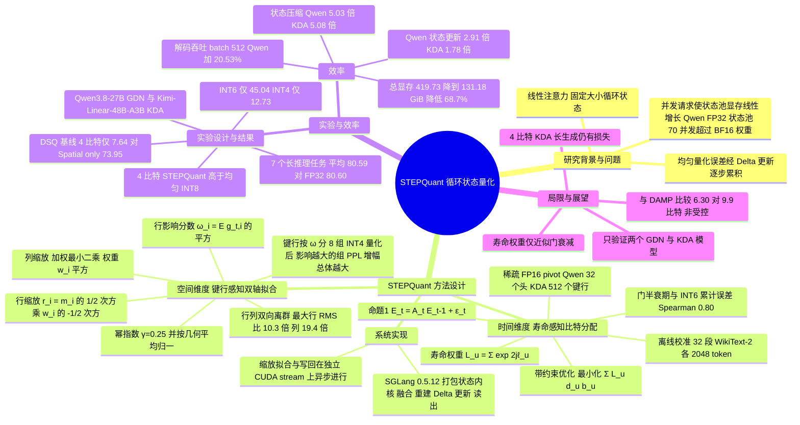

## 一、论文是干什么的？

先说背景。普通的大模型用 softmax 注意力，需要一个会越长越大的 **KV 缓存**（把已经读过的每个字都存下来）。近来一类「线性注意力」模型换了个思路：不存每个字，而是把历史压缩进一块**固定大小的「记忆板」**（论文称为循环状态，recurrent state），每读一个新字就在记忆板上擦一点、写一点。Qwen3.8-27B 和 Kimi-Linear-48B-A3B-Instruct 就是把这种记忆层和普通注意力层混合使用的模型。

听上去很省，但有一个容易被忽略的问题：**每一个同时在线的用户请求，都需要自己独立的一块记忆板**，服务器为了做缓存和调度还会多留几块。于是记忆板的总占用随并发数线性增长。论文指出，在官方 SGLang 部署里，Qwen 的 FP32 状态池在支持 70 个并发请求时，占用已经超过了它 BF16 模型权重本身的显存（图 1a）。

最直接的办法是把记忆板从 32 位浮点压成 4 到 8 位整数，也就是量化。但直接均匀量化会严重掉点：记忆板每一步都在「读上一步的旧状态、写出新状态」，而旧状态里已经带着取整误差，误差会一路传下去。就像传话游戏，每传一个人就走样一点，越靠前的消息被传的次数越多。论文发现，即使压到 8 位也仍有明显差距，6 位和 4 位则掉得很厉害。

STEPQuant（Spatial-TEmPoral Quantization）的核心想法是回答两个问题：误差**什么时候**要紧（时间维度：长寿的记忆里误差会存留很多步），误差在**哪里**要紧（空间维度：记忆板里不同的键行对输出影响不同，且数值大小在行和列上都极不均匀）。论文提供了开源代码（见 [GitHub 仓库](https://github.com/Dreamer-Toby/STEPQuant)），并把它集成进 SGLang 推理框架。

## 二、核心方法与创新

### 1. 背景公式：门控 Delta 规则

对一个注意力头，记忆板是矩阵 $S_t \in \mathbb{R}^{d_k \times d_v}$，每步更新为：

$$
S_t = D_t S_{t-1} + \beta_t k_t \left(v_t^{\top} - k_t^{\top} D_t S_{t-1}\right), \qquad y_t = S_t^{\top} q_t
$$

其中 $D_t$ 是「保留门」（决定旧记忆保留多少），$\beta_t$ 是写入强度。可以这样理解：先让旧记忆按门打个折，再拿当前的键 $k_t$ 去记忆里查一下「我现在记的值是多少」，把真实值 $v_t$ 与查到的值之差（残差）写回去。Qwen 所用的 Gated DeltaNet（GDN）每个头只有一个标量门，Kimi 所用的 Kimi Delta Attention（KDA）则每个通道一个门。

量化时的流程（式 4）是：用上一步重建出来的状态 $\hat{S}_{t-1}$ 在浮点下更新得到 $X_t$，算输出，再把 $X_t$ 量化存起来。

### 2. 时间维度：Lifetime-aware Bit Allocation（寿命感知的比特分配）

论文先给出命题 1：累计误差满足 $E_t = A_t E_{t-1} + \varepsilon_t$，其中 $A_t = (I - \beta_t k_t k_t^{\top}) D_t$。意思是旧误差会被保留门衰减，也会沿当前键方向被 Delta 更新部分抵消，但**与后续键几乎正交的方向上的误差只靠门衰减**，如果门接近 1，这些误差能留很多步。

作者在 Qwen3.8-27B 全部循环头上用均匀 INT6 量化做实验，发现门的半衰期越长的头，累计误差越大，Spearman 相关系数约 0.80（2304 个头）。

于是定义每个分配单元 $u$（Qwen 中是一整个头，KDA 中是一个键行）的平均对数保留 $\ell_u$，误差经 $j$ 步后保留因子约为 $\exp(j\ell_u)$，得到寿命权重：

$$
L_u = \sum_{j=0}^{H-1} \exp(2 j \ell_u)
$$

然后在平均比特预算 $\bar{b}$ 下做带约束优化（式 8）：

$$
\min_{b_u} \sum_u L_u \, d_u(b_u) \quad \mathrm{s.t.} \quad \sum_u n_u b_u \le \bar{b} \sum_u n_u
$$

也就是「误差越大、寿命越长的单元，分到越多的比特」。此外，还有极少数单元怎么分都难量化，就直接用 FP16 保存，称为**稀疏 FP16 pivot**（支点）。所有分配与 pivot 选择都在**离线校准**中一次性完成，推理时不额外花时间。

类比：给一栋楼的各层定防火预算，长期有人住、起火后会烧很久的楼层多配灭火器，没人待的房间少配。

### 3. 空间维度：Key-Row-Aware Dual-Axis Fitting（键行感知的双轴缩放）

**观察一：各键行对输出的影响不同。** 读出误差为 $\Delta y_t = E_{t-1}^{\top} A_t^{\top} q_t$。定义 $g_t = A_t^{\top} q_t$，则第 $i$ 行的误差对读出的贡献由 $g_{t,i}^2$ 决定。取校准集上的期望得到行影响分数 $\omega_i = \mathbb{E}_{\mathrm{cal}}[g_{t,i}^2]$。实验里把每个头的键行按 $\omega_i$ 排成 8 组，一次只把一组量化到 INT4，影响大的组确实使困惑度升得更多。

**观察二：数值的大小在行和列两个方向上都有离群点。** 与常见只关注单一轴向的量化不同，记忆板的最大行 RMS 与中位数之比为 10.3 倍，最大列 RMS 之比为 19.4 倍，且在 98.6% 的采样状态里两者都大于 3 倍。

因此给每个键行一个缩放 $r_i$，给每个值列一个缩放 $c_j$，重建值为 $\hat{X}_{ij} = r_i c_j z_{ij}$，其中 $z_{ij}$ 是低比特整数。行缩放同时考虑当前行大小与行影响：

$$
r_i = m_i^{1/2} \, w_i^{-1/2}, \qquad m_i = \frac{1}{d_v} \sum_j |X_{ij}|, \qquad w_i = \frac{\omega_i^{\gamma/2}}{\mathrm{GM}_k(\omega_k^{\gamma/2})}, \quad \gamma = 0.25
$$

直观上，幅度大的行得到更宽的量化范围，影响大的行得到更细的分辨率。列缩放则通过最小化「影响加权重建误差」求得：

$$
\min_{c_j > 0} \sum_{i,j} w_i^2 \left( X_{ij} - r_i c_j z_{ij} \right)^2
$$

### 4. 系统实现：融合内核与异步写回

作者把 STEPQuant 做成打包状态内核，集成进 SGLang 的循环状态池（附录 F.1 写明 SGLang 版本固定为 0.5.12）。解码时，一个内核把「状态重建、Delta 更新、读出」融合在一起，减少对整块状态的内存访问；读出之后，后续层继续算这个 token，而缩放拟合与打包写回在另一个 CUDA stream 上并行进行，下一步读状态之前保证写回完成。

## 三、使用了哪些模型和计算资源？

**被量化的模型（均为现成模型，STEPQuant 是后训练量化，没有训练新模型）：**

| 模型 | 循环层数 | 每层状态头数 | 分配单元 | 分配单元数 | FP16 pivot |
|---|---|---|---|---|---|
| Qwen3.8-27B（GDN） | 48 | 48 | 整个头 | 2304 | 32 个头 |
| Kimi-Linear-48B-A3B-Instruct（KDA） | 20 | 32 | 键行 | 81920 | 512 个键行 |

两个模型的权重分别用 BF16 与 4 比特 AWQ 量化权重（W4A16）各评测一遍；推理框架是 SGLang，基线是 SGLang 默认的 FP32 状态以及对称逐行 absmax 的 INT4/6/8 均匀量化。

**校准数据：** 32 段 WikiText-2 训练集文本，每段 2048 个 token，同时用于 bit 分配、FP16 pivot 与行影响分数；所有模型、位宽、权重格式都用同一套。Qwen 的分配用多选动态规划，KDA 用拉格朗日分配。Qwen 的候选位宽在 4 比特预算下为 {2,4,6,8}，在 6 比特预算下为 {4,6,8}；KDA 同样如此。

**硬件：** 4 张 NVIDIA A800 GPU（每张显存论文未写）。解码吞吐实验使用张量并行 TP4。

**软件栈：** 论文本身只写了 SGLang 0.5.12；[官方仓库](https://github.com/Dreamer-Toby/STEPQuant) 的 README 写明已测试环境为 SGLang 0.5.12、PyTorch 2.11.0、Triton 3.7.1，且运行 Qwen 示例需要四张 GPU。

**评测与生成设置：** 7 个长生成推理任务（LiveCodeBench v6、EvalPlus、AIME 2026、MATH-500、HMMT February 2026、GPQA Diamond、IFBench），每题分别采样 5、5、64、4、64、8、4 次，温度 1.0、top-k 20、top-p 0.95，每个样本最多生成 65536 个 token。6 个短生成任务（MMLU、ARC-C、OpenBookQA、HellaSwag、WinoGrande、LAMBADA）用贪心解码，每题生成一次答案。

**耗时信息（论文给出的部分）：**

- 解码吞吐测试：4 张 A800，TP4，每个请求 128 个 token 的相同提示词、生成 1024 个 token、贪心解码；每个配置在 1 次预热后跑 3 次取中位数吞吐（表 F7，单位 tokens/s）。
- 状态更新耗时：KDA 在 batch size 512 下，每次状态更新耗时由 8.48 毫秒降到 4.76 毫秒（1.78 倍）；Qwen 的 batch size 512 下状态更新时间下降 65.6%（2.91 倍更快），具体毫秒数只在图 3(d) 中，文本没有给出，故这里写「暂无相关信息」。
- 离线校准耗时、单道评测题的平均耗时、整套评测总 GPU 时数：暂无相关信息。

## 四、实验结果

### 1. 长生成推理准确率（BF16 权重，7 任务平均，%）

| 模型 | FP32 状态 | INT8 | INT6 | INT4 | STEPQuant@6bit | STEPQuant@4bit |
|---|---|---|---|---|---|---|
| Qwen3.8-27B | 80.60 | 71.86 | 45.04 | 12.73 | 80.59 | 80.51 |
| Kimi-Linear-48B-A3B | 61.52 | 56.02 | 45.70 | 21.63 | 61.47 | 58.52 |

要点：6 比特的 STEPQuant 几乎与 FP32 状态打平；4 比特的 STEPQuant 在两个模型上都高于均匀 INT8，在 Qwen 上几乎无损，在 Kimi 上仍差约 3 个点。均匀 INT4 在 AIME 2026 与 HMMT 上准确率直接降到 0.00。

### 2. 短生成准确率（BF16 权重，6 任务平均，%）

| 模型 | FP32 | INT8 | INT6 | INT4 | STEPQuant@6bit | STEPQuant@4bit |
|---|---|---|---|---|---|---|
| Qwen3.8-27B | 87.78 | 86.25 | 82.49 | 65.74 | 87.54 | 87.63 |
| Kimi-Linear-48B-A3B | 68.36 | 67.80 | 61.35 | 42.24 | 68.82 | 68.11 |

4 比特 STEPQuant 与 FP32 只差 Qwen 0.15 个点、Kimi 0.25 个点。

### 3. 与 4 比特 AWQ 权重结合（7 任务平均，%）

Qwen：FP32 状态 79.32，STEPQuant@6bit 79.27，STEPQuant@4bit 78.98。Kimi：FP32 状态 58.95，STEPQuant@6bit 58.62，STEPQuant@4bit 56.66。作者认为这更接近实际部署，而且权重越小，状态占显存的比例越大，状态压缩越重要。

### 4. 消融实验（Qwen3.8-27B，BF16 权重，AIME + GPQA + LCB 三任务平均，%）

| 方案 | 6 比特预算 | 4 比特预算 |
|---|---|---|
| FP32 状态 | 84.61 | 84.61 |
| 均匀 INT 量化 | 38.63 | 3.97 |
| Q-Mamba 的双轴状态量化（DSQ） | 75.95 | 7.64 |
| 只用空间（Spatial only） | 80.19 | 73.95 |
| 只用时间且无 pivot | 67.13 | 6.17 |
| 只用时间（含 FP16 pivot） | 75.63 | 12.87 |
| STEPQuant 完整版 | 84.51 | 84.72 |

结论：空间拟合是 4 比特下的主力（73.95% 对 DSQ 的 7.64%）；仅保护 1.39% 的 Qwen 头做 FP16 pivot，就让 4 比特三任务平均提升 6.70 个点、6 比特 AIME 提升 14.16 个点；两部分合起来才最强。

### 5. 生成长度

均匀量化会让模型「越想越长却想不对」：Kimi 在 4 比特均匀量化下 AIME 平均生成 63.40K token、HMMT 为 64.22K token，逼近 65536 的上限，但准确率接近 0。STEPQuant 的输出长度则与 FP32 状态接近。

### 6. 效率

- 总显存（Qwen，W4 权重，batch size 512）：STEPQuant@6bit 由 419.73 GiB 降到 131.18 GiB，降低 68.7%。KDA 由 149.70 GiB 降到 69.36 GiB，降低 53.7%。
- 循环状态显存：Qwen 压缩 5.03 倍（降低 80.1%）；KDA 从 100.04 GiB 降到 19.70 GiB，压缩 5.08 倍（降低 80.3%）。
- 单个请求的状态：Qwen 的 FP32 状态是 144 MiB，6 比特 STEPQuant 打包后为 28.609 MiB。
- 状态更新速度：Qwen 为 2.91 倍，KDA 为 1.78 倍。
- 整模型解码吞吐（BF16 权重，4 张 A800）：batch size 512 时，Qwen 由 6040 提升到 7280 tokens/s（+20.53%），KDA 由 21241 提升到 23748 tokens/s（+11.80%）；batch size 32 时收益较小，分别为 +4.32% 与 +2.06%。
- 压缩比的「口径」：6 比特只是名义预算，加上 FP16 缩放向量与 pivot 后，Qwen 的实际紧凑存储约 6.361 比特每元素，4 比特配置约 4.621 比特（对 FP32 的表示压缩比 6.93 倍）；KDA 约 6.30 与 4.30 比特（压缩 5.08 倍与 7.44 倍，这是分析计数，不是实测分配大小）。

### 7. 与同期工作 DAMP 的对比

DAMP 使用「衰减持久性选 FP16 通道、其余 INT8」的方案，报告在平均 9.9 比特下保持 100.99% 的 FP32 准确率。STEPQuant@6bit 在 6.30 比特下保持 100.51%，@4bit 在 4.30 比特下保持 92.91%（仅在 KDA 的 AIME 2026、HMMT 与 LiveCodeBench v6 三个共享任务上比较）。作者自己强调，对方没有公开实现，评测设置也不同，因此不是严格受控比较。

## 五、潜在应用与已落地应用

**论文自己声称的价值：** 在高并发的混合线性注意力模型服务里，把循环状态压到约 6 比特，可以省下大量显存，从而放下更多并发请求，也不牺牲推理准确率；同时还能提高解码吞吐。

**作者开源的内容：** [GitHub 仓库](https://github.com/Dreamer-Toby/STEPQuant) 包含校准脚本、SGLang 集成与复现指南；README 给出的是先离线校准、再以 `--state-format stepquant6` 之类的参数启动服务的流程。我查询时该仓库约有 100 颗星、1 个 fork，未标注开源许可证（GitHub 接口显示 license 为空），这一点使用前需要确认。

**作者的推测与局限（附录 H）：** 寿命权重只用门衰减近似误差存留，没有完整建模随时间和键变化的状态转移；BF16 权重下 4 比特的 KDA 在长生成任务上仍有精度损失，Qwen 在 4 比特下输出会变长；评测只覆盖两个 GDN/KDA 模型、固定硬件与负载，其他架构和动态服务负载下的效果有待验证。

**未发现的落地情况：** 暂未发现被主流推理框架合并或在生产环境采用的公开信息；目前只有作者自己的 SGLang 集成。

## 六、网络上的讨论与评价

已找到的只有官方与聚合类页面，没有找到有实质内容的独立评论：

- 论文的 [Hugging Face 页面](https://huggingface.co/papers/2609.38169)：我最后一次抓取时有 114 个点赞（在不同时间抓取分别看到过 87、97、98、99、104、114，会波动），关联了 GitHub 仓库；页面标注的机构为 Zhejiang University。未看到有价值的评论内容。
- 镜像与索引：[hyper.ai](https://hyper.ai/en/papers/2609.38169)、[paperswithcode.co](https://paperswithcode.co/paper/2609.38169)，以及某新闻聚合项目里自动生成的 [Issue 条目](https://github.com/hanzhad/squelch-news-engine/issues/1405)，都只是转述摘要。
- Hacker News（通过 Algolia 搜索）、Reddit 站内搜索被网络策略拦截（WebFetch 与带浏览器 User-Agent 的 curl 均返回 Blocked，未能直接读取），改用网页搜索检索「STEPQuant + reddit / LocalLLaMA」也没有出现任何 Reddit 帖子；X、知乎、博客同样只搜到论文摘要类页面，没有发现独立讨论。因此：**暂无发现公开讨论**。

基于论文本身的几点观察（属于本综述的判断，不是社区评价）：

- 精度对比用的是作者自己的评测框架和固定的校准集（WikiText-2），换到分布差异很大的真实流量上是否仍稳健，论文没有直接实验；但附录 B.6 显示，三种文本来源（WikiText-2、C4、LiveCodeBench）下门寿命排序的 Spearman 相关系数在 0.982 到 0.991 之间，说明寿命排序对校准文本不敏感。
- 论文中长生成任务的大样本平均（例如 AIME 2026 每题采样 64 次）降低了随机波动，但各数字未给出置信区间。
- 「6 比特」是名义预算，真实存储需要加上缩放向量和 FP16 pivot；表述上作者已经在脚注与附录中交代。

## 七、思维导图

