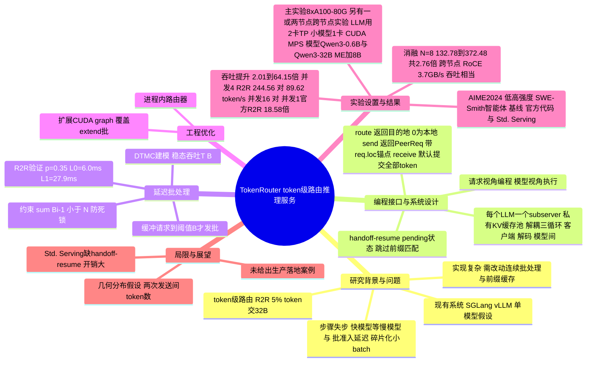

## 一、论文是干什么的？

先解释一个背景概念：**模型路由（model routing）**。现在大语言模型有大有小，大模型聪明但慢、贵，小模型快、便宜但容易出错。路由就是「让合适的模型干合适的活」。目前业界常见的做法是**请求级路由**：用户问一个问题，系统判断难度，把整个问题交给某一个模型从头答到尾（论文提到 ChatGPT 和 Cursor 这类商用系统就是这样分流的）。

更细的做法是 **token 级路由（token-level routing）**：一个回答里，大部分 token（可以理解为一个词或字片段）很好猜，小模型就能写；只有少数「关键转折」的 token 才需要大模型出手。论文引用的 R2R 方法就显示：只把约 5% 的 token 交给 32B 大模型、其余由 1.5B 小模型解码，就能达到 32B 模型的质量，而请求级路由则需要把约 40% 的请求交给 32B 模型。

问题在于：**算法层面的好处，现有推理服务系统（SGLang、vLLM 等）吃不到**。这些系统默认「一个请求从头到尾由同一个模型处理」，而 token 级路由每生成一个 token 就可能换一次模型。打个比方：一条流水线原本是一个工人从头做到尾，现在变成「大师傅和学徒每做一道小工序就互相传递半成品」，如果还用原来的调度方法，大师傅在忙的时候学徒的活就堆着等，学徒闲着的时候大师傅又在等。TokenRouter 就是专门为这种「接力式生成」设计的推理服务系统，同时让研究者只需要写很少的代码就能把自己的路由算法接进来。

## 二、核心方法与创新

### 1. 三个挑战

论文指出，把 token 级路由放到传统单模型服务系统里，会遇到三个问题：

- **步骤失步（step desynchronization）**：不同模型每一步的耗时差别很大。如果强制所有请求同步走每一步，快模型就要等慢模型，白白闲置。
- **批处理准入延迟（batch admission delay）**：路由会让请求频繁切换模型，一个请求到达目标模型时，往往该模型正在处理上一批，只能等下一批才能加入，形成空转和碎片化的小批次。
- **实现复杂度**：现有系统没有「每一步决定去哪个模型」的编程接口，要改动庞大的代码库，还得与连续批处理（continuous batching）、前缀缓存（prefix caching）等功能协调。

### 2. 设计原则：请求视角编程，模型视角执行

核心思想是 **request-centric programming, model-centric execution**。开发者只需要像「跟踪一个请求在多个模型之间怎么走」那样描述算法；而运行时给每个模型启动一个独立的**子服务器（subserver）**，由它自己管理调度器、模型执行器和私有 KV 缓存池，子服务器之间异步传递请求。对外只暴露一个接口，客户端协议与普通单模型服务器一致，因此可以直接替换现有服务（drop-in replacement）。

### 3. route / send / receive 三函数接口

论文把一个请求的生命周期总结为「接收 → 解码 → 路由 → 发送 → 对端接收 → 对端解码 → ……」，开发者只需要填三个函数：

- `route(result)`：每次解码一步后调用，根据隐藏状态、下一个 token 的 logits、采样结果等，给 batch 里每个请求给出目的地。目的地为 0 表示留在本地继续，非 0 表示交给对应的对端模型。
- `send(req)`：请求被委派时调用，返回一个 PeerReq 消息，里面带请求 ID、对端还没见过的 token 后缀、状态字段，以及算法自定义字段，并附带位置锚点 `req.loc`。
- `receive(peer_req)`：对端消息到达时调用。默认把传回来的 token 全部提交，只有算法有特殊交接语义时才需要重写。

论文的示例是 R-Stitch 的小模型端：`route` 里算下一个 token 分布的归一化熵，熵高于阈值 $\tau$ 的 token 交给大模型；`send` 丢掉刚解出的不确定 token，让大模型从这个位置重新生成。论文评测的五个算法（CITER、R2R、R-Stitch、Co-LLM、ME）都能用这三个函数表达，其中 ME 还能推广到两个以上的模型。

### 4. 异步三循环执行与「挂起再恢复」

- **解耦的三循环（decoupled tri-loop）**：标准服务器有两个异步循环，一个负责客户端收发请求，一个负责解码调度。TokenRouter 额外加了第三个「模型间循环」，负责在子服务器之间收发 peer 请求。被路由走的请求暂时离开本地 batch，其余请求继续按自己的节奏解码，对端结果回来后再放回 batch。
- **handoff-resume 机制**：朴素做法是把返回的请求当成新请求，需要重做前缀匹配和 KV 缓存分配，开销很大。TokenRouter 在 running 与 finished 之间新增一个 **pending 状态**：被路由走的请求被调度器跳过，但保留服务状态；回来时只需要把新 token 追加进去，等于「从没离开过」。这样模型间切换几乎只是一次 token 追加。

### 5. 延迟批处理（Delayed Batching）与数学模型

为了减少准入延迟，调度器不再「一来请求就开一步」，而是先缓冲请求，**积累到阈值 $B$ 才发起一批**。比喻：公交车不再来一个人就发车，而是等到几个人再走，虽然最早上车的人多等了一会，但后来的人不必错过一班车，平均等待反而更短。阈值太小会有大量准入延迟，太大又会让请求困在队列里、让小模型没活干。

论文把路由过程建模为一个**离散时间马尔可夫链（DTMC）**，给定路由概率矩阵 $\mathbf{P}$、并发数 $N$ 和每个模型的单步解码延迟 $L_i$，推出稳态吞吐 $T(\mathbf{B})$，再搜索使吞吐最大的阈值向量 $\mathbf{B}^\star$（附录 D 的式 21、24），并要求 $\sum_i (B_i - 1) < N$（式 22）以避免死锁。对 R2R，论文取 $p=0.35$，实测单步延迟 $L_0 = 6.0$ ms（小模型）、$L_1 = 27.9$ ms（大模型），时间量化单位 $\delta = 0.1$ ms，结果显示模型预测的最优阈值在每个并发度下都与实测最优阈值一致。

### 6. 其他工程优化（附录 B、C）

- 自动 KV 缓存显存分配：同一块 GPU 上的多个模型按「共同可容纳的最大 KV token 容量」联合分配。
- 为 extend 模式捕获 CUDA graph：因为每次 peer 返回都是一次 extend 批，而不是普通 decode 批。
- 进程内路由器：路由函数每个 token 都要执行，放在同一进程内，避免每个 token 一次跨进程通信。
- 全局状态同步：把「请求数变化」的状态更新搭在 peer 消息通道上，不额外加中心协调者。
- 实现基于 SGLang 0.5.1，子服务器间通过本地 ZeroMQ IPC 通信。

## 三、使用了哪些模型和计算资源？

TokenRouter 是一个系统论文，**没有训练新的基础模型**，用到的模型主要是被路由的现成模型：

| 用途 | 模型 |
|---|---|
| 主评测的两模型路由（CITER、R2R、R-Stitch、Co-LLM） | Qwen3-0.6B（小）与 Qwen3-32B（大） |
| ME 多模型集成 | Qwen3-0.6B、Qwen3-8B、Qwen3-32B，集成权重 0.5、0.3、0.2 |
| 模型对消融（Table 3） | 0.6B 与 8B、0.6B 与 32B、1.7B 与 8B、4B 与 8B（均为 Qwen3 系列） |
| 各算法原论文设置（Table 4） | R2R：DeepSeek-R1-Distill-Qwen-1.5B / 32B；CITER：Qwen2-1.5B / 72B；Co-LLM：LLaMA2-7B（微调）/ 70B；R-Stitch：L1-1.5B-Short / QwQ-32B |

算法设置：CITER 训练了路由器并取 $\tau=0.98$；R2R 用官方路由器与阈值；R-Stitch 取 $\tau=0.03$；Co-LLM 微调了 Qwen3-0.6B 并取 $\eta=0.15$。

**计算资源：**

- 主实验（论文 5.1 节）在一台 8 张 A100-80G 的 GPU 服务器上完成。
- 两模型算法：小模型放 1 张 GPU，大模型放 2 张 GPU 做张量并行（TP=2），两个模型通过 CUDA MPS 共享这两张 GPU；ME 则是每个模型各占 1 张 GPU。
- 跨节点实验（附录 A.3.2）：Qwen3-0.6B 用 1 张 GPU、Qwen3-32B 用 2 张 GPU（TP=2），部署在一个或两个节点上，在低强度推理设置下测吞吐；两节点通过 RoCE 连接，带宽 3.7 GB/s。
- 实现基于 SGLang 0.5.1。

**耗时信息**（原文给出的部分）：

- 实测单步解码延迟：R2R 设置下小模型 6.0 ms、大模型 27.9 ms。
- 在 Std. Serving 基线中，小模型一侧每个解码步的平均耗时拆解（取 2,048 token 生成的最后 128 步）：前缀匹配 7.78 ms、锁定缓存节点 6.49 ms、SLM 推理 1.56 ms、释放锁 5.13 ms、更新 radix cache 12.12 ms、其他 4.08 ms。
- 原论文设置下的端到端请求延迟见第四节表格（例如并发 4 时，R2R 官方代码 751.15 秒，TokenRouter 270.19 秒）。
- 论文没有给出的信息：整体实验的总耗时、GPU 小时数、训练开销（论文没有训练新模型，CITER 路由器与 Co-LLM 微调的耗时）均为「暂无相关信息」。

## 四、实验结果

**实验设定：** 三类负载。低强度推理用 AIME2024 提示词（约 100 token 输入），最大输出 2,048；高强度推理同样用 AIME2024，最大输出 8,192，只保留 Qwen3-32B 的解答超过 8,192 token 的题目；智能体任务用 SWE-Smith 轨迹，输入约 8,192 token，最大输出 1,024。基线有两个：各算法的官方代码（R-Stitch 没有开源代码），以及作者自己搭的基于 SGLang 的 **Std. Serving**（每个模型一个 SGLang 服务器，每次只返回一个 token，由外部调度器在服务器间转发）。吞吐的定义是生成的输出 token 总数除以总耗时。

### 1. 总体吞吐与延迟

在 15 个「算法 x 负载」组合上，TokenRouter 相对更强的基线，吞吐提升 2.01 到 64.15 倍；相对 Std. Serving 的端到端延迟降低 2.03 到 63.64 倍。输出长度从 2,048 增加到 8,192 时，TokenRouter 的吞吐基本稳定，而 Std. Serving 损失 58.1% 到 85.2% 的吞吐。

### 2. 在各算法原论文设置下（并发 4，Table 2）

| 算法 | 实现 | 吞吐（token/s） | TTFT（秒） | 延迟（秒） |
|---|---|---|---|---|
| R2R | 仅 LLM | 145.30 | 0.13 | 411.98 |
| R2R | 官方代码 | 89.62 | 0.11 | 751.15 |
| R2R | TokenRouter | 244.56 | 0.11 | 270.19 |
| CITER | 仅 LLM | 123.72 | 0.083 | 2.68 |
| CITER | 官方代码 | 17.16 | 0.036 | 7.64 |
| CITER | TokenRouter | 149.31 | 0.036 | 0.48 |
| Co-LLM | 仅 LLM | 134.79 | 0.069 | 13.39 |
| Co-LLM | 官方代码 | 3.46 | 1.14 | 247.61 |
| Co-LLM | TokenRouter | 76.02 | 0.067 | 11.46 |
| R-Stitch | 仅 LLM | 150.41 | 0.15 | 360.76 |
| R-Stitch | TokenRouter | 140.58 | 0.067 | 151.30 |

论文总结：相对官方实现，延迟降低 2.78 到 21.61 倍，吞吐提升 2.73 到 21.97 倍。并发 1 时（Table 5），对 R2R、CITER、Co-LLM 吞吐提升 1.93 到 10.20 倍，延迟降低 2.30 到 10.09 倍。注意 Co-LLM 的官方实现吞吐只有 3.46 token/s，所以 21.97 倍的提升里有「官方代码本身很慢」的因素。另外，Co-LLM 在这一设置下 TokenRouter 的吞吐（76.02）仍低于仅 LLM（134.79），但延迟更低（11.46 对 13.39 秒）。

### 3. 吞吐与单用户速度的权衡

并发度从 1 增加到 16 时，TokenRouter 的吞吐增长 8.61 倍，同时保留 51.7% 的单用户速度；官方 R2R 只增长 5.14 倍，保留 31.3%。并发 16 时 TokenRouter 的吞吐是并发 1 下官方 R2R 的 18.58 倍，单用户速度还高 1.13 倍。

### 4. 消融：每个优化贡献多少（R2R，Table 6，单位 token/s）

| 配置 | N=8 | N=4 | N=1 |
|---|---|---|---|
| TokenRouter 完整 | 372.48 | 210.61 | 73.02 |
| 去掉延迟批处理 | 296.86 | 161.26 | 73.02 |
| 再去掉异步执行 | 230.79 | 143.88 | 73.02 |
| 再去掉 Router CUDA graph | 228.10 | 142.33 | 72.62 |
| 再去掉 LLM CUDA graph | 164.08 | 95.55 | 51.22 |
| 再去掉 SLM CUDA graph（约等于 R2R） | 132.78 | 75.54 | 34.20 |
| R2R 官方代码 | 134.89 | 73.27 | 36.17 |

N=8 时，工程优化（含扩展的 CUDA graph）把吞吐从 132.78 提到 230.79，是官方 R2R（134.9）的 1.71 倍；异步执行再到 296.86，延迟批处理再到 372.48，总计 2.76 倍。CUDA graph 本身带来 1.88 到 2.12 倍提升；N=4 时异步执行与延迟批处理分别再贡献 1.12 倍与 1.31 倍。

### 5. 其他结论

- **模型对**（Table 3，R2R 官方对比）：0.6B 与 8B 为 3.21 倍，0.6B 与 32B 为 2.56 倍，1.7B 与 8B 为 2.76 倍，4B 与 8B 为 1.99 倍，即 1.99 到 3.21 倍。
- **并行策略**：把张量并行资源给大模型更划算。两张 GPU 时，LLM 的 TP 从 1 增到 2，N=1 时吞吐提升 40.6%，N=4 时提升 22.8%；LLM 已为 TP=2 时，把 SLM 的 TP 从 1 增到 2 只带来 0.8% 与 0.4% 的提升。
- **非重叠部署**：小模型与大模型用不同 GPU，平均吞吐比重叠部署高 6.43%。
- **跨节点部署**（RoCE 3.7 GB/s）：吞吐与同等资源的单节点相当，相对各自官方实现提升 1.93 到 32.81 倍。
- **Pareto 前沿**：在 AMC23 上用 Qwen3-0.6B 加 Qwen3-32B、贪心解码、最大输出 8,192 token，TokenRouter 把 token 级路由推到新的 Pareto 前沿，使其比 SGLang 上的请求级路由更有竞争力（具体数值在图 7，文本未给出，暂无相关信息）。
- **Std. Serving 的开销来源**：单步里前缀匹配、锁定缓存、释放锁、更新 radix cache 加起来占大头，SLM 推理本身仅占 4.20%。

## 五、潜在应用与已落地应用

**论文自己声称的价值：**

- 为 token 级路由研究社区提供一个高效、统一的运行平台，让研究者「专注算法，不用重写服务系统」。论文结论称它为未来 token 路由研究提供了「strong foundation」。
- 通过 route/send/receive 三函数，已经覆盖五种算法，包括小大模型协作（效率导向）与多模型集成（质量导向）。
- 对外是单一端点，客户端协议与标准单模型服务器相同，因此可作为现有服务的直接替代。

**作者开源的内容：**

- [GitHub 仓库 thu-nics/TokenRouter](https://github.com/thu-nics/TokenRouter)：包含 YAML 配置（R2R、CITER、Co-LLM 等）、`python -m tokenrouter.launch_server` 启动命令、OpenAI 风格的 chat completion 示例、Python 内直接使用的 `TokenRoutingEngine`，以及跨节点部署（每个节点一个模型）的配置说明。仓库 README 与 arXiv 摘要页的备注栏都标注该工作被 NeurIPS 2026 接收（已核实）。
- [项目主页](https://fuvty.github.io/thinking_yard_project_page/projects/tokenrouter/)提供交互式解释与结果。

**作者没有宣称的落地情况：** 论文没有给出任何生产环境部署案例，也没有端到端的商业应用报告。下面是本文的推测，不是论文的结论：如果 token 级路由的算法收益能稳定复现，这类系统可能被用在需要同时兼顾成本与质量的在线推理服务里；但目前论文的主实验在一台 8 张 A100 的服务器上进行（另有一或两个节点的跨节点实验），以 Qwen3 等模型与固定负载做评测。

## 六、网络上的讨论与评价

- Hugging Face 论文页面上目前只有作者 fuvty 自己发的介绍评论，以及 Librarian Bot 自动推荐相似论文的评论，没有看到其他读者的实质性讨论。
- Hacker News 上有一条同名项目主页的帖子（标题为 TokenRouter: A serving engine for token-level LLM routing），查询时为 1 分、0 条评论。
- 其他渠道：已用论文标题加 arXiv 编号做了网页搜索，并通过 Hacker News 的 Algolia 检索接口按 TokenRouter 与编号查询，只找到上面那条帖子；Reddit 搜索接口对脚本请求返回拦截页，X/Twitter、知乎与博客在搜索结果中也未发现相关讨论，因此暂无发现公开讨论。
- 以下是基于论文自身内容的几点观察，不是外部评价：
  - 评测集中在 Qwen3 系列，主实验在一台 8 张 A100 的服务器上（另有跨节点实验），基线是官方代码和作者自建的 Std. Serving。Std. Serving 缺少 handoff-resume 机制，每个返回的 token 都被当作新请求处理，带来额外开销，这是论文的说明。2.01 到 64.15 倍是论文对「各设置中相对更强基线」给出的总范围；论文文本没有把最大值归因于某个具体基线，也没有量化 Std. Serving 低效对它的贡献比例，这里也无法从公开文本逐项对应出 2.01 与 64.15 各自的基线和设置。综述者的推测（非论文结论）：倍数较大的组合可能受基线实现效率影响，但具体程度未知。
  - 吞吐提升是 TokenRouter 与各基线之间的相对比较，路由算法本身的准确率不是本文关注点。
  - 局限性由作者自己写明：数学模型假设两次发送之间的 token 数服从几何分布，这对多数 token 级路由算法成立，但违反该假设的特殊情况留待未来工作。
  - 提醒：官方代码对比的数据里，Co-LLM 官方实现本身只有 3.46 token/s，因此「21.97 倍」不能直接理解为与优化良好的系统相比。

## 七、思维导图

