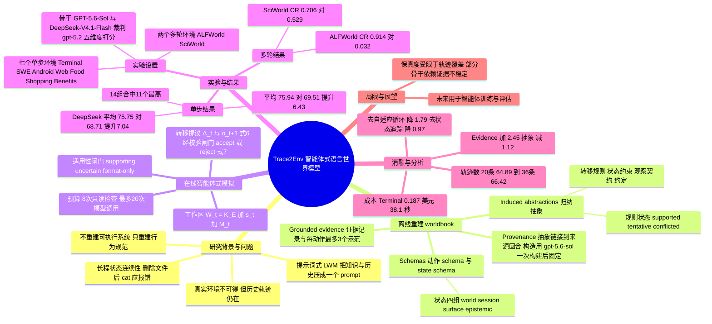

## 一、论文是干什么的？

训练或测试一个 LLM 智能体，常常需要一个「能对它的动作做出反应」的环境，比如一个真实的终端、一个购物网站、一个企业内部系统。但这些真实系统有时拿不到源码、数据或基础设施，或者复现代价太高。不过，这些系统过去留下的**交互轨迹**（谁在什么时候做了什么动作、系统返回了什么）往往还保存着。

这篇论文问的是：能不能不去重建那个真实系统，而是只靠这些历史记录，「照猫画虎」造出一个会回应的替身？作者提出的思路是让一个**世界模型智能体**（world model agent）充当环境，任务智能体发出动作，世界模型智能体负责回答「环境会返回什么」。

打个比方：你想训练一个新来的客服，但真实的客服系统不能随便给他乱点。于是你找一位老员工，让他翻阅过去的工单记录和一本整理好的「操作手册」，再看着当前这位客户的办理进度，来模拟系统会怎样回应。老员工既要记得系统的通用规律，也要记得「这位客户刚才删了哪个文件」。论文把这套方法叫 Trace2Env，并强调它是无需训练的（learning-free）。论文七位作者中，Xiao Chen 署名香港理工大学，其余六位署名南洋理工大学，论文页面见 [arXiv 页面](https://arxiv.org/abs/2610.06100)，代码见 [GitHub 仓库](https://github.com/ruyue0001/trace2env)，另有 [项目主页](https://quanyulong.net/trace2env/)。

## 二、核心方法与创新

### 1. 要解决的难点：长期状态连续性

论文举的例子是：删除 report.txt 可能没有任何输出，但之后再执行 cat report.txt，真实系统应该报「文件不存在」。传统的「提示词式」语言世界模型（LWM）把环境描述、全部历史、当前动作一股脑塞进一个提示词里，让模型预测下一个观察，写作 $\hat{o}_{t+1}\sim p_{\theta}(\cdot\mid d_{\mathcal{E}},h_{t},a_{t})$（式 1）。这样做的问题是：异质的知识和长期状态被压扁在一起，多轮之后很容易前后不一致。

### 2. 离线阶段：重建「环境手册」worldbook

给定一批历史轨迹 $\mathcal{D}_{\mathrm{build}}$，由构造器生成一个不可变的环境手册 $K_{\mathcal{E}}=\operatorname{Construct}_{\phi}(\mathcal{D}_{\mathrm{build}})$（式 3）。它包含四类内容：

- **Schemas**（模式）：动作接口和模拟器可维护的状态变量。状态变量分四组：world（环境的持久事实）、session（交互上下文）、surface（当前可见内容）、epistemic（不确定或冲突的信念）。
- **Grounded evidence**（有据证据）：保留下来的真实转移、示范及其原始观察，观察原文逐字保存。
- **Induced abstractions**（归纳抽象）：转移规则、状态约束、观察契约、约定俗成的规律。规则经过审核后标为 supported、tentative 或 conflicted，只有 supported 的规则才可执行。
- **Provenance**（出处）：每个抽象和示范都链接到支持它的轨迹与回合。

构造流程是：先把动作和结果对齐、抽取事实；归因含糊或并发动作的效果会被搁置；再归纳 schema；然后提出规则，并用支持案例和成功与失败的对比案例审核（例如成功与失败的对比可能提示一个缺失的前置条件）。

类比：不是照抄旧案例，而是既保留典型案例原文，又从中总结出「规则条文」，每条规则都能追溯到出处。

### 3. 在线阶段：持久的 episode 工作区

每一局（episode）的工作区是 $\mathcal{W}_{t}=(K_{\mathcal{E}},\hat{s}_{t},M_{t})$（式 4）：

- $K_{\mathcal{E}}$：环境手册，不可变、跨局共享，说明环境「通常怎么表现」。
- $\hat{s}_{t}$：本局当前的状态表示，可变，说明「现在什么是真的」。它故意不完整，缺失条目被视为未知，而不是「不存在」。
- $M_{t}$：本局的情景记忆，记录「之前发生过什么」。

### 4. 智能体式模拟：提议、校验、提交

每一步，世界模型智能体先看一个精简的简报，再按需检查手册、状态和记忆，然后给出一个转移提议 $q_t=(\Delta_t,\tilde{o}_{t+1})$（式 6），其中 $\Delta_t$ 是一组候选状态效果，$\tilde{o}_{t+1}$ 是提议的观察。提议不会直接改状态，要经过共享的运行框架（harness）做校验 $g^{\mathrm{val}}_t\in\{\mathrm{accept},\mathrm{reject}\}$（式 7）：在状态副本上检查是否符合 schema、规则支持和状态约束。只有通过的才提交，并写入下一轮的状态与记忆（附录 C.3：参考策略下，校验未通过的提议会丢弃其状态效果、只保留提议的观察；另有严格策略是直接记失败、不提交）。

此外，论文把「相关」与「适用」分开：检索到的某条证据可能只对别的局成立，所以有一个适用性闸门（式 5），把证据标为 supporting（可支持具体行为）、uncertain（谨慎使用）、format-only（只提供响应格式，不提供本局事实）。实现里这个闸门是确定性的，不用模型重新打标签。

### 5. 它和相关工作的区别

论文指出：Trace2Skill、Agent Workflow Memory 等把轨迹提炼成技能，主要帮任务智能体决定「怎么做」；Terminal-Universe 是把轨迹重建成可执行的终端工作区，而 Trace2Env 重建的是不可执行的行为手册；WorldEvolver 则假设更新记忆时还能持续拿到原环境的反馈，Trace2Env 研究的是原环境不可用的纯轨迹设定。

## 三、使用了哪些模型和计算资源？

论文没有训练任何模型，全部通过 API 调用，原文未提 GPU 型号与数量。

| 用途 | 模型 / 配置 |
|---|---|
| 收集构造轨迹（任务智能体） | gpt-5.6-sol（Terminal 用 Terminus-2 智能体跑 Terminal-Bench 2.0，Web 跑 WebArena，ALFWorld 用 AgentGym ReAct 提示词，EnvScaler 同样用 GPT-5.6-sol 智能体） |
| 构造 worldbook | gpt-5.6-sol，一次构建后固定，用于两个骨干 |
| 世界模型骨干 1 | GPT-5.6-Sol，中等推理强度，输出上限 16,384 token |
| 世界模型骨干 2 | DeepSeek-V4.1-Flash，低推理强度，输出上限 65,536 token |
| 评分裁判 | gpt-5.2（遵循 AgentWorldBench 官方协议，1 到 5 分，再换算到 0 到 100） |

参数量：原文未给出这些模型的参数量，暂无相关信息。

运行设置（附录 Table 13）：每个动作最多 8 次只读检查请求、最多 20 次模型调用；简报里最多放 5 条相似证据记录和 2 个示范；重建时模糊转移的置信度上限 0.5，编译规则的最低置信度 0.55，每种动作类型保留 3 个示范；基准评测里状态追踪窗口最多 8 个已观察回合。温度：框架调用不设温度，提示词基线和裁判用 0.6。

**耗时与成本**（附录 Table 10，Terminal，GPT-5.6-Sol，按标价估算，延迟为每条记录的墙钟秒数）：

| 系统 | 得分 | 每条调用次数 | 每条成本（美元） | 每条延迟（秒） |
|---|---|---|---|---|
| Direct Prompting | 55.76 | 1.0 | 约 0.04 | 26.0 |
| Trace RAG Prompting | 58.42 | 1.0 | 0.051 | 24.7 |
| Worldbook Prompting | 59.07 | 1.0 | 0.051 | 34.7 |
| Harness only | 60.14 | 1.4 | 0.036 | 17.3 |
| Trace2Env 去掉自适应循环 | 63.09 | 2.4 | 0.054 | 20.4 |
| Trace2Env 去掉状态追踪 | 63.91 | 3.3 | 0.144 | 27.9 |
| Trace2Env | 64.89 | 5.0 | 0.187 | 38.1 |

附录 Table 11 还给了四个环境下两种骨干的每条记录成本与延迟，例如 Terminal 上 Trace2Env 为 0.21 美元、41 秒（GPT-5.6-Sol）和 0.03 美元、48 秒（DeepSeek-V4.1-Flash），Web 上为 0.39 美元、18 秒和 0.68 美元、45 秒。该表题注写明数值顺序为「GPT-5.6-Sol / DeepSeek-V4.1-Flash」，与上述对应一致。需要注意：Terminal 上 Trace2Env 的成本在 Table 11（0.21 美元）与 Table 10（0.187 美元）中略有出入，论文未解释，推测是两张表统计口径或取整不同，本综述两处分别照录。

原文还说：去掉自适应循环可保留约 80% 的提升而只用 29% 的推理成本；去掉状态追踪省 23% 成本、分数降约一分。worldbook 构造是每个环境一次性成本，随轨迹数量大致线性增长（图 3，具体构造耗时和费用数字仅在图中，文本未给出，暂无相关信息）。训练耗时：无训练，暂无相关信息。

## 四、实验结果

### 1. 单步下一观察预测（九个环境中的七个）

评测集为 AgentWorldBench 的 Terminal、SWE、Android、Web 四个分片，加上 EnvScaler 的 Food、Shopping、Benefits。分数为格式、事实性、一致性、真实感、质量五个维度的平均，0 到 100。

| 方法（GPT-5.6-Sol 骨干） | Terminal | SWE | Android | Web | Food | Shopping | Benefits | 平均 |
|---|---|---|---|---|---|---|---|---|
| Direct Prompting | 55.76 | 65.87 | 62.80 | 54.23 | 81.67 | 77.32 | 88.89 | 69.51 |
| Trace RAG Prompting | 58.42 | 66.50 | 66.50 | 57.12 | 85.57 | 86.07 | 96.11 | 73.76 |
| Worldbook Prompting | 59.07 | 67.82 | 65.53 | 57.70 | 86.74 | 85.89 | 97.68 | 74.35 |
| Harness only | 60.06 | 69.89 | 62.62 | 55.40 | 82.07 | 77.62 | 87.89 | 70.79 |
| Trace2Env | 65.42 | 70.59 | 65.10 | 59.55 | 87.43 | 85.36 | 98.11 | 75.94 |

DeepSeek-V4.1-Flash 骨干下，Trace2Env 平均 75.75，对 Direct Prompting 的 68.71 提升 7.04 分；GPT 骨干下提升 6.43 分。Trace2Env 在 14 个「环境 x 骨干」组合中的 11 个最高，且在所有组合中都不低于 Direct Prompting。要注意，它并非处处第一：例如 DeepSeek 骨干的 Terminal 上，Worldbook Prompting 为 65.24，高于 Trace2Env 的 64.12。

附录给出的统计：在 AgentWorldBench 上，相对 Direct Prompting 的提升（以轨迹为单位做聚类自助法，10,000 次重采样，95% 置信区间）在每个环境和骨干上都排除零；事实性、一致性、真实感、质量在全部 14 个组合里都提升。

### 2. 多轮长程一致性（ALFWorld 与 SciWorld）

Real 指任务智能体在真实环境中的成功率，WM 指在世界模型里的成功率，W2R 指把世界模型里生成的动作序列拿回真实环境重放的成功率，$\mathrm{CR}=\mathrm{W2R}/\mathrm{Real}$。

| 环境 | 方法 | Real | WM | W2R | CR |
|---|---|---|---|---|---|
| ALFWorld | Direct Prompting | 93% | 97% | 3% | 0.032 |
| ALFWorld | Trace2Env | 93% | 88% | 85% | 0.914 |
| SciWorld | Direct Prompting | 85% | 92.5% | 45% | 0.529 |
| SciWorld | Trace2Env | 85% | 87.5% | 60% | 0.706 |

大白话：Direct Prompting 在虚构世界里「通关」更容易，但那是在一个错误的世界里通关，拿回真实环境一重放就几乎全失败（ALFWorld 只剩 3%）。需要说明的是，Trace2Env 并非一律拒绝不被支持的动作：论文第 4.3 节与附录 C.3 允许没有显式重建规则覆盖、由模型依据手册中可变状态字段提出的状态效果，只要通过 schema 与状态约束检查（不引入新的约束违反），参考策略就会接受；只有在具体案例中（如 ALFWorld 的一次不合法 put），违反环境约束的动作才被建模为不改变状态的空操作（no-op）。Trace2Env 因为有校验闸门、持续维护状态，模拟里的成功率反而略低，但重放回真实环境后成功率高很多。

### 3. 消融实验（Terminal，GPT-5.6-Sol）

- 证据比抽象更重要：在 schema only（62.05）上加证据（证据回合、示范）达到 64.18，效果 +2.45±0.89；只加抽象（规则、契约、笔记）是 60.69，效果 -1.12±0.90。
- 两者互补：在已有证据上再加抽象有 +0.69±0.63；在已有抽象上再加证据有 +4.26±1.02；完整 worldbook 为 64.89。
- 运行时也有贡献：去掉自适应循环下降 1.79±0.91，去掉状态追踪下降 0.97±0.78。
- 轨迹数量：5 到 15 条时表现不稳定，从 20 条的 64.89 升到 36 条的 66.42，曲线仍在上升，构造成本也同步上升，正文实验统一用 20 条。
- 未见任务迁移（附录 B.3，Table 8）：下面各数字的比较对象不同，Terminal 与 Web 行是相对 Harness only（去掉 worldbook 后的基线）的提升，Android 与 SWE 行才是相对 Direct Prompting 的提升。Terminal 中任务不在构造集里的 312 条记录上，GPT 骨干提升 +3.69±0.95，DeepSeek 骨干只有 +0.61±1.19（区间含零）；同任务的 42 条记录提升更大（+17.86 与 +12.86）。Web 无重叠的 151 条记录提升 +4.21 与 +5.00。Android 中「其他折叠含该应用」的 73 条提升明显（+7.33 与 +15.00），而「应用不在其他折叠」的 127 条在 GPT 下为 -0.59。

## 五、潜在应用与已落地应用

**论文自己声称的潜在方向**：为训练和评测智能体提供逼真的环境替身；未来可研究这类智能体式模拟环境如何支持任务智能体的训练和评估（结论中的展望）。

**作者开源的内容**：[GitHub 仓库](https://github.com/ruyue0001/trace2env)（Apache-2.0 许可，我核对时约 30 星、3 个 fork，创建于 2026 年 10 月 4 日），以及 Hugging Face 上的 [在线演示 Space](https://huggingface.co/spaces/Quanyu001/trace2env_demo)，可体验一个完全由世界模型智能体模拟的终端，Space 里也能查看 worldbook 长什么样。

**仓库 README 的说法（作者宣传，未经独立验证）**：可用于不接触真实系统地训练智能体、在安全可复现的沙箱里测试智能体、为工具和 API 搭建有状态的模拟、重建不可用/私有/遗留的环境；还提到可推广到内部企业工具、工单流程、云和运维控制台、API 与 MCP 后端等。论文本身只在终端、软件仓库、安卓、网页、企业服务和文本游戏上做了评测，其余是作者的推测。

**已知局限（论文承认）**：保真度受限于轨迹所揭示的内容；部分骨干对重建证据的依赖不够稳定；目前世界模型智能体只模拟文本接口的环境。关于真实工业落地，暂无发现公开案例。

## 六、网络上的讨论与评价

- Hugging Face 论文页面：我查到点赞数为 122，GitHub 星数 29（接口数据，会随时间变化）；页面评论区有 2 条：账号 Quanyu001 于 2026 年 10 月 9 日发布的论文方法介绍（内容是对论文做法的概述，没有评价或质疑），以及 Librarian Bot 于 10 月 10 日发的相似论文自动推荐。这两条都不算独立的第三方讨论。
- 我用网页搜索（标题加 arXiv ID、Trace2Env 加 reddit、twitter、知乎、博客等关键词）和 Hacker News 的 Algolia 接口各查询一轮，只返回无关或同领域的其他论文（如 Qwen-AgentWorld），没有找到针对这篇论文的独立讨论串；Reddit、X、知乎的内容搜索引擎未收录。结论：暂无发现公开讨论。
- 因此以下是基于论文内容的观察，不是社区评价：
  - （综述者的推测）论文评测了 GPT-5.6-Sol 和 DeepSeek-V4.1-Flash 两个骨干，评分裁判为 gpt-5.2。裁判 gpt-5.2 对两个骨干一视同仁地打分，论文未检验、也未讨论裁判偏置，因此无法排除裁判的模型家族偏好对两个骨干结果的影响，其方向和程度都不明（两个骨干平均分分别为 75.94 与 75.75，相差很小，但这不足以说明裁判没有偏置）。
  - 多轮实验的任务数不大（ALFWorld 100 个任务，SciWorld 40 个任务），SciWorld 上 CR 从 0.529 提升到 0.706，样本量有限。
  - 推理成本约是单次调用提示词基线的数倍（Terminal 上 0.187 美元对约 0.04 美元），论文也承认这一点并给出轻量模式。

## 七、思维导图

